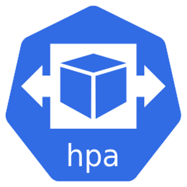
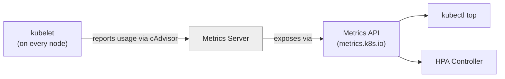
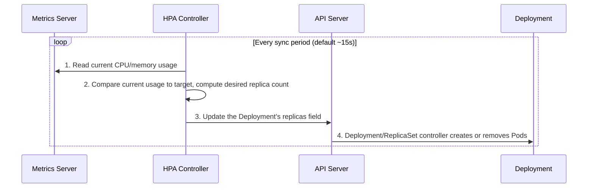
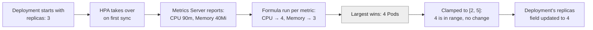
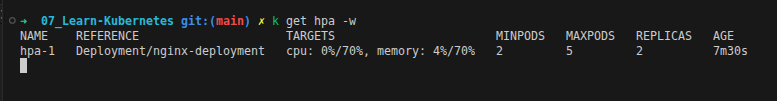
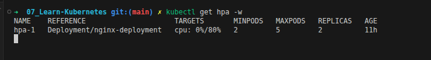
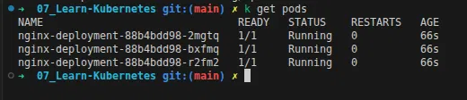
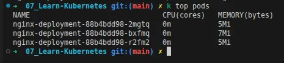
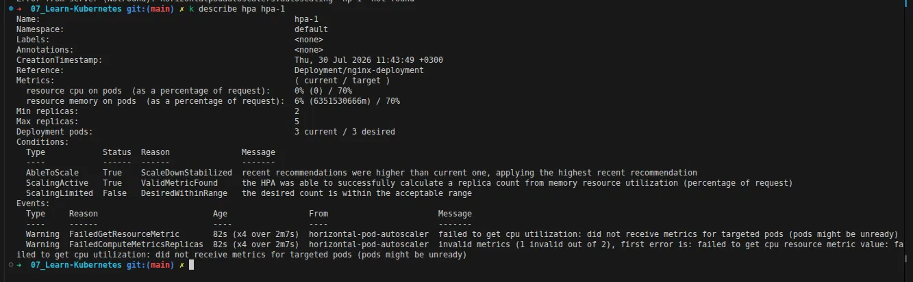
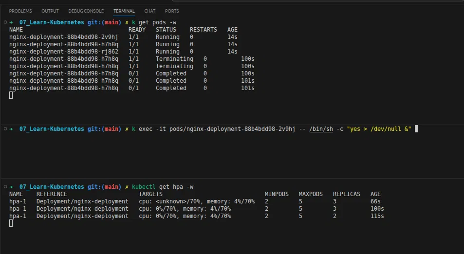

<div align="center">

</div>

# HPA — Horizontal Pod Autoscaler

## Table of Contents
- [Overview](#overview)
- [1. What & Why HPA?](#1-what--why-hpa)
- [2. Metrics Server](#2-metrics-server)
- [3. How HPA Works](#3-how-hpa-works)
- [4. HPA YAML Example](#4-hpa-yaml-example)
- [5. Walking Through the Math](#5-walking-through-the-math)
- [6. Basic Commands](#6-basic-commands)
- [7. Live Walkthrough: A Real Run](#7-live-walkthrough-a-real-run)
- [Summary in points](#summary-in-points)

---

## Overview

The **Horizontal Pod Autoscaler (HPA)** automatically changes the **number of Pod replicas** in a Deployment, ReplicaSet, or StatefulSet, based on observed metrics like CPU or memory usage. **Instead of you deciding "we need 5 replicas" once and hoping that's always enough**, HPA continuously watches real usage and scales the replica count up or down to match actual demand.

---

## 1. What & Why HPA?

| Without HPA | With HPA |
|---|---|
| You pick a fixed `replicas` count and hope it covers both quiet periods and traffic spikes | Replica count adjusts automatically to match real, current load |
| Under load spikes → Pods get overwhelmed, latency increases, requests may fail | New Pods are added automatically as usage crosses the target threshold |
| During quiet periods → you're paying for idle capacity you don't need | Extra Pods are scaled back down once load drops, saving resources |
| Someone has to manually watch dashboards and run `kubectl scale` | The scaling decision is fully automated, based on live metrics |

> HPA scales **horizontally** (more/fewer Pods) — this is different from the **Vertical Pod Autoscaler (VPA)**, which instead changes the CPU/memory *requests* of existing Pods.

---

## 2. Metrics Server

HPA needs to know the **actual current CPU/memory usage** of your Pods before it can decide anything — and a vanilla Kubernetes cluster doesn't expose that by default. That's the job of the **Metrics Server**.

- It's a cluster add-on (**not installed by default** on most distros — including Minikube) that collects resource usage data from every node's `kubelet` (which in turn gets it from cAdvisor).
- It exposes that data through the standard **Metrics API** (`metrics.k8s.io`), which both `kubectl top` and the HPA controller read from.
- Without it, `kubectl top` fails, and HPA has no data to base its scaling decisions on — it will show `<unknown>` for current metric values.

**Enabling it on Minikube:**
```bash
minikube addons enable metrics-server
```



> This is a **resource metrics pipeline** — lightweight, short-term (no historical data). If you need long-term metrics/dashboards, that's a separate concern (Prometheus, etc.), not the Metrics Server.

---

## 3. How HPA Works



- The HPA controller runs this loop continuously, on a fixed interval (**default: every ~15 seconds**, controlled by `--horizontal-pod-autoscaler-sync-period` on the controller manager).
- **Important:** once an HPA object targets a Deployment, **the Deployment's `replicas` field is no longer really "yours"** — HPA owns it. If you manually run `kubectl scale deployment ... --replicas=10`, the next HPA sync will simply overwrite it back to whatever HPA calculates.
- To avoid rapid "flapping" (scaling up and down repeatedly), HPA applies a **stabilization window** — scale-down decisions are more conservative by default (waiting to see sustained lower usage) than scale-up decisions.

### The Core Formula

For each metric, HPA computes a desired replica count using:

```
desiredReplicas = ceil( currentReplicas × ( currentMetricValue / desiredMetricValue ) )
```

- `currentReplicas` — how many Pods are running right now.
- `currentMetricValue` — the actual measured usage (e.g., 90m CPU).
- `desiredMetricValue` — the **target** usage HPA is trying to maintain (e.g., 75m CPU, derived from your `averageUtilization` percentage).
- `ceil(...)` — **always rounds up**, never down. This matters — see the worked example below.

If your HPA tracks **more than one metric** (like CPU *and* memory, as in our example), HPA calculates a desired replica count **for each metric separately**, then picks the **largest** value across all of them. This guarantees the cluster is always sized for the *most demanding* metric, not just the average.

Finally, the result is **clamped** to stay within `[minReplicas, maxReplicas]` — it can never go below or above those bounds, no matter what the formula says.

---

## 4. HPA YAML Example

**Deployment** (defines the requests HPA's percentages are calculated against):
```yaml
apiVersion: apps/v1
kind: Deployment
metadata:
  name: nginx-deployment
spec:
  replicas: 3
  selector:
    matchLabels:
      app: nginx
  template:
    metadata:
      labels:
        app: nginx
    spec:
      containers:
        - name: hpa-deploy-cont
          image: nginx
          imagePullPolicy: IfNotPresent
          ports:
            - containerPort: 80
          resources:
            requests:
              cpu: "150m"
              memory: "100Mi"
            limits:
              cpu: "200m"
              memory: "250Mi"
```

**HorizontalPodAutoscaler:**
```yaml
apiVersion: autoscaling/v2
kind: HorizontalPodAutoscaler
metadata:
  name: hpa-1
spec:
  scaleTargetRef:
    apiVersion: apps/v1
    kind: Deployment
    name: nginx-deployment
  minReplicas: 2
  maxReplicas: 5
  metrics:
    - type: Resource
      resource:
        name: cpu
        target:
          type: Utilization
          averageUtilization: 50
    - type: Resource
      resource:
        name: memory
        target:
          type: Utilization
          averageUtilization: 50
```

See the full file: [08_hpa.yaml](../k8s_yaml_files/08_hpa.yaml) *(Deployment + HPA combined in one file, separated by `---`)*

---

## 5. Walking Through the Math

Let's compute exactly what this HPA will do, step by step, using the YAML above.

### Step 1 — What HPA has to work with

| | CPU | Memory |
|---|---|---|
| **Container Request** (the baseline HPA calculates % against) | 150m | 100Mi |
| **Container Limit** (the hard cap — not used by HPA's math) | 200m | 250Mi |
| **HPA Target Utilization** | 50% | 50% |

> **Key rule:** `averageUtilization` is always a percentage **of the Request**, never the Limit. This is exactly why the container's `resources.requests` block matters so much here.

### Step 2 — Convert target % into an absolute target value

```
CPU target    = 50% × 150m  = 75m
Memory target = 50% × 100Mi = 50Mi
```

### Step 3 — Plug in real, measured usage

Say the Metrics Server reports the current **average usage per Pod** is:
- CPU: **90m**
- Memory: **40Mi**

With `currentReplicas = 3` (the Deployment's starting replica count):

| Metric | Formula | Result |
|---|---|---|
| CPU | `ceil(3 × 90m / 75m)` = `ceil(3 × 1.2)` = `ceil(3.6)` | **4** |
| Memory | `ceil(3 × 40Mi / 50Mi)` = `ceil(3 × 0.8)` = `ceil(2.4)` | **3** |

> Notice memory rounds **up** to 3, not down to 2 — `ceil()` never rounds down. This is a common mistake when doing this math by hand.

### Step 4 — Pick the largest result across all metrics

```
final decision = max(CPU result, Memory result) = max(4, 3) = 4 Pods
```

CPU is the "more demanding" metric here — even though memory usage is actually *below* its target (40Mi < 50Mi, which alone would suggest scaling down), CPU usage is *above* its target, so the cluster scales **up** to satisfy CPU. HPA always sizes for the worst-case metric, never averages them together.

### Step 5 — Clamp to `[minReplicas, maxReplicas]`

```
clamp(4, min=2, max=5) = 4   →  within bounds, no change needed
```

**Two more cases, to see the clamp actually do something:**

| Scenario | Raw calculated value | After clamping to `[2, 5]` |
|---|---|---|
| Usage spikes hard, formula says 7 Pods needed | 7 | **5** (capped at `maxReplicas`) |
| Usage drops very low, formula says 1 Pod is enough | 1 | **2** (floored at `minReplicas`) |

### Putting it all together



> **The big takeaway:** the `replicas: 3` written in the Deployment YAML is only the **starting point**, used the moment the Pods are first created. From the very next HPA sync onward, that number is continuously recalculated and overwritten by the HPA controller based on real, live usage — not by whatever you originally typed in the YAML file.

---

## 6. Basic Commands

| Command | What it does |
|---|---|
| `kubectl get hpa` | List all HPAs, their current/target metrics, and current replica count |
| `kubectl get hpa -w` | Same as above, but watches live — useful to see scaling happen in real time |
| `kubectl describe hpa <name>` | Full details: target vs current values per metric, recent scaling events |
| `kubectl top nodes` | Current CPU/memory usage **per node** (requires Metrics Server) |
| `kubectl top pods` | Current CPU/memory usage **per pod** (requires Metrics Server) |
| `kubectl autoscale deployment <name> --cpu-percent=50 --min=2 --max=5` | Imperative shortcut to create a CPU-only HPA, without writing YAML |
| `kubectl delete hpa <name>` | Remove the HPA — the Deployment keeps running at whatever replica count it was last scaled to |

```bash
# Quick end-to-end check
kubectl apply -f 08_hpa.yaml
kubectl get hpa -w
kubectl top pods
```

Here's a real `kubectl get hpa -w` session — note the `TARGETS` column showing `cpu: 0%/80%` (current/target) and the live `MINPODS`/`MAXPODS`/`REPLICAS` counts:

<div align="center">

</div>

---

## 7. Live Walkthrough: A Real Run

Everything above is the theory. Here's what actually happened running it for real — including a couple of things that *didn't* go the way a textbook example would, because that's exactly the kind of detail worth understanding.

**The manifest actually applied** (Deployment + HPA in one file, note the target is **70%** here, not the 50% used in the worked example above):

```yaml
---
apiVersion: apps/v1
kind: Deployment
metadata:
  name: nginx-deployment
spec:
  replicas: 3
  selector:
    matchLabels:
      app: nginx
  template:
    metadata:
      labels:
        app: nginx
    spec:
      containers:
        - name: hpa-deploy-cont
          image: nginx
          imagePullPolicy: IfNotPresent
          ports:
            - containerPort: 80
          resources:
            limits:
              cpu: "200m"
              memory: "250Mi"
            requests:
              cpu: "150m"
              memory: "100Mi"
---
# HPA
apiVersion: autoscaling/v2
kind: HorizontalPodAutoscaler
metadata:
  name: hpa-1
spec:
  maxReplicas: 5
  minReplicas: 2
  scaleTargetRef:
    apiVersion: apps/v1
    kind: Deployment
    name: nginx-deployment
  metrics:
    - type: Resource
      resource:
        name: cpu
        target:
          type: Utilization
          averageUtilization: 70
    - type: Resource
      resource:
        name: memory
        target:
          type: Utilization
          averageUtilization: 70
```

### Step 1 — Apply it

```bash
kubectl apply -f K8s/k8s_yaml_files/08_hpa.yaml
```

<div align="center">

</div>

Both objects get created in one shot: `deployment.apps/nginx-deployment created` and `horizontalpodautoscaler.autoscaling/hpa-1 created`.

### Step 2 — Confirm the starting Pods

```bash
kubectl get pods
```

<div align="center">

</div>

Exactly **3 Pods**, all `Running` — this is the Deployment's `replicas: 3` from the YAML, before HPA has made a single decision yet.

### Step 3 — Baseline resource usage

```bash
kubectl top pods
```

<div align="center">

</div>

`0m` CPU on every Pod, and only `5–7Mi` memory — this is nginx sitting completely idle, no traffic hitting it yet. This is our "before" baseline.

### Step 4 — Check the HPA's own view of things

```bash
kubectl describe hpa hpa-1
```

<div align="center">

</div>

A few important things are visible here that don't show up in the theory alone:

- **CPU shows `0% (0) / 70%`, but memory shows `6% (6351530666m) / 70%`.** That memory value is in "milli-units" — `6351530666m` bytes ≈ **6.35 MB ≈ 6% of the 100Mi request** — which lines up exactly with the `top pods` baseline above.
- **The `Events` section shows real warnings**: `FailedGetResourceMetric ... failed to get cpu utilization: did not receive metrics for targeted pods (pods might be unready)`. This is a very common, harmless, **transient cold-start state** — right after Pods are created, the CPU metric can take a little while to become available (Metrics Server needs at least one scrape cycle, and the HPA controller has its own initial readiness delay for fresh Pods). It is not a misconfiguration.
- **The `Conditions` section confirms HPA didn't just give up** — `ScalingActive: True, ValidMetricFound: "the HPA was able to successfully calculate a replica count from memory resource utilization"`. When one metric is temporarily unavailable, HPA simply computes its decision from whichever metric(s) it *does* have, rather than failing outright.
- **`AbleToScale: True, ScaleDownStabilized`** — HPA is actively considering scaling **down**, since both available metrics are well under their 70% targets.

### Step 5 — Generate load and watch it react

```bash
# Inside one specific pod, start a CPU-burning background loop
kubectl exec -it pods/nginx-deployment-88b4bdd98-2v9hj -- /bin/sh -c "yes > /dev/null &"

# In separate terminals, watch both the pods and the HPA live
kubectl get pods -w
kubectl get hpa -w
```

<div align="center">

</div>

This capture is honestly more interesting than a clean scale-*up* would have been. Reading the three panes together:

| Time | `cpu` (current/target) | `memory` (current/target) | `REPLICAS` |
|---|---|---|---|
| ~66s | `<unknown>/70%` | `4%/70%` | 3 |
| ~100s | `0%/70%` | `4%/70%` | 3 |
| ~115s | `0%/70%` | `4%/70%` | **2** |

- The CPU metric goes from `<unknown>` to a measured `0%` — the cold-start gap from Step 4 clearing up, exactly as expected.
- Both metrics stay **well below** the 70% target the whole time, so HPA does what it's designed to do: it scales **down**, from 3 replicas toward the configured floor of `minReplicas: 2`. You can see this land in the `get pods -w` pane too — one specific Pod (`...-h7h8q`) transitions `Running → Terminating → Completed`, which is the scale-down actually removing a Pod.
- **The injected CPU load never shows up as a spike in these snapshots.** Two likely reasons: (1) Metrics Server only refreshes usage roughly once every ~60 seconds by default, so the `yes` loop may simply not have been reflected yet in either of these two post-exec samples, and/or (2) backgrounding a process with a bare `&` inside `sh -c "... &"` over `kubectl exec` can be unreliable — once the exec session's shell process exits, some container runtimes don't keep an orphaned background job alive the way a normal terminal session would.

> 💡 **Practical tip, if you want to reliably capture a real scale-*up*:** run the load generator **in the foreground**, without `&`, in its own dedicated terminal tab (`kubectl exec -it <pod> -- yes > /dev/null`), so it's guaranteed to keep consuming CPU for as long as that tab stays open — then give it at least one full minute (one Metrics Server scrape interval) before expecting `kubectl get hpa -w` to reflect it.

### The takeaway from this run

Even without a clean scale-up moment, this run demonstrated almost everything from Section 3 and Section 5 for real: the CPU metric's cold-start `<unknown>` state, HPA falling back to whichever metric *is* available instead of failing, the `ScaleDownStabilized` condition actually firing, and a real scale-down event clamped exactly at `minReplicas: 2` — never going any lower, no matter how idle the Pods are.


# Summary in points:
- HPA needs a resources bolck defined for a pod [See Resource requirements and limits](./21_Resource_Requirements_and_Limits.md)
- HPA need the metrics server to be installed in the cluster to get the current usage of the pods
- HPA deals with request only that allocated to a pod for memory and cpu 
- The resoure block defined per pod not per container or deployment
- the HPA controller runs a loop continuously, on a fixed interval (**default: every ~15 seconds**)
- the average utilization percentage = 50% means that the HPA will scan in or out to make the pod consume this percentage of the request defined in the pod
- the finial number of pods after scalling out or in =
  ceil( current running Replicas × ( the pod current consumption of memory/cpu / average utilization number ) )
- If you configured memory and cpu in HPA it will scale to the highest number of pods calculated from the two metrics/functions mentioned above


---


<style>
body {font-size: 16px; line-height: 1.6;}
</style>