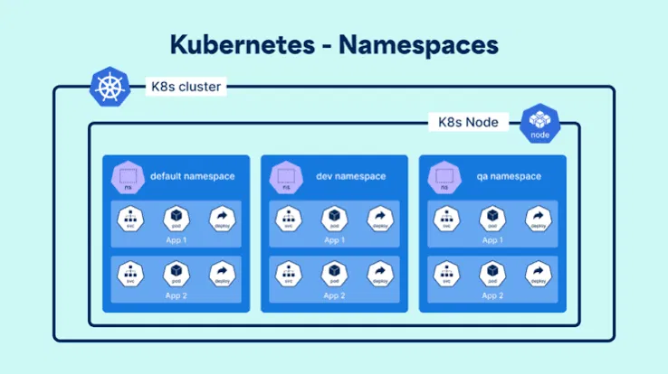

<div align="center">

</div>

# Namespaces

## Table of Contents
- [Overview](#overview)
- [1. Default Namespaces](#1-default-namespaces)
- [2. Namespace Commands](#2-namespace-commands)
- [3. Declarative Namespace Creation](#3-declarative-namespace-creation)
- [4. Namespaced vs. Cluster-Scoped Resources](#4-namespaced-vs-cluster-scoped-resources)

---

## Overview

A **namespace** is a virtual cluster inside your one physical cluster — a way to divide resources between multiple users, teams, or environments (`dev`, `qa`, `prod`), without needing separate physical clusters. Resources inside different namespaces can even share the same name, as long as the namespace differs.

<div align="center">

</div>

As the diagram shows: the same app structure (`Service` → `Pod` → `Deployment`) can exist independently inside `default`, `dev`, and `qa` namespaces on the same node, fully isolated from each other by name.

---

## 1. Default Namespaces

Every cluster ships with 4 built-in namespaces:

| Namespace | Purpose |
|---|---|
| `default` | Used automatically whenever no namespace is specified |
| `kube-system` | Holds the objects backing the Kubernetes control plane itself — Pods like `kube-apiserver`, `kube-proxy`, `kube-controller-manager`, `etcd`, `kube-scheduler` |
| `kube-public` | Readable by **everyone**, including unauthenticated users — used to share cluster-wide info. Notably contains the `cluster-info` ConfigMap, used during node bootstrapping (e.g. `kubeadm join`) |
| `kube-node-lease` | Holds `Lease` objects used to track node heartbeats/health |

> ⚠️ **These namespaces aren't specially protected by Kubernetes itself** — the API will generally let you delete them if you really try. In practice, doing so can seriously break your cluster (especially `kube-system`), so treat them as off-limits regardless of whether the API technically stops you.

---

## 2. Namespace Commands

**Viewing:**
```bash
kubectl get namespaces
kubectl get ns
```

**Creating:**
```bash
kubectl create namespace <namespace-name>
```

**Working with a specific namespace:**
```bash
kubectl get pods -n <namespace-name>
kubectl run <pod-name> --image=<image-name> --namespace=<namespace-name>
kubectl apply -f <resource.yaml> -n <namespace-name>
```

**Across all namespaces:**
```bash
kubectl get pods --all-namespaces
kubectl get services --all-namespaces
kubectl get rs --all-namespaces
kubectl get all --all-namespaces
```

**Setting your default namespace** (so you don't need `-n` on every command):
```bash
kubectl config set-context --current --namespace=<namespace-name>
```

**Checking which namespace/context is currently active:**
```bash
kubectl config get-contexts
```

**Deleting:**
```bash
kubectl delete ns <namespace-name>
```

**Generating a namespace's YAML without creating it (dry run):**
```bash
kubectl create namespace <namespace-name> --dry-run=client -o yaml > namespace.yaml
```

---

## 3. Declarative Namespace Creation

```yaml
apiVersion: v1
kind: Namespace
metadata:
  name: development-namespace
  labels:
    env: development
---
apiVersion: v1
kind: Pod
metadata:
  name: nginx-pod-2
  namespace: development-namespace
spec:
  containers:
    - name: cont-1
      image: nginx:kube
```

> ⚠️ **The `namespace:` field on the Pod must exactly match the `Namespace` object's `name`** — a typo here is a very easy way to end up with a Pod silently targeting a namespace that doesn't exist (or the wrong one).

---

## 4. Namespaced vs. Cluster-Scoped Resources

Not every resource lives inside a namespace — some are **cluster-scoped** and exist independently of any of them (the `Namespace` object itself, `Node`, `PersistentVolume`, `StorageClass`, `ClusterRole`/`ClusterRoleBinding`, and others).

To check which category a resource falls into, straight from your cluster:
```bash
kubectl api-resources --namespaced=true   # everything scoped to a namespace
kubectl api-resources --namespaced=false  # everything cluster-wide
```

<style>
body {font-size: 16px; line-height: 1.6;}
</style>