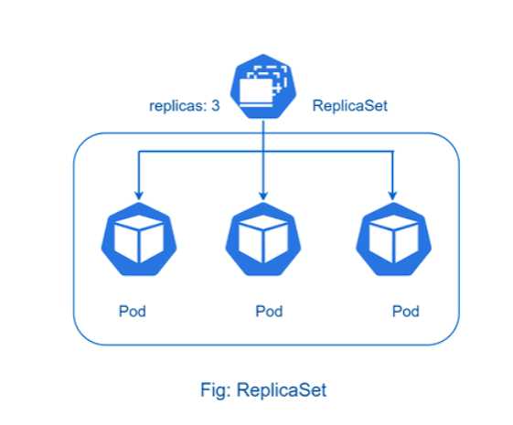

<div align="center">

</div>

# ReplicaSet & ReplicationController

## Table of Contents
- [Overview](#overview)
- [1. ReplicaSet vs. ReplicationController](#1-replicaset-vs-replicationcontroller)
- [2. ReplicaSet YAML Example](#2-replicaset-yaml-example)
- [3. ReplicaSet Commands](#3-replicaset-commands)
- [4. A Note on How These Fit with Deployments](#4-a-note-on-how-these-fit-with-deployments)

---

## Overview

A **ReplicaSet (RS)** is a controller that ensures a **specified number of identical Pod replicas** are running at any given time — if a Pod dies, the ReplicaSet notices and creates a replacement; if there are too many, it removes the extras.

<div align="center">

</div>

---

## 1. ReplicaSet vs. ReplicationController

**ReplicaSet (RS)** is the modern successor to the older **ReplicationController (RC)** — they solve the exact same problem, but RS is strictly more capable:

| | ReplicationController (RC) | ReplicaSet (RS) |
|---|---|---|
| Status | Legacy, largely superseded | Current standard |
| Selector type | **Equality-based only** (`key: value`) | **Equality-based *and* set-based** (`In`, `NotIn`, `Exists`) |
| API | `v1`, `kind: ReplicationController` | `apps/v1`, `kind: ReplicaSet` |
| Typically used directly? | Rarely, even historically | Rarely — see [Section 4](#4-a-note-on-how-these-fit-with-deployments) |

> In practice, you'll almost never write a `ReplicationController` YAML today — it's covered here mainly for context, since ReplicaSet exists specifically to replace it with more flexible selectors.

---

## 2. ReplicaSet YAML Example

```yaml
apiVersion: apps/v1
kind: ReplicaSet
metadata:
  name: nginx-rs
  labels:
    env: dev-rs
spec:
  replicas: 3
  selector:
    matchLabels:
      env: dev
  template:
    metadata:
      name: nginx # ignored — Pod names are generated, not taken from here
      labels:
        env: dev
        tier: frontend
    spec:
      containers:
        - name: nginx-pod
          image: nginx:kube
```

> **Pod naming:** the Pods this ReplicaSet creates are named `<replicaset-name>-<random-suffix>` (e.g. `nginx-rs-8f2xk`) — the `metadata.name` you write inside `template` is not actually used for the Pod's name.

---

## 3. ReplicaSet Commands

| Command | What it does |
|---|---|
| `kubectl get replicasets` | Lists ReplicaSets in the **current** namespace |
| `kubectl get replicasets --all-namespaces` | Lists ReplicaSets across **every** namespace |
| `kubectl describe replicaset <replicaset-name>` | Full details and recent events for one ReplicaSet |
| `kubectl scale replicaset <replicaset-name> --replicas=<n>` | Rescales it imperatively from the command line |
| `kubectl delete replicaset <replicaset-name>` | Deletes it (and, by default, the Pods it manages) |

> You can also rescale declaratively — just change `replicas:` in the YAML and re-`apply` it. Same result, but trackable in version control.

---

## 4. A Note on How These Fit with Deployments

In real-world use, you'll rarely create a `ReplicaSet` directly. Instead, you create a **`Deployment`**, and the Deployment creates and owns a ReplicaSet *for you* — which in turn creates the actual Pods:

```
Deployment  →  owns  →  ReplicaSet  →  owns  →  Pods
```

The Deployment adds the features that make this manageable in practice — rolling updates, rollback history, and pause/resume — by creating a **new ReplicaSet** for every version of your app and shifting traffic between old and new ones. A bare ReplicaSet, on its own, has no concept of "versions" at all; it only ever keeps the replica count of one single Pod template correct.

<style>
body {font-size: 16px; line-height: 1.6;}
</style>