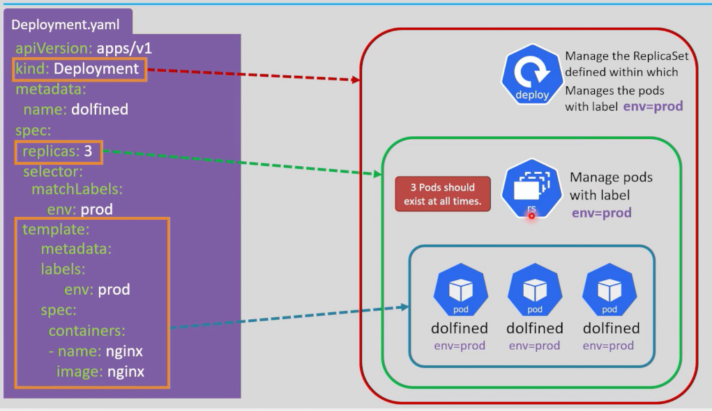
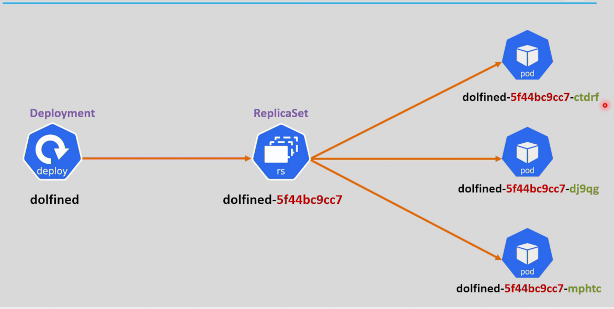

<div align="center">

</div>

# Deployment

## Table of Contents
- [Overview](#overview)
- [1. Declarative YAML Example](#1-declarative-yaml-example)
- [2. Naming Convention](#2-naming-convention)
- [3. Deployment Commands](#3-deployment-commands)
- [4. Rollouts: Strategy, History & Rollback](#4-rollouts-strategy-history--rollback)

---

## Overview

**Deployment = ReplicaSet + Controller + Rollout.**

A Deployment doesn't manage Pods directly — it manages a **ReplicaSet**, which in turn manages the Pods. What the Deployment adds on top of a bare ReplicaSet is exactly the third piece of that formula: **rollout behavior** — controlled, trackable updates to your app, with history and rollback built in (covered in [Section 4](#4-rollouts-strategy-history--rollback)).

```
Deployment  →   ReplicaSet  →  Pods
```

---

## 1. Declarative YAML Example

```yaml
apiVersion: apps/v1
kind: Deployment
metadata:
  name: deployment-test-1
  labels:
    env: dev
spec:
  replicas: 3
  selector:
    matchLabels:
      tier: frontend
  template:
    metadata:
      labels:
        tier: frontend
    spec:
      containers:
        - name: nginx
          image: nginx
```




---

## 2. Naming Convention


> The `<template-hash>` in the ReplicaSet's name is exactly what changes every time you update the Pod template — it's how a Deployment creates a **new** ReplicaSet per version instead of reusing the old one (more on this in Section 4).

---

## 3. Deployment Commands

| Command | What it does |
|---|---|
| `kubectl create deployment <name> --image=<image> --replicas=<n>` | Creates a Deployment imperatively |
| `kubectl get deploy` | Lists Deployments in the current namespace |
| `kubectl get deployments --all-namespaces` | Lists Deployments across every namespace |
| `kubectl describe deployment <name>` | Full details and recent events |
| `kubectl scale deployment <name> --replicas=<n>` | Rescales it imperatively |
| `kubectl delete deployment <name>` | Deletes the Deployment (and its ReplicaSet + Pods) |

---

## 4. Rollouts: Strategy, History & Rollback

This is the part that makes a Deployment more than "a ReplicaSet with extra steps."

### Update Strategy

Controlled by `spec.strategy`, this decides **how** Pods get replaced when you update the template:

| Strategy | Behavior |
|---|---|
| `RollingUpdate` (default) | Gradually replaces old Pods with new ones — some downtime-free overlap, controlled by `maxSurge`/`maxUnavailable` |
| `Recreate` | Kills **all** old Pods first, then creates the new ones — simpler, but causes downtime |

```yaml
spec:
  strategy:
    type: RollingUpdate
    rollingUpdate:
      maxSurge: 1          # at most 1 extra Pod above `replicas` during the rollout
      maxUnavailable: 0    # never drop below `replicas` available Pods during the rollout
```

### Triggering & Watching a Rollout

Any change to `spec.template` (image, env vars, labels, etc.) triggers a new rollout automatically on `kubectl apply`. You can also trigger just an image update directly:

```bash
kubectl set image deployment/<name> <container-name>=<new-image>
```

```bash
kubectl rollout status deployment/<name>
# streams live progress until the rollout finishes (or fails)
```

### History & Rollback

Every rollout is recorded as a numbered revision, exactly like Helm's release revisions:

```bash
kubectl rollout history deployment/<name>
# lists every past revision

kubectl rollout history deployment/<name> --revision=2
# shows exactly what changed in that specific revision

kubectl rollout undo deployment/<name>
# rolls back to the previous revision

kubectl rollout undo deployment/<name> --to-revision=2
# rolls back to a specific revision
```

### Pausing Mid-Rollout

Useful for making several template changes without triggering a rollout after each one:

```bash
kubectl rollout pause deployment/<name>
# ...make multiple changes...
kubectl rollout resume deployment/<name>
# triggers a single rollout with all the accumulated changes
```

<style>
body {font-size: 16px; line-height: 1.6;}
</style>