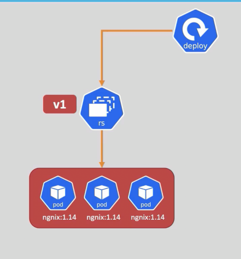
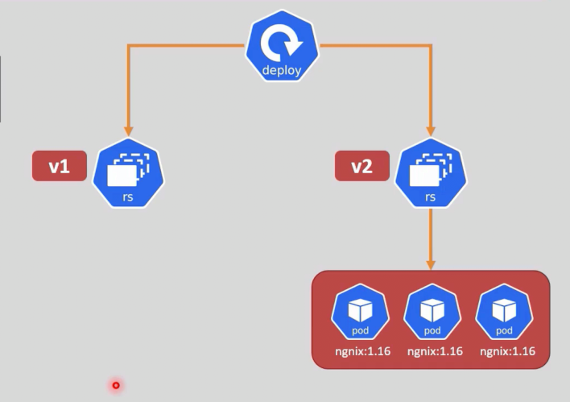

<div align="center">

</div>

# Rollout and Scaling

## Table of Contents
- [Overview](#overview)
- [1. Scaling a Deployment](#1-scaling-a-deployment)
- [2. Rolling Out an Update](#2-rolling-out-an-update)
- [3. Rollout History](#3-rollout-history)
- [4. Rolling Back a Deployment](#4-rolling-back-a-deployment)
- [5. Pause & Resume](#5-pause--resume)

---

## Overview

Scaling and rolling out an update are two **completely different operations** on a Deployment, even though both end with different Pods running than before:

| | Changes replica **count** | Creates a **new ReplicaSet** | Creates a rollout **revision** |
|---|---|---|---|
| **Scaling** | ✅ Yes | ❌ No — same ReplicaSet, just more/fewer Pods | ❌ No |
| **Rolling out an update** | Not necessarily | ✅ Yes — a brand-new ReplicaSet, matching the new Pod template | ✅ Yes |

---

## 1. Scaling a Deployment

```bash
kubectl scale deployment <deploy-name> --replicas=<new-number>
```

> **Scaling does not create a new ReplicaSet.** It's the exact same ReplicaSet, just told to run a different number of Pods. Nothing about the Pod template (image, env vars, etc.) changes, so there's nothing to roll out — no new revision is recorded.

---

## 2. Rolling Out an Update

Unlike scaling, changing the **Pod template** — most commonly the image — is what actually triggers a rollout:

```bash
kubectl set image deployment/<deployment-name> <container-name>=<new-image-name>:<tag>
```

> ⚠️ You'll sometimes see this written with a `--record` flag — **that flag is deprecated and shouldn't be used anymore.** To record *why* you made a change (visible later in `rollout history`), use an annotation instead:
> ```bash
> kubectl annotate deployment <deployment-name> kubernetes.io/change-cause="updated image to v2"
> ```

**What actually happens when you update the image:**
1. A **new ReplicaSet** is created, matching the new Pod template.
2. Pods are shifted from the old ReplicaSet to the new one, following the rollout strategy (`RollingUpdate` by default).
3. The **old ReplicaSet is scaled down to 0 Pods — but not deleted**. It's kept around specifically so a rollback has something to restore.

> Old, scaled-to-zero ReplicaSets aren't kept forever: only the most recent ones, up to `spec.revisionHistoryLimit` (**default: 10**), are retained. Beyond that limit, the oldest ones are garbage-collected automatically.

---

## 3. Rollout History

```bash
kubectl rollout history deployment/<deployment-name>
```

Lists every retained revision, along with the `CHANGE-CAUSE` column — populated from the `kubernetes.io/change-cause` annotation, if you set one.

```bash
kubectl rollout history deployment/<deployment-name> --revision=<n>
```

Shows the exact Pod template (image, env vars, etc.) that specific revision used.

---

## 4. Rolling Back a Deployment

```bash
kubectl rollout undo deployment/<deployment-name>
# rolls back to the immediately previous revision

kubectl rollout undo deployment/<deployment-name> --to-revision=<revision-number>
# rolls back to a specific, named revision
```

Under the hood, a rollback is really just another rollout — it scales the old (still-retained) ReplicaSet back up and scales the current one down to 0, using the same rollout strategy as any other update.

```bash
kubectl rollout status deployment/<deployment-name>
```

Streams live progress of whichever rollout is currently in flight — an update or a rollback — until it finishes successfully or fails.

---

## 5. Pause & Resume

Useful when you need to make **several** changes to a Deployment without triggering a separate rollout after each one:

```bash
kubectl rollout pause deployment/<deployment-name>
# make multiple changes here — image, replicas, env vars, etc.
# none of them trigger a rollout yet, they just queue up

kubectl rollout resume deployment/<deployment-name>
# now triggers a single rollout with all the accumulated changes at once
```


## Full Example

### First create a Deployment with 3 replicas of nginx:1.14

```yaml
apiVersion: apps/v1
kind: Deployment
metadata:
  name: nginx-1
  labels:
    env: dev
spec:
    replicas: 3
    selector:
        matchLabels:
        env: dev
    template:
        metadata:
            labels:
                env: dev
        spec:
            containers:
            - name: nginx
              image: nginx:1.14
```



### Now update the image to nginx:1.16
```bash
#                 V Deployment name   V Container name=new image:tag  
kubectl set image deployment/nginx-1 nginx=nginx:1.16
```



### Notes:
> After the update, a new ReplicaSet is created for the new image, and the old ReplicaSet is scaled down to 0 and not deleted.
>
> The rollout strategy determines how the Pods are shifted from the old ReplicaSet to the new one.
>
> It keeps the old Replicasets because they are needed for rollback.
>
> The old ReplicaSets are kept up to the limit specified in `spec.revisionHistoryLimit` (default is 10).


<style>
body {font-size: 16px; line-height: 1.6;}
</style>