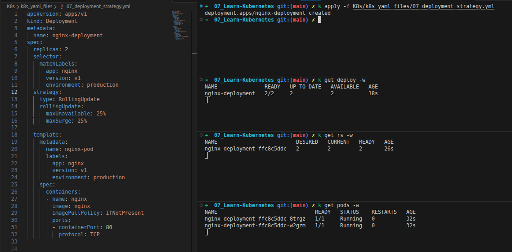
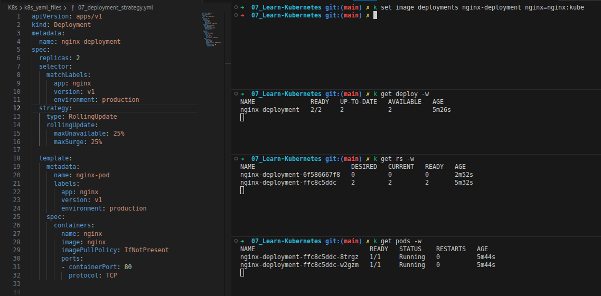
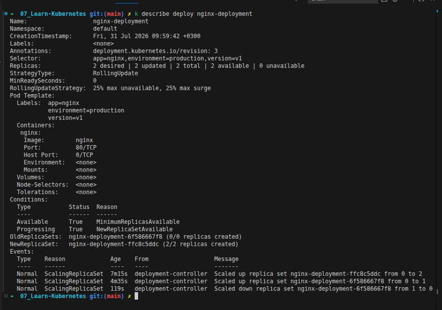
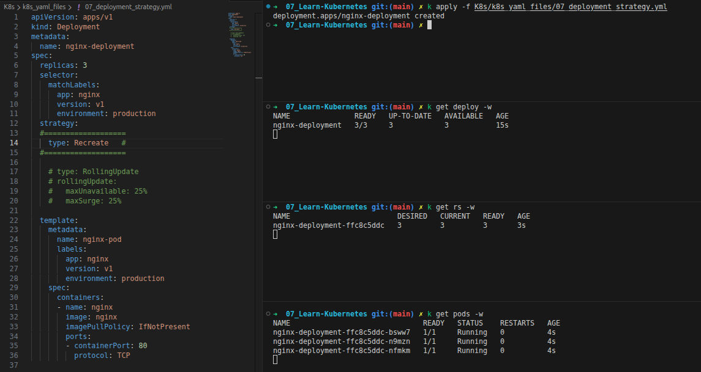
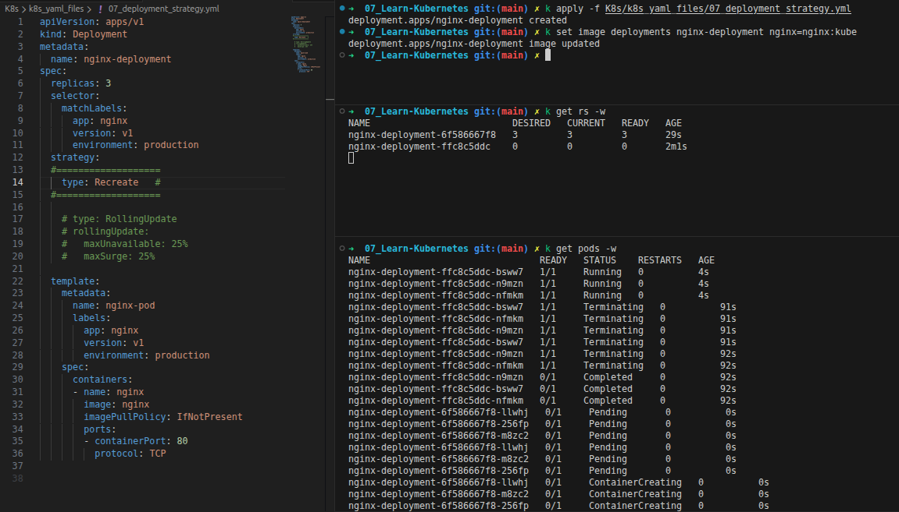
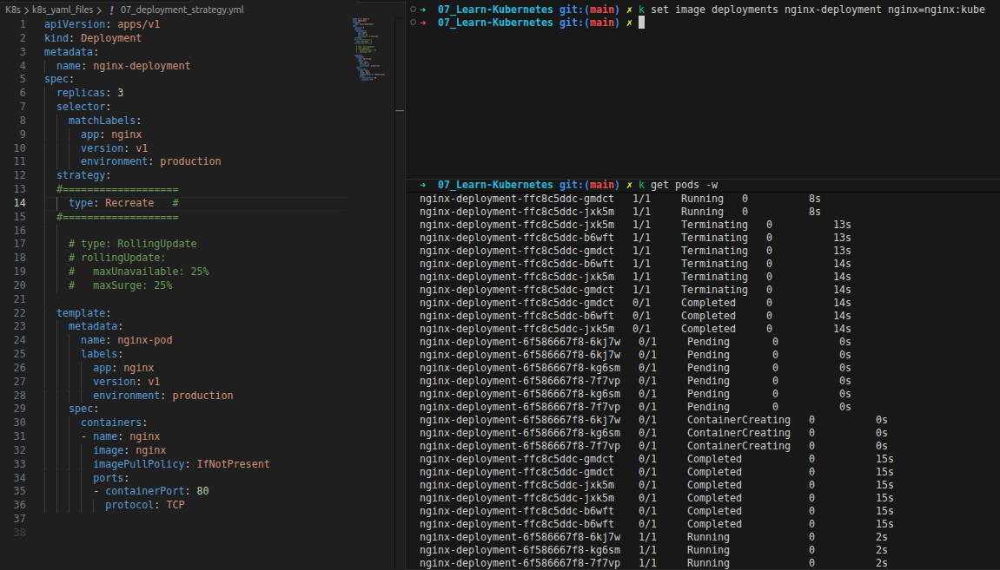

<div align="center">

</div>

# Rollout Strategies

## Table of Contents
- [Overview](#overview)
- [1. RollingUpdate Strategy](#1-rollingupdate-strategy)
  - [Live Walkthrough](#rolling-update-live-walkthrough)
- [2. Recreate Strategy](#2-recreate-strategy)
  - [Live Walkthrough](#recreate-live-walkthrough)
- [3. YAML Reference](#3-yaml-reference)

---

## Overview

`spec.strategy.type` decides **how** a Deployment replaces old Pods with new ones whenever the Pod template changes. There are two options: `RollingUpdate` (the default, gradual and zero-downtime) and `Recreate` (all-at-once, with downtime). Both are demonstrated below with real `kubectl` output.

---

## 1. RollingUpdate Strategy

```yaml
spec:
  strategy:
    type: RollingUpdate
    rollingUpdate:
      maxSurge: 25%       # extra pods allowed above the desired count during the rollout (default: 25%)
      maxUnavailable: 25% # pods allowed to be unavailable during the rollout (default: 25%)
```

**Worked example — 4 replicas, both set to 25%:**
- `maxSurge`: 25% of 4 = **1 extra pod** → up to 5 pods can exist at once during the rollout
- `maxUnavailable`: 25% of 4 = **1 pod** → at least 3 pods must stay available at all times

So Kubernetes can create 1 new pod ahead of schedule, and tolerate 1 pod being down — replacing the rest gradually, a few at a time, until all 4 are on the new version.

### Rolling Update — Live Walkthrough

**Step 1 — Apply the Deployment (2 replicas in this run):**
```bash
kubectl apply -f K8s/k8s_yaml_files/07_deployment_strategy.yml
```
<div align="center">

</div>

Straightforward baseline: one ReplicaSet (`nginx-deployment-ffc8c5ddc`) at `2/2`, two Pods `Running`. Nothing is rolling out yet — this is just the initial creation.

**Step 2 — Trigger an update:**
```bash
kubectl set image deployments nginx-deployment nginx=nginx:kube
```
<div align="center">

</div>

Now there are **two ReplicaSets**: the original `ffc8c5ddc` still sitting at `2/2/2`, and a new one, `6f586667f8`, showing `0/0/0` at the moment of this snapshot. Two prior guesses at why (image not pullable at all, then image not loaded into Minikube's Docker daemon) both turned out to be wrong — the image *was* built and loaded directly inside Minikube's Docker environment. With that ruled out, pinpointing the exact cause from these screenshots alone isn't really possible: the `Events` in the next step confirm the new ReplicaSet did briefly reach 1 Pod before being scaled back to 0, but *why* that Pod never became `Ready` (crash loop, failing readiness probe, something else entirely) isn't something `kubectl get rs -w` or `kubectl get deploy -w` can show — that level of detail only shows up in `kubectl describe pod <new-pod-name>` or `kubectl logs <new-pod-name>`, run *while that specific Pod still existed*. Worth keeping in mind as a real lesson on its own: when a rollout stalls, the ReplicaSet/Deployment view tells you *that* something's wrong, but you have to drop down to the Pod itself to find out *what*.

> **Follow-up confirmation:** a later test, updating to the exact same `nginx:kube` image under the `Recreate` strategy (see [Section 2's walkthrough](#recreate-live-walkthrough)), completed cleanly — all 3 new Pods reached `Running` without any issue. That rules the image itself out as the cause of the stall above; whatever caused this particular RollingUpdate attempt to stall was something specific to that run, not the image tag.

**Step 3 — Inspect the full picture:**
```bash
kubectl describe deploy nginx-deployment
```
<div align="center">

</div>

A few things worth reading closely here:
- `Annotations: deployment.kubernetes.io/revision: 3` — three revisions have happened by this point.
- The `Events` section tells the real story in order: `ffc8c5ddc` scaled `0→2` (the original creation), then `6f586667f8` scaled `0→1` (the `nginx:kube` rollout attempt — note it only got to **1** pod, exactly matching `maxSurge: 25%` of 2), then `6f586667f8` scaled back down `1→0` — consistent with that one Pod never reaching `Ready`, for whatever reason.
- That last step is why `ffc8c5ddc` is listed as the **`NewReplicaSet`** again (`2/2 replicas created`) while `6f586667f8` shows up under `OldReplicaSets` at `0/0` — the most likely explanation is a `kubectl rollout undo` back to the original image. Since the old ReplicaSet still exists with a matching template hash, Kubernetes reactivates it directly instead of creating yet another new one.

This is a genuinely useful failure case to have seen: `maxSurge`/`maxUnavailable` limited the damage to a single extra Pod attempt, and rolling back reused the still-retained old ReplicaSet rather than rebuilding it from scratch.

---

## 2. Recreate Strategy

```yaml
spec:
  strategy:
    type: Recreate
```

All existing Pods are terminated **first**, and only then are the new ones created. This causes a brief window of full downtime, but guarantees there's never a mix of old and new Pod versions running at the same time.

### Recreate — Live Walkthrough

**Step 1 — Initial creation (3 replicas, `type: Recreate`):**
```bash
kubectl apply -f K8s/k8s_yaml_files/07_deployment_strategy.yml
```
<div align="center">

</div>

One ReplicaSet, `3/3` immediately. This step alone doesn't actually demonstrate anything Recreate-specific — a brand-new Deployment has no "old" Pods to replace yet, so the strategy only becomes visible on an *update*, which is exactly what the next step shows.

**Step 2 — Trigger an update:**
```bash
kubectl set image deployments nginx-deployment nginx=nginx:kube
```
<div align="center">

</div>

This is the clean, textbook proof of `Recreate` in action. Reading the `Pods -w` output top to bottom:
1. All **3 old Pods** (`-bsww7`, `-n9mzn`, `-nfmkm`) move to `Terminating` **together**, then `Completed` **together**.
2. Only *after* all three are gone do the **3 new Pods** (`-llwhj`, `-m8zc2`, `-256fp`) appear, all starting from `Pending` → `ContainerCreating` **together**.

Compare this to the RollingUpdate walkthrough above, where old and new Pods coexisted the entire time — here, there's a clear gap where **zero** Pods are running at all. That gap is the downtime `Recreate` trades away in exchange for never mixing app versions.

**Confirming it end-to-end:** watching a bit longer, all 3 new Pods make it all the way to `Running (1/1)` cleanly:

<div align="center">

</div>

This run also had `imagePullPolicy: IfNotPresent` set **explicitly** in the manifest — a good habit in general, since it removes any ambiguity about the default rule from [Section 4 of the Pods doc](./01_Pods.md#4-important-note-imagepullpolicy) and guarantees the local image gets used regardless of tag. With the full transition captured cleanly here, this also confirms the `nginx:kube` image itself was never the problem — it pulls, starts, and reaches `Running` without issue.

---

## 3. YAML Reference

Full manifest used throughout this walkthrough: [07_deployment_strategy.yml](../k8s_yaml_files/07_deployment_strategy.yml)

```yaml
apiVersion: apps/v1
kind: Deployment
metadata:
  name: nginx-deployment
spec:
  replicas: 4
  selector:
    matchLabels:
      app: nginx
      version: v1
      environment: production
  strategy:
    type: RollingUpdate
    rollingUpdate:
      maxUnavailable: 25%
      maxSurge: 25%
  template:
    metadata:
      name: nginx-pod
      labels:
        app: nginx
        version: v1
        environment: production
    spec:
      containers:
        - name: nginx
          image: nginx:1.14.2
          ports:
            - containerPort: 80
              protocol: TCP
```

> **On revision cleanup:** old ReplicaSets from previous rollouts aren't kept forever — see [Rollout and Scaling](./10_Rollout_and_Scaling.md#3-rollout-history) for how `revisionHistoryLimit` controls that.

<style>
body {font-size: 16px; line-height: 1.6;}
</style>