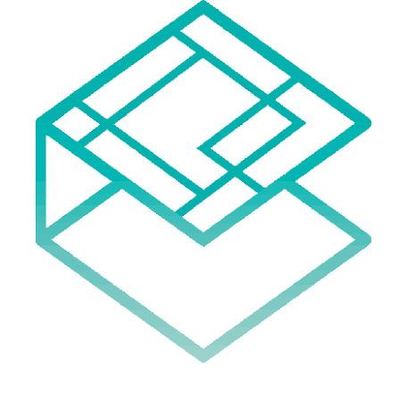
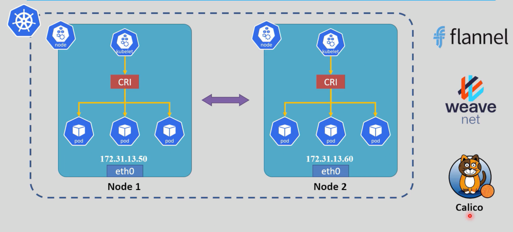
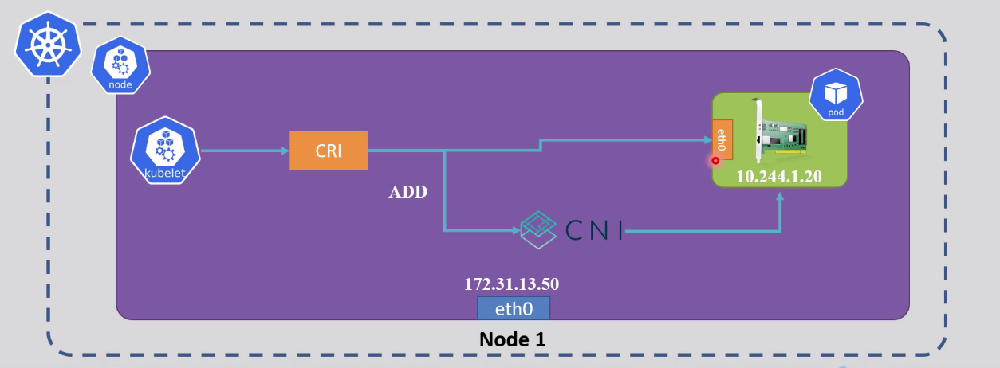
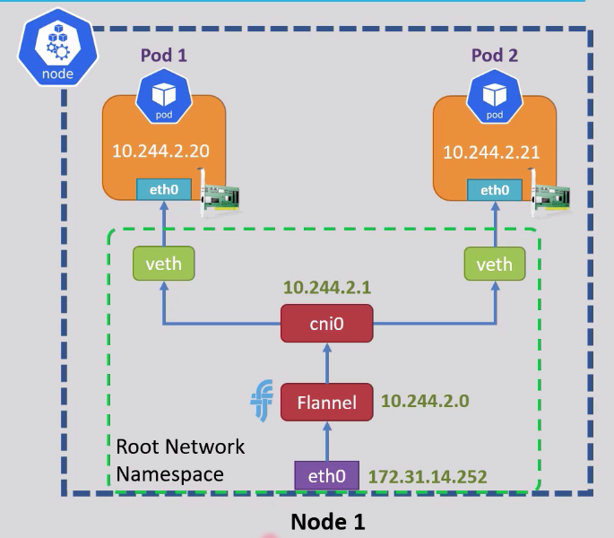
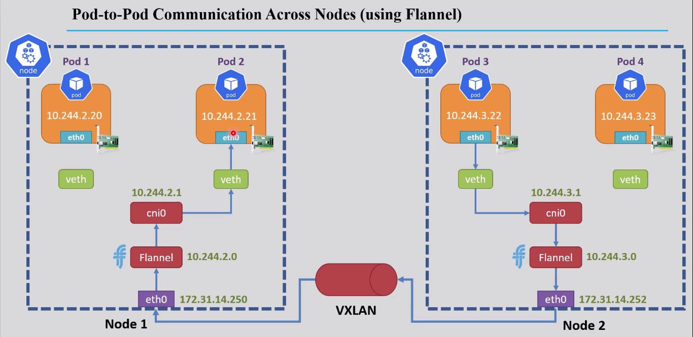

<div align="center">

</div>

# Kubernetes Networking

## Table of Contents
- [Overview](#overview)
- [1. Network Solutions](#1-network-solutions)
- [2. Architecture](#2-architecture)
  - [How CNI Assigns IP Addresses to Pods](#how-cni-assigns-ip-addresses-to-pods)
  - [CNI Components](#cni-components)
  - [Communication Routes](#communication-routes)
- [3. VXLAN Tunneling](#3-vxlan-tunneling)

---

## Overview

By default, Kubernetes Pods do not have assigned IP addresses. To enable inter-pod communication across different nodes in a cluster, a network solution must be implemented to assign IP addresses to Pods and facilitate networking connectivity.



---

## 1. Network Solutions

Kubernetes networking requires a **Container Network Interface (CNI)** plugin to manage Pod networking. Popular CNI implementations include:

- **Flannel** — Simple overlay network
- **Calico** — Policy-based networking with high performance
- **Weave Net** — Easy-to-deploy mesh network

### Default CNI Plugins

| Tool | Default CNI |
|---|---|
| kubeadm | Configured by the user (no default) |
| K3s | Flannel |

---

## 2. Architecture

### How CNI Assigns IP Addresses to Pods

The IP assignment process:

1. The kubelet manages the Pod lifecycle on a node.
2. When a Pod is created, the kubelet communicates with the CRI to create the container.
3. The CRI requests the CNI plugin to assign an IP address to the Pod.
4. For Pod deletion, the CRI requests the CNI to release the IP address before deleting the Pod.



### CNI Components

After installing a CNI plugin, the cluster includes:

| Component | Role |
|---|---|
| **Plugin IP range** | e.g., Flannel default: `10.244.x.x/24` |
| **cni0** | Bridge interface created by the CNI plugin — the default gateway for Pods |
| **veth** | Virtual ethernet pair connecting each Pod to the bridge interface |
| **eth0** | Network interface inside each Pod |



### Communication Routes

**Same-node communication:**
```
eth0 (pod-1) → veth (pod-1) → cni0 (bridge) → veth (pod-2) → eth0 (pod-2)
```

**Different-node communication:**
```
eth0 (pod-1) → veth (pod-1) → cni0 (bridge) → eth0 (node-1) → VXLAN → eth0 (node-2) → cni0 (bridge) → veth (pod-2) → eth0 (pod-2)
```

---

## 3. VXLAN Tunneling

VXLAN is a tunneling protocol that encapsulates Layer 2 Ethernet frames within Layer 4 UDP packets, enabling Pods on different nodes to communicate as if they were on the same local network. This mechanism is essential for maintaining seamless networking across the Kubernetes cluster.

**Key benefits:**
- Abstracts the underlying physical network topology
- Enables Pod-to-Pod communication across nodes
- Maintains Layer 2 semantics for containerized applications



<style>
body {font-size: 16px; line-height: 1.6;}
</style>