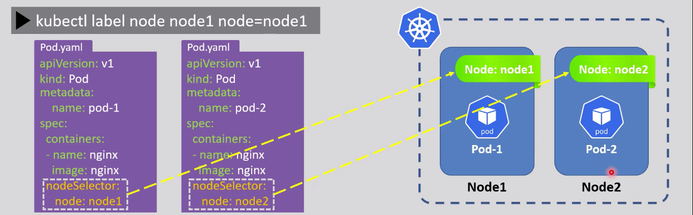

<div align="center">

</div>

# Node Selectors

## Table of Contents
- [Overview](#overview)
- [1. Label a Node](#1-label-a-node)
- [2. Assign a Pod to That Node](#2-assign-a-pod-to-that-node)
- [3. Managing Node Labels](#3-managing-node-labels)

---

## Overview

`nodeSelector` controls **which node** a Pod is allowed to be scheduled on, by matching a label on the Pod's spec against a label on the node itself.



---

## 1. Label a Node

```bash
kubectl label node <node-name> <key>=<value>
# e.g.
kubectl label node node1 node=node1
```

---

## 2. Assign a Pod to That Node

Add a matching `nodeSelector` to the Pod's spec:

```yaml
apiVersion: v1
kind: Pod
metadata:
  name: test-pod
spec:
  containers:
    - name: test-container
      image: nginx
      ports:
        - containerPort: 80
          protocol: TCP
  nodeSelector:
    # <label-key>: <label-value> — must match a label actually set on the node
    node: node1
```

This Pod will only be scheduled on a node that has the label `node=node1` — exactly matching the diagram above, where `Pod-1` (labeled `node: node1`) lands on `Node1`, and `Pod-2` (labeled `node: node2`) lands on `Node2`.

---

## 3. Managing Node Labels

```bash
# Remove a label from a node
kubectl label node node1 node-

# Show every label currently set on all nodes
kubectl get nodes --show-labels
```

> see [Node Selector Example](../k8s_yaml_files/08_node_selector.yaml) for a full example manifest.

<style>
body {font-size: 16px; line-height: 1.6;}
</style>