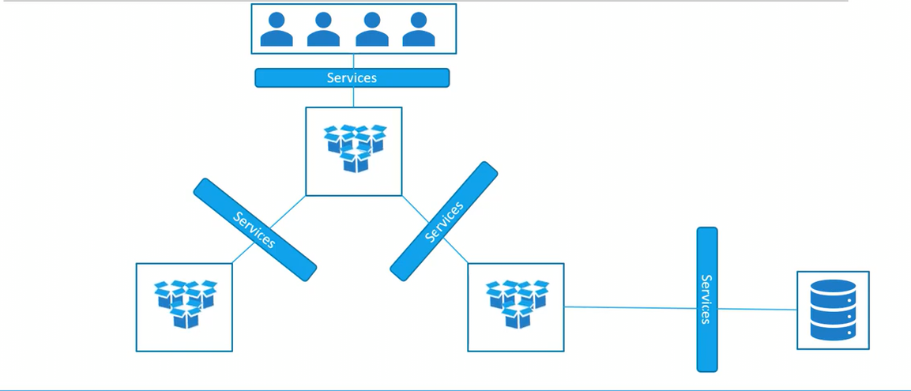
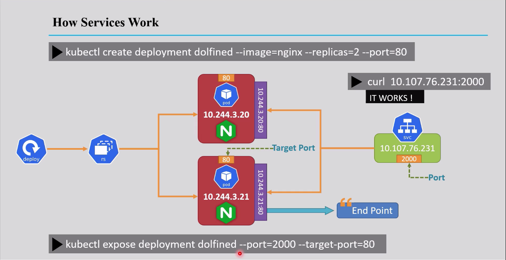
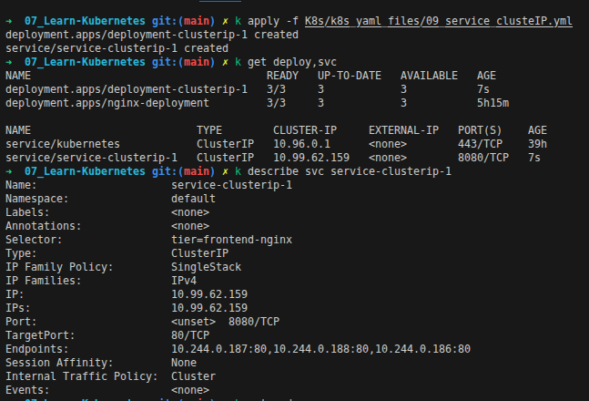
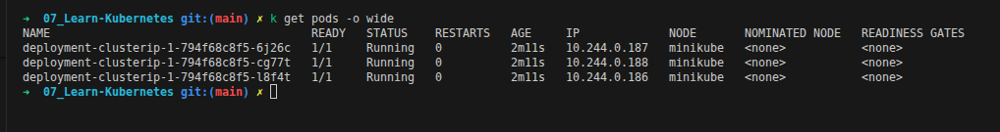
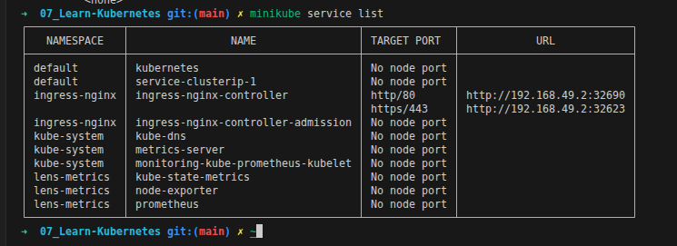
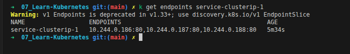

<div align="center">

</div>

# Services in Kubernetes — ClusterIP

## Table of Contents
- [Overview](#overview)
- [1. Service Types](#1-service-types)
- [2. How a Service Finds Its Pods: Endpoints](#2-how-a-service-finds-its-pods-endpoints)
- [3. Working with ClusterIP Services](#3-working-with-clusterip-services)
  - [Service Command Line Operations](#service-command-line-operations)
  - [Create a Deployment](#create-a-deployment)
  - [Create a ClusterIP Service for a Deployment](#create-a-clusterip-service-for-a-deployment)
  - [Live Walkthrough](#live-walkthrough)
  - [Limitations of ClusterIP](#limitations-of-clusterip)
- [4. Accessing the Application: 5 Different Ways](#4-accessing-the-application-5-different-ways)
- [5. Bonus: Listing Services via Minikube](#5-bonus-listing-services-via-minikube)

---

## Overview

A Kubernetes **Service** is a stable network abstraction that groups a set of Pods (matched via a label selector, see [Labels & Selectors](./05_Labels_and_Selectors.md)) and gives them one consistent way to be reached — even as individual Pods are replaced and their IPs change underneath it.

**Why a Service, specifically?** Pods are ephemeral and disposable by design — but nothing that talks to them should have to care about that. Services enable communication between different components of an application (front-end ↔ back-end, microservice ↔ microservice) without either side needing to know or track individual Pod IPs.

<div align="center">

</div>

The diagram above captures the single most important mental model for this whole topic: **any communication between two Pods, Deployments, or even an external client and the cluster, is expected to go *through* a Service** — never by talking to a Pod's IP directly. Pods come and go; the Service in front of them is the stable thing everything else depends on.

---

## 1. Service Types

Kubernetes Services come in four types — this file covers **ClusterIP**; **NodePort** and **LoadBalancer** each get their own dedicated file, linked below.

| Type | Reachable from | Typical use |
|---|---|---|
| **ClusterIP** *(default)* | Only from inside the cluster | Internal service-to-service communication — covered in this file |
| **NodePort** | `<NodeIP>:<NodePort>`, from outside the cluster | Simple external access without a cloud load balancer — see `15_Service_NodePort.md` |
| **LoadBalancer** | A dedicated external IP (if the cloud provider supports it) | Production-grade external exposure — see `16_Service_Loadbalancer.md` |
| **ExternalName** | N/A — resolves via DNS `CNAME`, no proxying involved | Mapping a Service name to an external DNS name (e.g. an external database host) |

---

## 2. How a Service Finds Its Pods: Endpoints

<div align="center">

</div>

This diagram shows the full chain for a real example (`kubectl expose deployment dolfined --port=2000 --target-port=80`):

| Term | What it means here |
|---|---|
| **Port** | `2000` — the port clients hit on the **Service's own IP** (`10.107.76.231`) |
| **Target Port** | `80` — the port traffic gets forwarded to on each **matching Pod** |
| **Endpoint** | The live, constantly-updated list of `<Pod-IP>:<TargetPort>` pairs currently backing this Service (here: `10.244.3.20:80` and `10.244.3.21:80`) |

Kubernetes maintains this list automatically in an `Endpoints` (or `EndpointSlice`) object — every time a matching Pod is created, removed, or fails its readiness check, this list updates, and the Service starts/stops routing to it accordingly. You can inspect it directly:

```bash
kubectl get endpoints <service-name>
```

> ⚠️ **`Endpoints` is deprecated as of Kubernetes 1.33+** in favor of `discovery.k8s.io/v1 EndpointSlice` (you'll see a warning about this directly in the command's output on newer clusters). The classic `Endpoints` object still works and still shows the same information for a small Service like this, but `EndpointSlice` is the modern, more scalable replacement — check it with:
> ```bash
> kubectl get endpointslices -l kubernetes.io/service-name=<service-name>
> ```

---

## 3. Working with ClusterIP Services

### Declarative YAML Example

```yaml
apiVersion: apps/v1
kind: Deployment
metadata:
  name: petclinic-deployment
spec:
  replicas: 3
  selector:
    matchLabels:
      app: petclinic
  template:
    metadata:
      labels:
        app: petclinic
    spec:
      containers:
        - name: petclinic
          image: karimfathy1/petclinic-app
          ports:
            - containerPort: 8080
---
apiVersion: v1
kind: Service
metadata:
  name: petclinic-service
spec:
  type: ClusterIP
  selector:
    app: petclinic # must match the Deployment's Pod labels — this is how the Service finds its Pods
  ports:
    - port: 8080        # the port clients hit on the Service's own ClusterIP
      targetPort: 8080   # the port traffic gets forwarded to on each matching Pod
```

> This is the exact same relationship covered in [Section 2](#2-how-a-service-finds-its-pods-endpoints) — `spec.selector` here is what builds the live `Endpoints` list, and `port`/`targetPort` are exactly the "Port" and "Target Port" boxes in that diagram.

Full file used throughout this section: [09_service_clusteIP.yml](../k8s_yaml_files/09_service_clusteIP.yml)

### Service Command Line Operations

```bash
kubectl get services
kubectl describe service <service-name>
kubectl delete service <service-name>
```

### Create a Deployment

```bash
kubectl create deployment <deployment-name> --image=<image-name> --port=<port-number> --replicas=<number-of-replicas>
```

**Example:**
```bash
kubectl create deployment petclinic-deployment --image=karimfathy1/petclinic-app --port=8080 --replicas=3
```

### Create a ClusterIP Service for a Deployment

```bash
kubectl expose deploy <deployment-name> --type=ClusterIP --port=<port-number> --target-port=<container-port>
```

> **Note:** the Service type defaults to `ClusterIP`, so `--type=ClusterIP` can be omitted entirely. `--target-port` is the container port traffic actually gets forwarded to.

**Example:**
```bash
kubectl expose deploy petclinic-deployment --type=ClusterIP --port=8080 --target-port=8080
```

### Live Walkthrough

**Step 1 — Apply, then check what got created:**
```bash
kubectl apply -f K8s/k8s_yaml_files/09_service_clusteIP.yml
kubectl get deploy,svc
kubectl describe svc service-clusterip-1
```

<div align="center">

</div>

Reading this real output against [Section 2](#2-how-a-service-finds-its-pods-endpoints): `service-clusterip-1` shows up with `TYPE: ClusterIP`, `CLUSTER-IP: 10.99.62.159`, and `EXTERNAL-IP: <none>` — exactly the "internal-only" behavior described earlier. The `describe` output goes further and shows the actual pieces from the diagram directly: `Selector: tier=frontend-nginx` (how it finds its Pods), `Port: 8080/TCP` and `TargetPort: 80/TCP` (the two ports from the diagram), and `Endpoints: 10.244.0.187:80, 10.244.0.188:80, 10.244.0.186:80` — the live list backing this Service, right now, for real.

**Step 2 — Confirm those Endpoint IPs are actually the Pods:**
```bash
kubectl get pods -o wide
```

<div align="center">

</div>

The 3 running Pods' IPs (`10.244.0.187`, `10.244.0.188`, `10.244.0.186`) are **exactly** the same 3 IPs from the `Endpoints:` line above — this is the direct, visible proof that a Service's Endpoints really are just "whichever Pods currently match the selector," nothing more mysterious than that.

**Step 3 — See it from Minikube's point of view:**
```bash
minikube service list
```

<div align="center">

</div>

Notice `service-clusterip-1` shows **"No node port"** and has **no URL** listed at all — compare that to `ingress-nginx-controller` right above it, which does have real URLs. This is [the ClusterIP limitation from earlier](#limitations-of-clusterip) made visible: Minikube itself has no external way to reach this Service, because there genuinely isn't one.

**Step 4 — The `Endpoints` object on its own:**
```bash
kubectl get endpoints service-clusterip-1
```

<div align="center">

</div>

Same 3 `IP:port` pairs again, plus the real deprecation warning mentioned above: `Warning: v1 Endpoints is deprecated in v1.33+; use discovery.k8s.io/v1 EndpointSlice`.

### Limitations of ClusterIP

- **Internal access only** — ClusterIP Services are reachable only from inside the cluster; no external client can reach them directly.
- **Fine for internal communication** — front-end, back-end, and database Pods in the same cluster can talk to each other over ClusterIP Services with no need to expose anything externally.
- **Limited use cases** — great for internal service-to-service traffic, but insufficient on its own for exposing an app to the outside world.
- **Needs extra components for external access** — reaching a ClusterIP Service from outside the cluster requires something else in front of it: an Ingress controller, or a `NodePort`/`LoadBalancer` Service instead.

---

## 4. Accessing the Application: 5 Different Ways

**1. From inside the cluster, using the ClusterIP Service's IP and port:**
```bash
minikube ssh
curl <ClusterIP>:<port>
```

**2. Using the Pod's own IP and port directly:**
```bash
kubectl get pods -o wide
kubectl exec -it <pod-name> -- curl <Pod-IP>:<port>
# or
minikube ssh
curl <Pod-IP>:<port>
```

**3. From inside the Pod itself:**
```bash
kubectl exec -it <pod-name> -- curl localhost:<port>
# or
minikube ssh
docker exec -it <container-id> curl localhost:<port>
```

**4. From outside the cluster, via port-forwarding the Service:**
```bash
kubectl port-forward svc/<service-name> <local-port>:<service-port>
```

**Example:**
```bash
kubectl port-forward svc/petclinic-deployment 8080:8080
```

**5. From outside the cluster, via port-forwarding the Pod directly:**
```bash
kubectl port-forward pod/<pod-name> <local-port>:<pod-port>
```

---

## 5. Bonus: Listing Services via Minikube

```bash
minikube service list
```

Prints every Service in the cluster in a nicely formatted table — including a clickable URL for any that Minikube can open directly.

<style>
body {font-size: 16px; line-height: 1.6;}
</style>