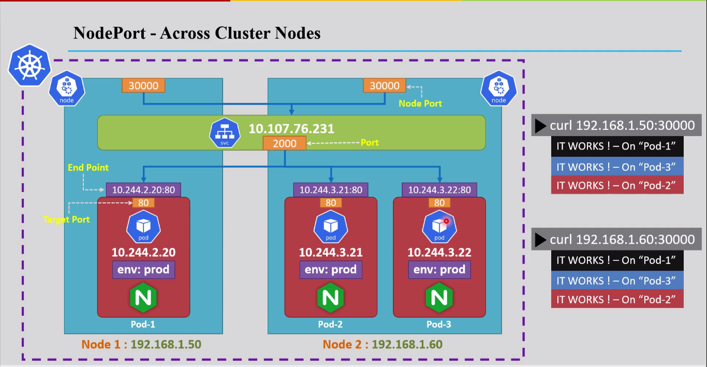
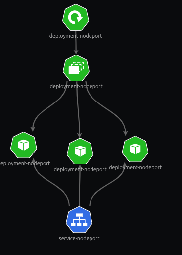
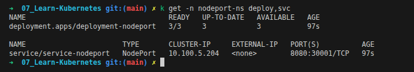
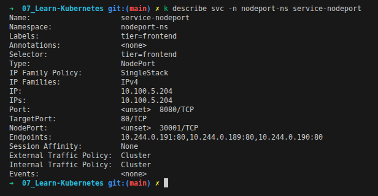
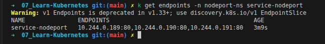
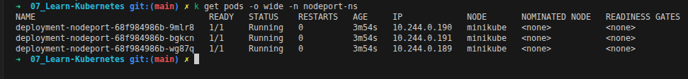

<div align="center">

</div>

# Services in Kubernetes — NodePort

## Table of Contents
- [Overview](#overview)
- [1. How NodePort Works](#1-how-nodeport-works)
- [2. Working with NodePort Services](#2-working-with-nodeport-services)
  - [Service Command Line Operations](#service-command-line-operations)
  - [Create a Deployment](#create-a-deployment)
  - [Create a NodePort Service for a Deployment](#create-a-nodeport-service-for-a-deployment)
  - [Live Walkthrough](#live-walkthrough)
  - [Limitations of NodePort](#limitations-of-nodeport)
- [3. Accessing the Application: 8 Different Ways](#3-accessing-the-application-8-different-ways)

---

## Overview

[ClusterIP](./14_Service_ClusterIP.md) solves internal Pod-to-Pod communication, but it comes with one hard limitation: **it is only reachable from inside the cluster.** There is no `<NodeIP>` or public URL that gets you to a ClusterIP Service from outside — by design.

**NodePort** is the next step up: it does everything ClusterIP does (it still creates a ClusterIP under the hood), and on top of that it opens the **same static port on every single Node's IP address** in the cluster. Any client that can reach any Node — not just the Service — can now hit the app directly, from outside the cluster, with no extra components needed.

<div align="center">

</div>

The diagram above is the mental model for this whole file: `curl <any-Node-IP>:30000` works identically no matter which Node you hit — Node 1 or Node 2 — because Kubernetes opens that same `30000` port on **every** Node and routes it to the Service, which then load-balances across whichever Pods are currently healthy, even Pods sitting on a completely different Node.

---

## 1. How NodePort Works

| Term | What it means |
|---|---|
| **NodePort** | A static port (default range **30000–32767**) opened on **every** Node's IP address in the cluster |
| **Port** | The port clients hit on the Service's own ClusterIP (same role as in a plain ClusterIP Service) |
| **Target Port** | The port traffic is forwarded to on each matching Pod |

Traffic flow for a request: `<NodeIP>:<NodePort>` → Service `<ClusterIP>:<Port>` → Pod `<PodIP>:<TargetPort>`. The `NodePort` is just an extra front door bolted onto the same ClusterIP Service covered in the previous file — the Endpoints mechanism, label selector, and load-balancing behavior all work exactly the same way underneath.

> **Note:** if `nodePort` is not specified, Kubernetes assigns one randomly from the default range. If `targetPort` is not specified, it defaults to the same value as `port`.

---

## 2. Working with NodePort Services

### Declarative YAML Example



```yaml
apiVersion: apps/v1
kind: Deployment
metadata:
  name: deployment-nodeport
  namespace: nodeport-ns
spec:
  replicas: 3
  selector:
    matchLabels:
      tier: frontend
  template:
    metadata:
      labels:
        tier: frontend
    spec:
      containers:
        - name: nginx
          image: nginx
          ports:
            - containerPort: 80
---
apiVersion: v1
kind: Service
metadata:
  name: service-nodeport
  namespace: nodeport-ns
spec:
  type: NodePort
  selector:
    # must match the Deployment's Pod labels — this is how the Service finds its Pods
    tier: frontend
  ports:
      # the port clients hit on the Service's own ClusterIP, the only mandatory port field
    - port: 8080  
      # the port traffic gets forwarded to on each matching Pod (defaults to `port` if omitted)
      targetPort: 80
      # the port opened on every Node's IP (random from 30000-32767 if omitted)
      nodePort: 30001   
```

> This is the same Service/Pod relationship covered in [the ClusterIP file](./14_Service_ClusterIP.md#2-how-a-service-finds-its-pods-endpoints) — `spec.selector` builds the live `Endpoints` list exactly as before. The only new field is `nodePort`.

Full file used throughout this section: [10_service_nodePort.yml](../k8s_yaml_files/10_service_nodePort.yml)

### Service Command Line Operations

```bash
kubectl get services
kubectl describe service <service-name>
kubectl delete service <service-name>
```

### Create a Deployment

```bash
kubectl create deployment <deployment-name> --image=<image-name> --port=<port-number> --replicas=<number-of-replicas>
```

### Create a NodePort Service for a Deployment

```bash
kubectl expose deploy <deployment-name> --type=NodePort --port=<port-number> --target-port=<container-port> --node-port=<node-port>
```

> **Note:** `--node-port` is optional — omit it and Kubernetes assigns a random port from the default range.

**Example:**
```bash
kubectl expose deployment deployment-nodeport --type=NodePort --name=service-nodeport --port=8080 --target-port=80 --node-port=30001
```

### Live Walkthrough

**Step 1 — Apply, then check what got created:**
```bash
kubectl apply -f K8s/k8s_yaml_files/10_service_nodePort.yml
kubectl get -n nodeport-ns deploy,svc
```

<div align="center">

</div>

Reading this against [Section 1](#1-how-nodeport-works): `service-nodeport` shows `TYPE: NodePort` and `PORT(S): 8080:30001/TCP` — that's `<Port>:<NodePort>` in one field, both live and reachable at the same time.

**Step 2 — Describe the Service to see the full picture:**
```bash
kubectl describe svc -n nodeport-ns service-nodeport
```

<div align="center">

</div>

Every piece from [Section 1's table](#1-how-nodeport-works) shows up directly here: `Selector: tier=frontend` (how it finds its Pods), `Port: 8080/TCP`, `TargetPort: 80/TCP`, `NodePort: 30001/TCP`, and `Endpoints: 10.244.0.191:80,10.244.0.189:80,10.244.0.190:80` — the same live Endpoints list mechanism from the ClusterIP file, just with a NodePort now sitting in front of it.

**Step 3 — Confirm the Endpoints object matches:**
```bash
kubectl get endpoints -n nodeport-ns service-nodeport
```

<div align="center">

</div>

Same 3 `IP:port` pairs as the `describe` output above, plus the same `v1 Endpoints is deprecated in v1.33+` warning covered in the ClusterIP file.

**Step 4 — Confirm those Endpoint IPs are actually the Pods:**
```bash
kubectl get pods -o wide -n nodeport-ns
```

<div align="center">

</div>

The 3 running Pods' IPs (`10.244.0.190`, `10.244.0.191`, `10.244.0.189`) are **exactly** the same 3 IPs from the `Endpoints:` line — same direct proof as before: Endpoints are just "whichever Pods currently match the selector."

### Limitations of NodePort

- **Security risk of the exposed port** — the Node's IP address becomes reachable from outside on that port, widening the attack surface; proper firewall rules and access controls matter here.
- **Port range and conflicts** — NodePort only uses the 30000–32767 range by default, and two NodePort Services cannot reuse the same port on the same Node.
- **Not built for production-grade traffic** — no advanced load balancing like an Ingress controller or a `LoadBalancer` Service provides.
- **Depends on Node IPs staying reachable** — in cloud environments where Node IPs are dynamic or private, NodePort access can become unreliable without extra networking in front of it.
- **Still creates a ClusterIP** — internal cluster communication through the Service keeps working exactly as before; NodePort only adds the external door.
- **Good fit for** — development, testing, or any case where you need simple external access without setting up an Ingress or LoadBalancer.

---

## 3. Accessing the Application: 8 Different Ways

**1. From outside the cluster, using any Node's IP and the NodePort:**
```bash
curl http://<NodeIP>:<NodePort>
# or from the browser directly: http://<NodeIP>:<NodePort>
```
> Get Node IPs with `minikube ip` (Minikube) or `kubectl get nodes -o wide` (other clusters). If using Docker Desktop directly, note it runs in an isolated VM, so this may not reach the host as expected.

**2. From inside the cluster, using the Service's ClusterIP and port:**
```bash
minikube ssh
curl <Service-ClusterIP>:<port>
```

**3. Using the Pod's own IP and port directly:**
```bash
kubectl get pods -o wide
minikube ssh
curl <Pod-IP>:<port>
```

**4. From inside the Pod itself:**
```bash
kubectl exec -it <pod-name> [-n <namespace-name>] -- curl localhost:<target-port>
```

**5. From inside a specific container in the Pod:**
```bash
kubectl exec -it <pod-name> [-n <namespace-name>] -c <container-name> -- curl localhost:<target-port>
# or
minikube ssh
docker exec -it <container-id> curl localhost:<target-port>
```

**6. From outside the cluster, via port-forwarding the Service:**
```bash
kubectl port-forward svc/<service-name> [-n <namespace-name>] <local-port>:<service-port>
```

**7. From outside the cluster, via port-forwarding the Pod directly:**
```bash
kubectl port-forward pod/<pod-name> [-n <namespace-name>] <local-port>:<pod-port>
```

**8. From the browser when using WSL:**
```bash
minikube service <service-name>
```

<style>
body {font-size: 16px; line-height: 1.6;}
</style>