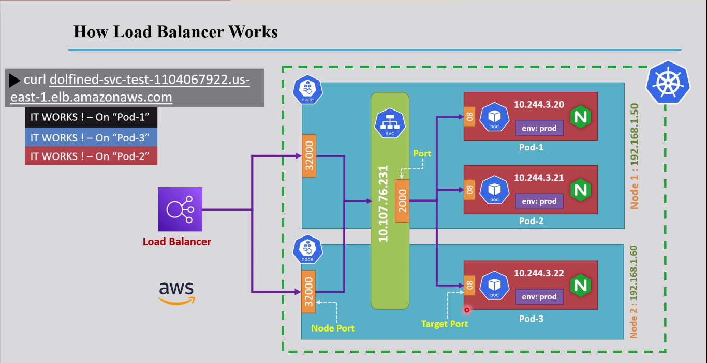
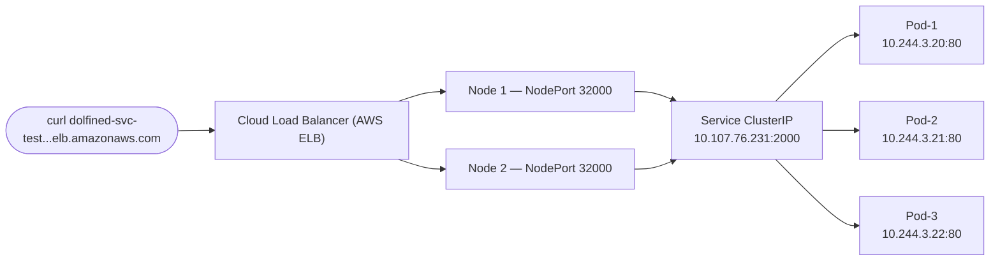
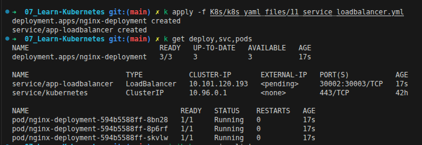
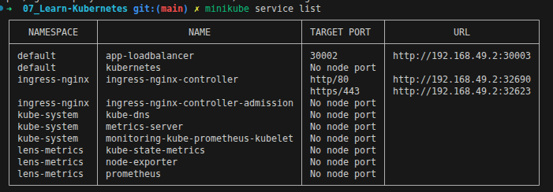
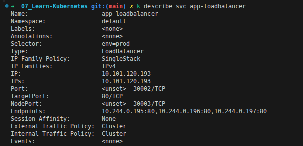
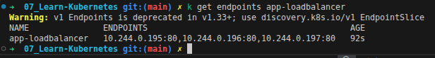
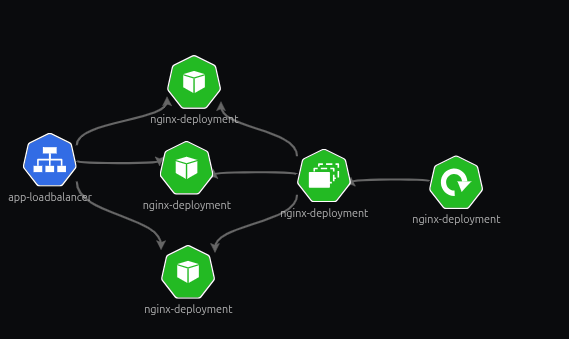

<div align="center">

</div>

# Services in Kubernetes — LoadBalancer

## Table of Contents
- [Overview](#overview)
- [1. Why NodePort Wasn't Enough](#1-why-nodeport-wasnt-enough)
- [2. How LoadBalancer Works](#2-how-loadbalancer-works)
- [3. Working with LoadBalancer Services](#3-working-with-loadbalancer-services)
  - [Service Command Line Operations](#service-command-line-operations)
  - [Create a Deployment](#create-a-deployment)
  - [Create a LoadBalancer Service for a Deployment](#create-a-loadbalancer-service-for-a-deployment)
  - [Live Walkthrough](#live-walkthrough)
  - [Bonus: Visualizing with KubeView](#bonus-visualizing-with-kubeview)
  - [Limitations of LoadBalancer](#limitations-of-loadbalancer)
- [4. Accessing the Application](#4-accessing-the-application)
- [5. Where This Leaves Us: Why Ingress?](#5-where-this-leaves-us-why-ingress)

---

## Overview

A **LoadBalancer** Service is Kubernetes' way of asking the underlying cloud provider (AWS, GCP, Azure, ...) to provision a **real, external load balancer** in front of the cluster, and wire it up automatically so it forwards traffic all the way down to the right Pods.

It's not a replacement for `ClusterIP` or `NodePort` — it's built **on top of both**: every `LoadBalancer` Service still gets a `ClusterIP` internally, and it still opens a `NodePort` on every Node exactly like the previous file. The only new thing is the cloud provider's external load balancer sitting in front of that `NodePort`, giving clients one single stable external address instead of a list of Node IPs to guess between.

---

## 1. Why NodePort Wasn't Enough

[NodePort](./15_Service_NodePort.md) does get traffic in from outside the cluster — but it hands you a raw deal in return:

- Clients need to know an **actual Node IP**, which in the cloud can be private, dynamic, or simply not meant to be public.
- The exposed port is stuck in the ugly **30000–32767** range — nobody wants to send people to `http://34.201.10.5:31840`.
- There's no single stable address: if a Node dies or is replaced, whatever IP clients were using is gone.
- Nothing is spreading traffic intelligently across Nodes — a client hitting one Node's port has no idea if that Node is overloaded while another sits idle.

This is exactly the gap a `LoadBalancer` Service closes: instead of a client aiming at a random Node, they aim at **one address that a cloud load balancer owns**, and that load balancer takes care of spreading traffic across every Node's NodePort behind the scenes.

---

## 2. How LoadBalancer Works

<div align="center">

</div>



Reading the diagram end to end: the client only ever knows **one DNS name** — the load balancer's. The load balancer picks a healthy Node and hits its `NodePort` (`32000` here), which forwards into the Service's `ClusterIP:Port` (`10.107.76.231:2000`), which then load-balances across whichever Pods are currently healthy — even a Pod sitting on a completely different Node than the one the client's request originally landed on.

> **Note:** the client never sees `32000`, the Node IPs, or the Pod IPs at all — every one of those is an internal implementation detail the load balancer and the Service hide from the outside world.

---

## 3. Working with LoadBalancer Services

### Declarative YAML Example

```yaml
apiVersion: apps/v1
kind: Deployment
metadata:
  name: nginx-deployment
spec:
  replicas: 3
  selector:
    matchLabels:
      env: prod
  template:
    metadata:
      labels:
        env: prod
    spec:
      containers:
        - name: nginx
          image: nginx
          ports:
            - containerPort: 80
---
apiVersion: v1
kind: Service
metadata:
  name: app-loadbalancer
spec:
  type: LoadBalancer
  selector:
    env: prod # must match the Deployment's Pod labels — this is how the Service finds its Pods
  ports:
    - port: 30002        # the port clients hit on the Service's own ClusterIP
      targetPort: 80      # the port traffic gets forwarded to on each matching Pod (defaults to `port` if omitted)
      nodePort: 30003     # the port opened on every Node's IP (random from 30000-32767 if omitted)
```

> This is the exact same Service/Pod relationship covered in [the ClusterIP file](./14_Service_ClusterIP.md#2-how-a-services-finds-its-pods-endpoints) and [the NodePort file](./15_Service_NodePort.md#1-how-nodeport-works) — `spec.selector` still builds the live `Endpoints` list, `port`/`targetPort`/`nodePort` still mean exactly what they meant before. The only thing that actually changed is `type: LoadBalancer`.

You can see the code above in this section: [LoadBalancer - Service](../k8s_yaml_files/11_service_loadbalancer.yml)

### Service Command Line Operations

```bash
kubectl get services
kubectl describe service <service-name>
kubectl delete service <service-name>
```

### Create a Deployment

```bash
kubectl create deployment <deployment-name> --image=<image-name> --port=<port-number> --replicas=<number-of-replicas>
```

### Create a LoadBalancer Service for a Deployment

```bash
kubectl expose deploy <deployment-name> --type=LoadBalancer --port=<port-number> --target-port=<container-port>
```

**Example:**
```bash
kubectl expose deployment nginx-deployment --type=LoadBalancer --name=app-loadbalancer --port=30002 --target-port=80
```

### Live Walkthrough

**Step 1 — Apply, then check what got created:**
```bash
kubectl apply -f K8s/k8s_yaml_files/11_service_loadbalancer.yml
kubectl get deploy,svc,pods
```

<div align="center">

</div>

`nginx-deployment` comes up `3/3` ready, and `app-loadbalancer` shows up with `TYPE: LoadBalancer`, `CLUSTER-IP: 10.101.120.193`, `PORT(S): 30002:30003/TCP` — and `EXTERNAL-IP: <pending>`. That last part isn't a bug: Minikube has no real cloud provider behind it to actually hand out an external IP, so it just sits pending until something (like `minikube tunnel`) simulates one.

**Step 2 — See it from Minikube's point of view:**
```bash
minikube service list
```

<div align="center">

</div>

Compare this to [the ClusterIP walkthrough](./14_Service_ClusterIP.md#live-walkthrough), where the equivalent Service showed **no URL at all**. Here, `app-loadbalancer` shows a real, clickable `http://192.168.49.2:30003` — Minikube's own way of standing in for the cloud load balancer that a real provider like AWS would otherwise create.

**Step 3 — Describe the Service to see the full picture:**
```bash
kubectl describe svc app-loadbalancer
```

<div align="center">

</div>

Every piece from [Section 2](#2-how-loadbalancer-works) is right here: `Selector: env=prod` (how it finds its Pods), `Type: LoadBalancer`, `Port: 30002/TCP`, `TargetPort: 80/TCP`, `NodePort: 30003/TCP`, and `Endpoints: 10.244.0.195:80,10.244.0.196:80,10.244.0.197:80` — the same live Endpoints mechanism from the last two files, just with a cloud load balancer sitting in front of it now.

**Step 4 — Confirm the Endpoints object matches:**
```bash
kubectl get endpoints app-loadbalancer
```

<div align="center">

</div>

Same 3 `IP:port` pairs as the `describe` output above, plus the same `v1 Endpoints is deprecated in v1.33+` warning covered in the previous two files.

### Bonus: Visualizing with KubeView

<div align="center">

</div>

KubeView draws the same relationship visually: `app-loadbalancer` sits on one side, and it fans out to every `nginx-deployment` Pod it's currently routing to — with the Deployment and ReplicaSet that actually own those Pods shown right behind them. It's the same `Endpoints` list from the steps above, just as a graph instead of a `kubectl` command.

### Limitations of LoadBalancer

- **Cloud provider dependency** — this only works if there's a real cloud provider underneath (AWS, GCP, Azure, ...) that knows how to provision a load balancer. On-prem or unsupported environments leave the external IP `<pending>` forever, same as we saw in Minikube.
- **Cost** — every single `LoadBalancer` Service provisions its own dedicated cloud load balancer, and cloud providers charge per load balancer, per hour, regardless of traffic.
- **Provisioning time** — getting a real external IP from the cloud provider isn't instant; it can take anywhere from seconds to a few minutes.
- **One Service, one load balancer, one IP** — this is the big one: if you have 10 different apps that each need external access, that's 10 separate `LoadBalancer` Services, which means 10 separate cloud load balancers and 10 separate bills.
- **No Layer 7 routing** — a `LoadBalancer` Service only understands IPs and ports. It has no concept of a URL path (`/api` vs `/admin`) or a hostname (`api.example.com` vs `admin.example.com`) — it can't route one incoming address to different backend apps based on what's actually being requested.

---

## 4. Accessing the Application

**1. From outside the cluster, using the external IP/DNS name assigned by the cloud provider:**
```bash
curl http://<ExternalIP-or-DNS>:<port>
```

**2. From Minikube, using `minikube tunnel` to simulate a real external IP:**
```bash
minikube tunnel
kubectl get svc # EXTERNAL-IP should now show a real address instead of <pending>
```

**3. From Minikube, without a tunnel, straight from the service list:**
```bash
minikube service <service-name>
```

**4. From inside the cluster, using the Service's ClusterIP and port — same as a plain ClusterIP Service:**
```bash
minikube ssh
curl <Service-ClusterIP>:<port>
```

**5. From outside the cluster, via port-forwarding the Service — no cloud provider needed:**
```bash
kubectl port-forward svc/<service-name> <local-port>:<service-port>
```

---

## 5. Where This Leaves Us: Why Ingress?

`LoadBalancer` solves "get traffic in from outside the cluster" cleanly — but the moment there's more than one app to expose, its limitations from [above](#limitations-of-loadbalancer) start to hurt: a separate cloud load balancer (and a separate bill) per app, with zero awareness of paths or hostnames to tell those apps apart at the routing level.

What's actually needed is **one** external entry point that's smart enough to look at the incoming request — the path, the host — and decide *which* backend Service it should go to. That's precisely the gap `Ingress` fills, covered next in [17_Ingress.md](./17_Ingress.md).


<style>
body {font-size: 16px; line-height: 1.6;}
</style>