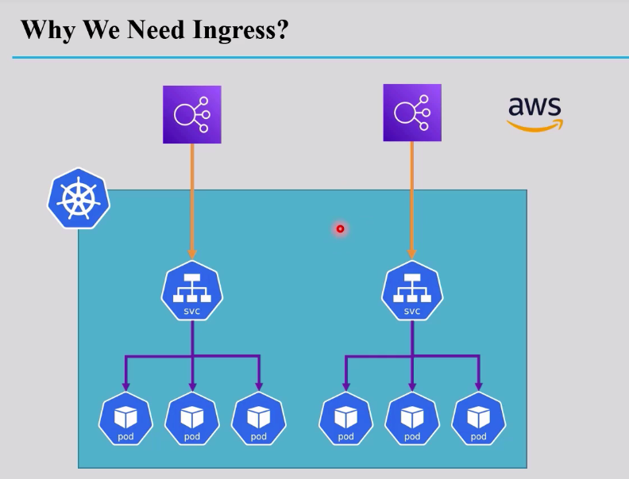
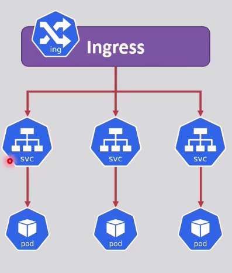
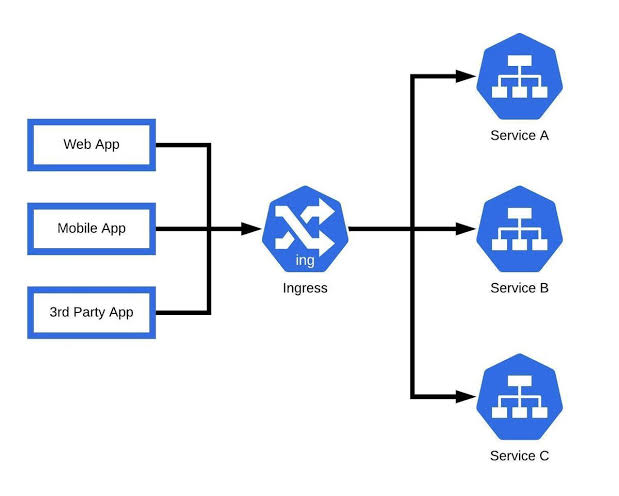
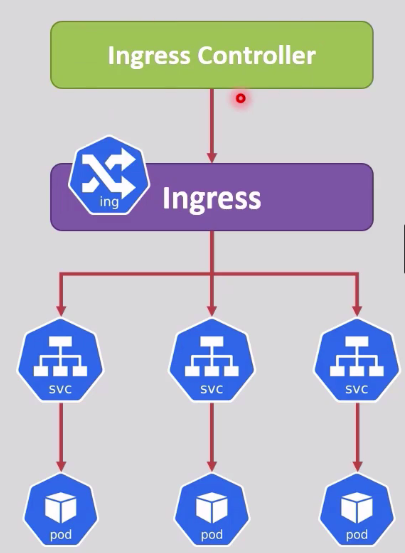
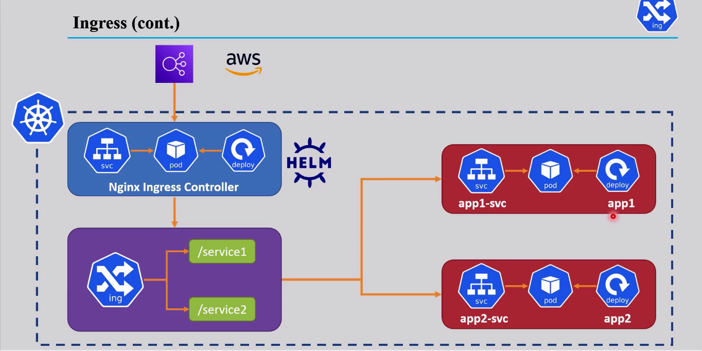
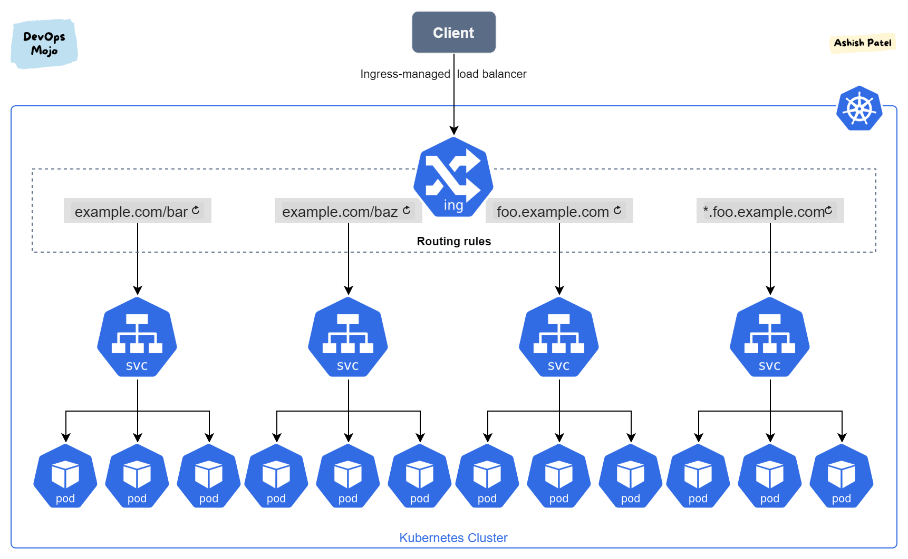
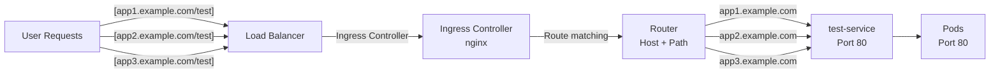

<div align="center">
  
  <h1>Ingress</h1>
</div>

## Outlines
- [The Problem](#the-problem)
- [Benefits of Using Ingress](#benefits-of-using-ingress)
- [Ingress Controller Overview](#ingress-controller-overview)
- [Advanced Routing Capabilities](#advanced-routing-capabilities)
- [Example Configuration](#example-configuration)
- [Ingress Fanout](#ingress-fanout)

---

## The Problem

For regular services, you can use a `LoadBalancer` service type to expose your application to the internet.

However, if you have multiple services that need to be exposed, you would need to create a separate LoadBalancer for each service. This can lead to increased costs and resource usage.

<div align="center">
  
</div>

---

## Benefits of Using Ingress

Ingress allows you to have multiple services under a single external IP address, reducing costs and resource usage. That means, with only one load balancer, you can route traffic to multiple services based on the request's host or path.

For instance, requests to `service1.example.com` can be routed to `service1`, while requests to `service2.example.com` can be routed to `service2` and so on.

<div align="center">
  
</div>

This also means the client side never needs to know anything about the internal structure of the cluster — a web app, a mobile app, and a third-party integration can all hit the exact same Ingress, and it's the Ingress that decides which Service each request actually belongs to.

<div align="center">
  
</div>

---

## Ingress Controller Overview

Ingress needs an `ingress controller` that is an application that runs within the cluster and configures an `HTTP loadbalancer service` according to ingress resources.

<div align="center">
  
</div>

Zooming into a real-world setup makes this a lot more concrete. Below, the entry point is a cloud LoadBalancer (AWS), which sits in front of the **Nginx Ingress Controller** — itself just another Deployment/Pod/Service running inside the cluster (here installed via **Helm**). The controller watches the `Ingress` resource, reads its routing rules (`/service1`, `/service2`, ...), and forwards each request to the matching backend Service — which then forwards it to that app's own Pods.

<div align="center">
  
</div>

> **Note:** `app1` and `app2` each keep their **own dedicated Service** behind the Ingress — the Ingress Controller is just the single shared front door that knows how to pick the right one per request.

---

## Advanced Routing Capabilities

Ingress also provides advanced routing capabilities, such as `path-based` routing and `host-based` routing, which are not available with standard LoadBalancer services.

### Example Configuration

```yaml
apiVersion: v1
kind: Service
metadata:
    name: test-service
spec:
    type: ClusterIP # preferred for ingress, only accessible within the cluster  
    selector:
        env: prod
    ports: 
        - port: 80
          targetPort: 80
---
apiVersion: networking.k8s.io/v1
kind: Ingress
metadata:
    name: app-ingress
    annotations:
      nginx.ingress.kubernetes.io/rewrite-target: / # for nginx ingress controller
      # traefik.ingress.kubernetes.io/router.entrypoints: web # for traefik
spec:  
    # ingressClassName: nginx # specify the ingress controller to use
    ingressClassName: traefik # for traefik ingress controller 
    rules: 
        - host: app.example.com
          http:
            paths:
                - pathType: Prefix # or Exact
                  path: /test # if the user writes [app.example.com/test](https://app.example.com/test), it will go to test-service
                  backend:
                    service:
                      name: test-service # must match the service name
                      port:
                        number: 80 # must match the service port
                
                - pathType: Prefix
                # and so on ...
```

---

## Ingress Fanout

Fanout is the same idea taken further: **one** Ingress, with **multiple rules** — different hosts and/or different paths — each pointing at a different backend, all still behind a single external IP.

<div align="center">
  
</div>

### Fanout YAML Example
```yaml
apiVersion: networking.k8s.io/v1
kind: Ingress
metadata:
  name: fanout-ingress
  annotations:
    nginx.ingress.kubernetes.io/rewrite-target: /
spec:
  ingressClassName: nginx # specify the ingress controller to use 
  rules:
    - host: app1.example.com
      http:
        paths:
          - pathType: Prefix
            path: /test
            backend:
              service:
                name: test-service
                port:
                  number: 80
    
    - host: app2.example.com
      http:
        paths:
          - pathType: Prefix
            path: /test
            backend:
              service:
                name: test-service
                port:
                  number: 80

    - host: app3.example.com
      http:
        paths:
          - pathType: Prefix
            path: /test
            backend:
              service:
                name: test-service
                port:
                  number: 80
```

### Flow Visualization
