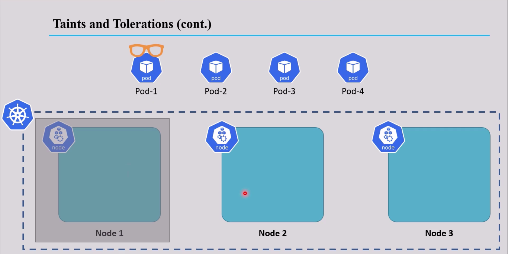
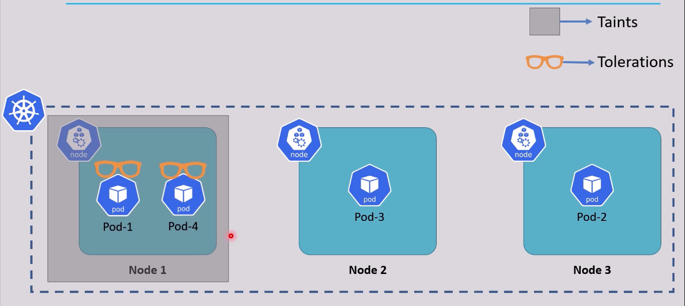
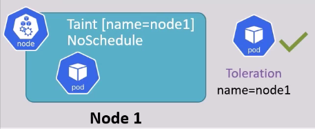
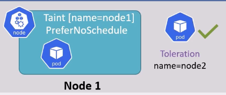
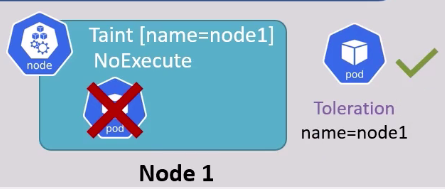
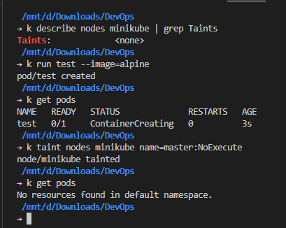

# Scheduling in K8s - Taint and Tolerations

- Scheduling in K8s is about making sure that pods are matched to nodes such that kubelet cna create/run them.
- The Kube Scheduler selects proper node with the highest score, the notify the API server about the chosen node.
```
YAML file apply -> (master-API-server) -> (master-Scheduler) -> (worker-node1,node2)? 
```
- A Scheduler watches for newly created podd that no node assigned.

- For each discoverd pod, the Scheduler works to find the best node for that pods

- The Scheduler finds feasible nodes for a pod and then scores them and picks a node with the highest score and notify the API server about it.

## There are several method for achieving scheduling in a Kubernetes clutser including:
- [Node Selector - md](./12_Node_Selectors.md) | [Node Selector - YAML](../k8s_yaml_files/08_node_selector.yaml)  
- [Labels and Selectors - md](./05_labels_selectors.md) | [Labels and Selectors - YAML](../k8s_yaml_files/01_pods.yaml)
- [Taints and Tolerations - YAML](../k8s_yaml_files/13_scheduling_taint_toleration.yaml)
- [Node Affinity](./18_Scheduling_node_affinity.md)
- [DaemonSets]


## Taint and Tolerations
- ## 👉 Let's see, if I want to assign a specific pod to a specific node:
- ## The Kube Scheduler will assign pods to node with the `highest score`, but for instanse, what if I want to put all `database pods only` in a specific node?!

> 

# 👉 To do that, first I need to mark the pod and also mark the node.
> ### only the marked pod will be assigned to the marked node 
> 


## But that doesn't meant that the tolerated pod will be only assigned to the tainted node 😕
- ### that meant, the tolerated pods just have more nodes choises    


## Taint effects:
### 1. NoSchedule
- 👉 the k8s will only allow scheduling pods that have the tolerations for the tainted nodes.
> 

### 2. PreferNoSchedule: 
- 👉 the pods can be scheduled in this node it there isn't any node accepts it, even if the pod has no tolerations for this node 
> 

### 3. NoExecute: 
- 👉 a strong effect where all previously scheduled pods will be removed and only the tolerated pods will be assigned tot this tainted node    
> 
> 


```bash
kubectl taint nodes <node-name> <taint-key>=<taint-value>:<taint-effect>
                               # key,  Operator, Value,     Effect
```
```yaml
apiVersion: v1
kind: Pod
metadata:
    name: test-toliration
spec:
    containers:
        - name: nginx
          image: nginx
          ports:
            - targetPort: 80
        tolerations:
            - key: "taint-key"
              operator: "Equal"
              value: "taint-value"
              effect: "NoSchedule"
```
> 


## How to Remove the Taint?
```bash
# kubectl taint nodes <node-name> <taint-key>=<taint-value>:<taint-effect>-
kubectl taint nodes node1 node-type=db-node:NoExcute-
```