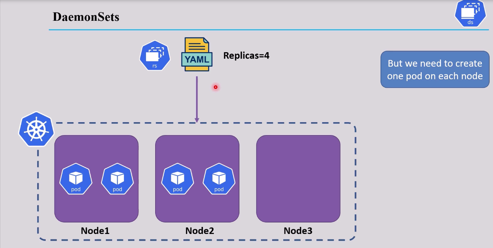
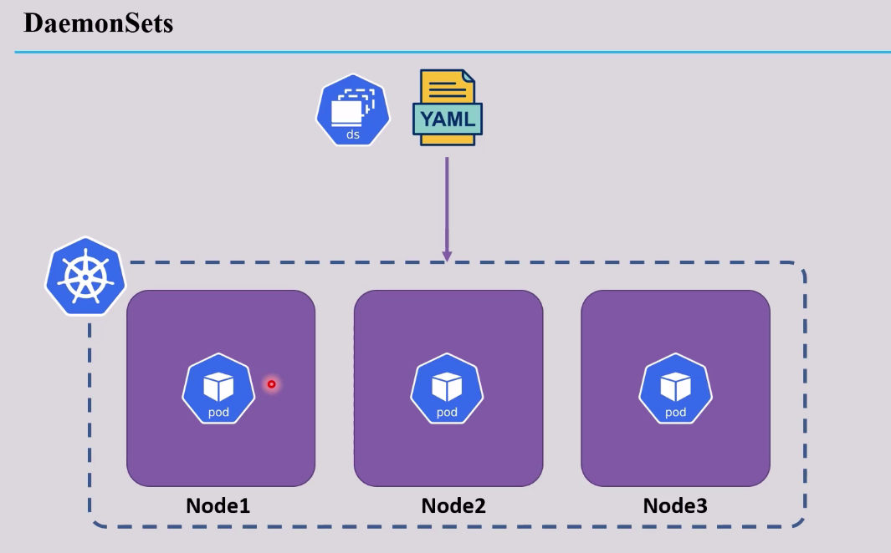

# Scheduling in K8s -  DaemonSets:

- If we created a Deployment with 4 replicas and we have 3 nodes, The scheduler may decide not to add any pods in a certain node. 
- But we need a pod of our application in each single node
>    


- Daemonset create a single pod in each single node 
- If any node was created the Daemonset will create a pod in it 
- If it was deleted the pod also will be deleted 
>    

```yaml
apiVersion: apps/v1
kind: DaemonSet
metadata:
    name: daemonset-test
spec:
    selector:
        matchLabels:
            app: daemonset-test-app
    template:
        metadata:
            name: daemonset-pod
            labels:
                app: daemonset-test-app
        spec:
            containers:
                - name: daemonset-cont
                  image: nginx
                  ports:
                    - containerPort: 80 
```
## DaemonSet UseCases:
- Used with logging and monitoring for the hosts

## DaemonSet Commands:
```bash
kubectl get daemonset # list all daemonsets
kubectl get ds

kubectl describe ds <ds-name> # ddescribe a ceratin daemonset
kubectl delete ds <ds-name> # delete a daemonset
```