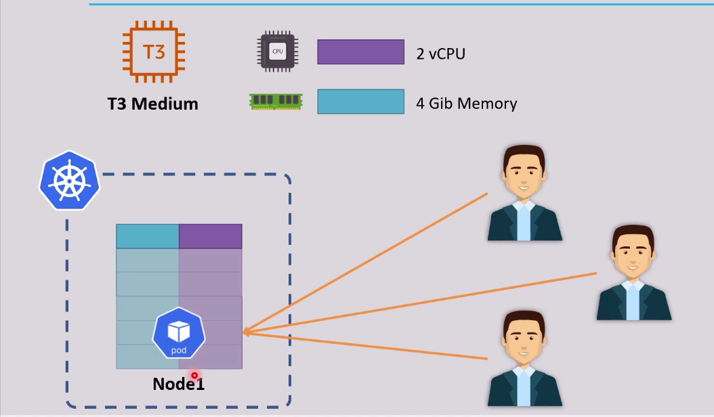
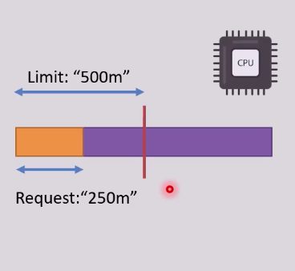
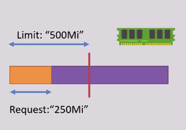
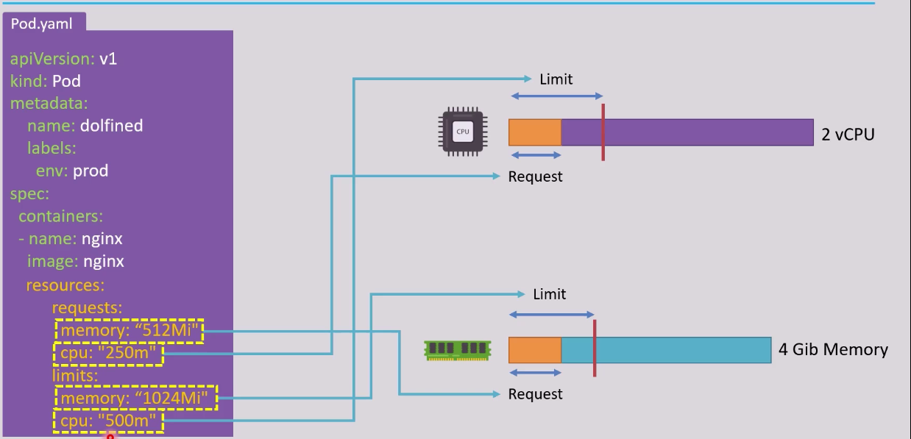

# Resource Requirements and Limits
- The pod in a node uses resources when the requests increse
- if requests increse extremelly, the pod consumes more resources from the node, so k8s will not be able to add another pod in this node and the added pod will be in a `Pending state`.
> 


## We need to specify `Requests` and `Limits`
- `Requests` are the minimum resources that the pod need to operate
- `Limits` are the maximum resources that the pod will consiume
- `Limits` must always >= `Requests`and < the machine/node resources 
- `Requests` and `Limits` are on a `per-container` basis
- `CPU Resources` are defined in milli cores, for instance: 
    - "0.5" , "1" , "2"
    - also ¼ core = 250m and so on
> 

- `Memory Resources` are defined in Bytes, for instance: P, G, M,K or Pi, Gi, Mi, Ki, ==> 1024Mi = 1GigMemory 
> 

```yaml
apiVersion: v1
kind: Pod
metadata:
    name: test
    labels:
        tier: frontend
spec:
    containers:
        - name: test-cont
          image: nginx
          ports:
            containerPort: 80
          resources:
            limits:
                memory: "2048M"
                cpu: "1000m"
            requests:
                memory: "1024M"
                cpu: "250m"
```
> 


## You have to install `metrics-server` to get the metrics of the pods and nodes
- Metrics-server is a cluster-wide aggregator of resource usage data.
- It collects metrics of the pods from the Summary API, exposed by Kubelet on each node.
- Metrics-server is not deployed by default in Kubernetes clusters.

```bash
kubectl apply -f https://github.com/kubernetes-sigs/metrics-server/releases/latest/download/components.yaml
kubectl get pods -n kube-system # metrics server deployment will not be working, we have to make some edits
kubectl edit deploy metrics-server -n kube-system

# -> spec.containers.command:
# - /metrics-server
# - --kubelet-insecure-tls
# - --kubelet-preferred-address-types=InternalIP
```

Now you can check the metrics of the pods and nodes using the following commands:
```bash
kubectl top pod
kubectl top node
```
