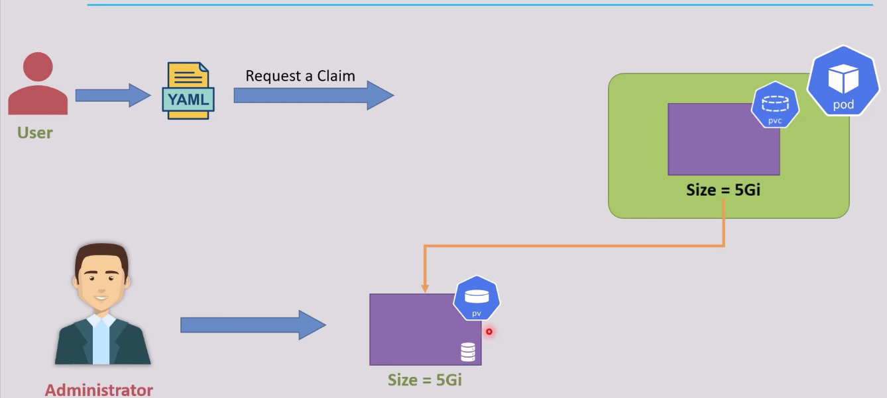
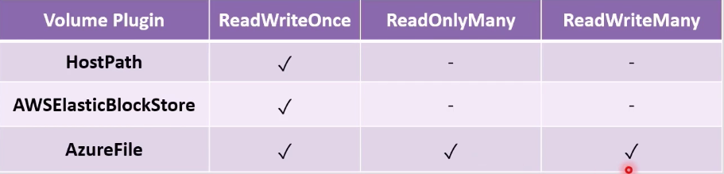
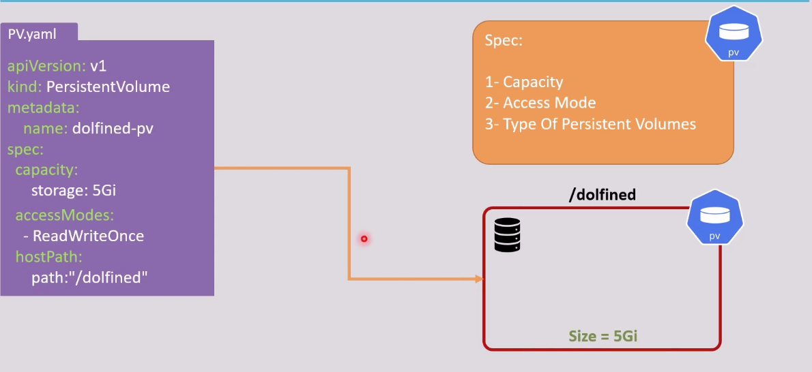
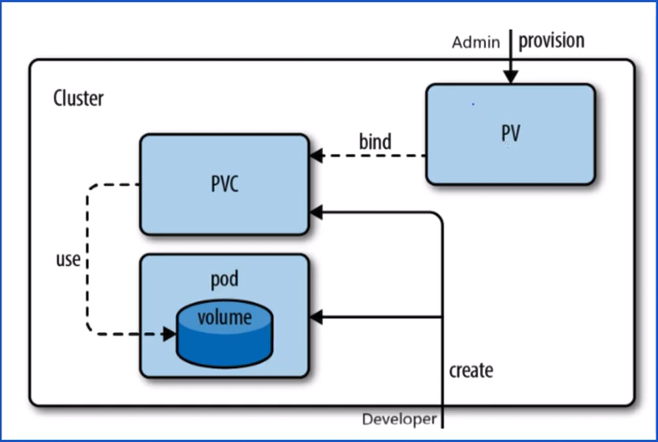
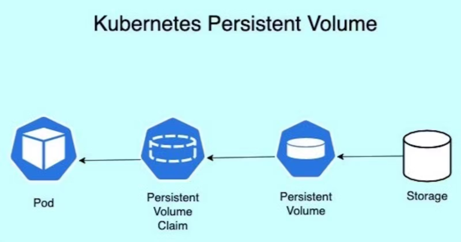
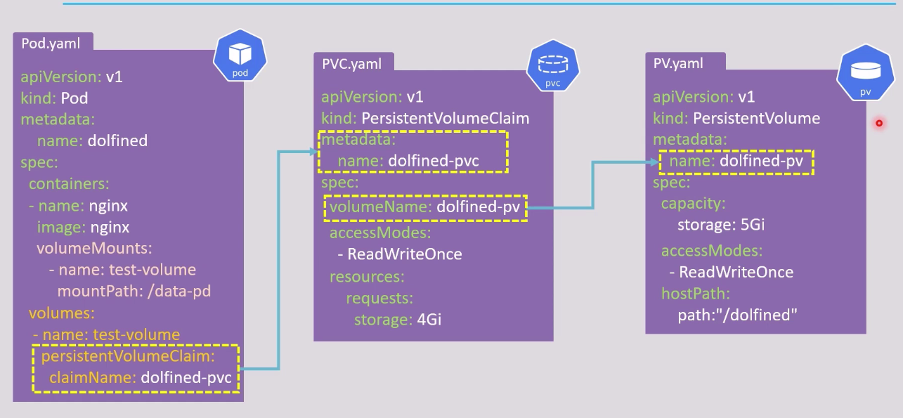
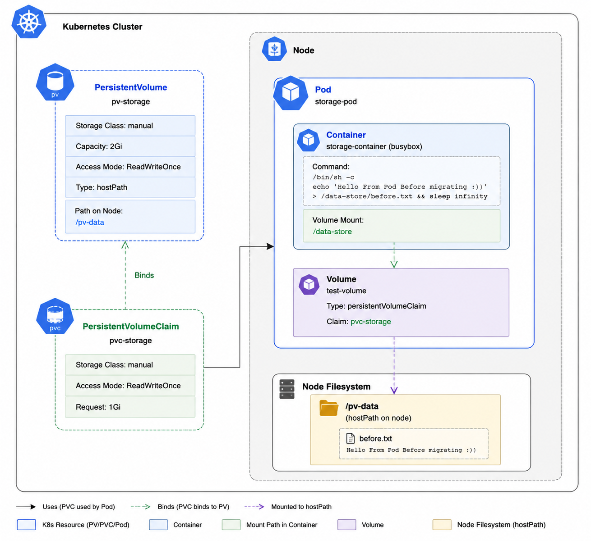

# Storage in K8s: Persistent Volumes (Part 1)

## Outlines:
1. [Why Storage in K8s](#why-storage-in-k8s)
2. [Two Ways to Create Volumes](#two-ways-to-create-volumes)
3. [Static Provisioning: Core Concepts](#1-static-provisioning-core-concepts)
   - [Persistent Volumes (PV)](#persistent-volumes-pv)
   - [Persistent Volume Claims (PVC)](#persistent-volume-claims-pvc)
   - [The Role of storageClassName](#the-role-of-storageclassname-in-static-provisioning)
   - [Complete Example: PV, PVC, and Pod](#complete-example-pv-pvc-and-pod)
4. [The Problem with hostPath in Multi-Node Environments](#2-the-problem-with-hostpath-in-multi-node-environments)
5. [The Data Loss Problem (Lab)](#3-the-data-loss-problem-lab)

## Overview

### Why Storage in K8s
- **Ephemeral Nature of Pods**: Pods are temporary and can be terminated, recreated, or rescheduled at any time, leading to total data loss if storage is not managed properly.
- **Need for Persistent Storage**: Applications (like databases) require data to persist beyond the lifecycle of individual pods, necessitating a dedicated mechanism for persistent storage.

Storage in Kubernetes is managed through **Persistent Volumes (PV)** and **Persistent Volume Claims (PVC)**, decoupling infrastructure storage from application configuration.

---

## Two Ways to Create Volumes

| Method | Description |
|--------|-------------|
| **[Static Provisioning](#1-static-provisioning-core-concepts)** | Cluster Administrators pre-create PVs before PVCs are requested. |
| **[Dynamic Provisioning](#)** | Kubernetes automatically creates PVs on-demand using a `StorageClass`. |

---

## 1. Static Provisioning: Core Concepts

In **Static Provisioning**, the Cluster Administrator must manually create a pool of storage volumes (PVs) first. Then, developers can request a piece of that storage using a claim (PVC).

> 

### Persistent Volumes (PV)

**Definition:**
- Created by Cluster Administrators.
- An independent volume resource with a lifecycle completely separate from any Pod using it.
- Remains available after a pod shuts down so data can be reused.
- **Cluster-Scoped Resource:** PV is not bound to any specific namespace.

Check by running:
```bash
kubectl api-resources | grep pv
# You will see `False` under NAMESPACED, which means it is a cluster-wide resource.
```

#### PV Specifications

| Spec | Description |
|------|-------------|
| **Capacity** | Storage size allocated (e.g., `10Gi`) |
| **hostPath** | File path on the underlying host node (for local dev) |
| **Access Modes** | Defines how the volume can be mounted by nodes |

#### Access Modes

1. **ReadWriteOnce (RWO):**
   - Only a single node can mount the volume for reading and writing.
   - Tied to a specific node (like an SSD physically attached to a single machine).
   - *Example:* AWS EBS (Elastic Block Store), hostPath.

2. **ReadWriteMany (RWX):**
   - Multiple nodes can mount the volume simultaneously for both reading and writing.
   - *Example:* NFS, AWS EFS.

3. **ReadOnlyMany (ROX):**
   - Multiple nodes can mount the volume for reading only.
   - *Example:* Shared configuration or media assets.

4. **ReadWriteOncePod (RWOP):**
   - A single pod can mount the volume for reading and writing.
   - Introduced in Kubernetes 1.22, useful for scenarios where a volume should be restricted to a single pod, ensuring strict data isolation.

> ⚠️ **Note:** A volume can only be mounted using **one** access mode at a time by a Pod, even if the underlying storage driver supports multiple modes.

> 

See [Kubernetes Access Modes Documentation](https://kubernetes.io/docs/concepts/storage/persistent-volumes/#access-modes) for more details.

#### PV Example

```yaml
apiVersion: v1
kind: PersistentVolume
metadata:
  name: pv-storage
spec:
  capacity:
    storage: 10Gi
  accessModes:
    - ReadWriteOnce
  hostPath:
    path: "/pv-data"
```

> 

#### Basic PV Commands

```bash
kubectl get pv                    # List all PVs in the cluster
kubectl describe pv <pv-name>     # Inspect a specific PV
kubectl delete pv <pv-name>       # Delete a PV
```

---

### Persistent Volume Claims (PVC)

**Definition:**
- Requested by developers/users via YAML.
- Acts as a "ticket" or request for specific storage criteria (capacity, access mode).
- Kubernetes matches PVC requests with suitable available PVs.
- **Namespace-Scoped Resource:** PVC lives within a specific namespace.

> Check by running:
```bash
kubectl api-resources | grep pvc
# You will see `True` under NAMESPACED, which means it is namespace-scoped.
```

**Matching Logic:**
Kubernetes finds the smallest available PV that satisfies the PVC criteria (Capacity, AccessMode, and StorageClassName). 

**Example:** If PVs exist with `10Gi`, `5Gi`, and `8Gi`, and a PVC requests `4Gi`, Kubernetes assigns the `5Gi` PV to avoid wasting storage.

#### *Pro-Tip*: Difference between Gi and G:
- **Gi (Gibibyte)**: 1 Gi = 2^30 bytes = 1,073,741,824 bytes
- **G (Gigabyte)**: 1 G = 10^9 bytes = 1,000,000,000 bytes
- `Gi` is more than `G` by ~7.37%. Always use Gi for storage in Kubernetes to avoid confusion.
- If a PV has 1G and a PVC requests 1Gi, it will **not** match because 1Gi > 1G.

**Once the PV is bound to a PVC, it cannot be used by another PVC until released.**

<div align='center'>

  
 
  

</div>

---

### The Role of `storageClassName` in Static Provisioning

When creating PVs and PVCs, the `storageClassName` attribute plays a critical role in how binding occurs:

1. **Explicit Binding (`storageClassName: manual`)**: 
   By defining a custom class name (e.g., `manual`) in both the PV and the PVC, you ensure that the PVC will **only** bind to a PV with that exact same class name.
2. **Preventing Dynamic Provisioning (`storageClassName: ""`)**:
   If your cluster has a default StorageClass, creating a PVC without this field might trigger the creation of a new Dynamic volume instead of binding to your Static PV. Setting `storageClassName: ""` tells Kubernetes to completely disable Dynamic Provisioning for this claim and only look for existing PVs that also have no class defined.

---

### Complete Example: PV, PVC, and Pod

```yaml
apiVersion: v1
kind: PersistentVolume
metadata:
  name: pv-storage
spec:
  storageClassName: manual   # Groups this PV under the "manual" class
  capacity:
    storage: 10Gi
  accessModes:
    - ReadWriteOnce
  hostPath:
    path: "/pv-data"
---
apiVersion: v1
kind: PersistentVolumeClaim
metadata:
  name: pvc-storage
spec:
  storageClassName: manual   # Ensures it only binds to a PV with the "manual" class
  accessModes:
    - ReadWriteOnce
  resources:
    requests:
      storage: 5Gi
---
apiVersion: v1
kind: Pod
metadata:
  name: storage-pod
spec:
  containers:
    - name: storage-container
      image: nginx
      volumeMounts:
        - name: test-volume
          mountPath: "/data-store"
  volumes:
    - name: test-volume
      persistentVolumeClaim:
        claimName: pvc-storage
```

---

> 

#### Basic PVC Commands

```bash
kubectl get pvc                      # List PVCs in current namespace
kubectl describe pvc <pvc-name>      # Inspect a specific PVC
kubectl delete pvc <pvc-name>        # Delete a PVC
```

See full YAML example in [Storage - PV, PVC, and Pod](../k8s_yaml_files/20_storage_persistent_volume_PV_PVC_part_1.yaml)

---

## 2. The Problem with hostPath in Multi-Node Environments

The `hostPath` volume type is great for single-node clusters (like Minikube or Docker Desktop), but it becomes a major risk in production multi-node environments.

### Creating a PV, PVC, and Pod with hostPath

#### Step 1: Create a PV with hostPath
```yaml
apiVersion: v1
kind: PersistentVolume
metadata:
  name: pv-storage
spec:
  storageClassName: manual
  capacity:
    storage: 2Gi
  accessModes:
    - ReadWriteOnce
  hostPath:
    path: "/pv-data"
    type: DirectoryOrCreate
```

#### Step 2: Create a PVC
```yaml
apiVersion: v1
kind: PersistentVolumeClaim
metadata:
  name: pvc-storage
spec:
  storageClassName: manual
  accessModes:
    - ReadWriteOnce
  resources:
    requests:
      storage: 1Gi
```

#### Step 3: Create a Pod that Uses the PVC
```yaml
apiVersion: v1
kind: Pod
metadata:
  name: storage-pod
spec:
  containers:
    - name: storage-container
      image: busybox
      command: ["/bin/sh"]
      # Writing a file to the volume
      args: ["-c", "echo 'Hello From Pod Before migrating :))' > /data-store/before.txt && sleep infinity"]
      volumeMounts:
        - name: test-volume
          mountPath: "/data-store"
  volumes:
    - name: test-volume
      persistentVolumeClaim:
        claimName: pvc-storage
```



### What Happens with hostPath?
The pod is scheduled on a specific worker node (e.g., `Node-1`), and data is stored locally in `/pv-data` on that exact node (mounted at `/data-store` inside the container). In multi-node clusters, `hostPath` is problematic because:
1. If the pod is rescheduled on another node, it **cannot** access data from the original node.
2. If the node experiences hardware issues, the data is permanently lost.

---

## 3. The Data Loss Problem (Lab)

Let's simulate a pod failure and rescheduling to see the data loss in action.

#### Step 1: Delete the Original Pod
```bash
kubectl delete pod storage-pod
```

#### Step 2: Reschedule Pod on Another Worker Node
We use `nodeSelector` to force the pod onto a different node (e.g., `node-2`).

```yaml
apiVersion: v1
kind: Pod
metadata:
  name: storage-pod-migrated
spec:
  nodeSelector:
    kubernetes.io/hostname: node-2   # Force scheduling on Node-2
  containers:
    - name: storage-container
      image: busybox
      command: ["/bin/sh"]
      args: ["-c", "sleep infinity"]
      volumeMounts:
        - name: test-volume
          mountPath: "/data-store"
  volumes:
    - name: test-volume
      persistentVolumeClaim:
        claimName: pvc-storage
```

**The Result:** When the pod is rescheduled on `node-2`, it mounts a completely new, empty `/pv-data` directory on `node-2`. The original `before.txt` file is inaccessible because it resides on `node-1`'s local hard drive, resulting in **Data Loss**.

---
<style>
body {
  font-size: 16px;
}
</style>