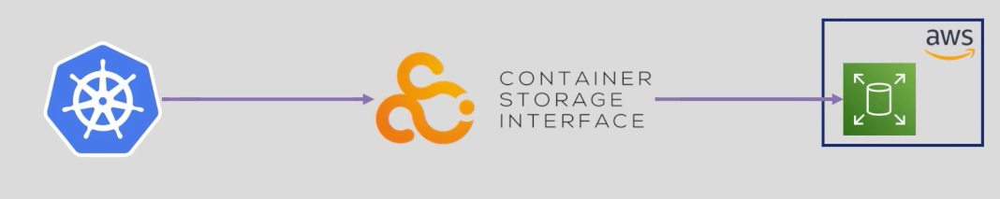
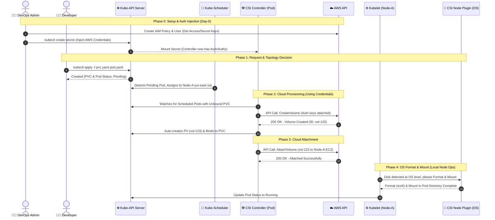
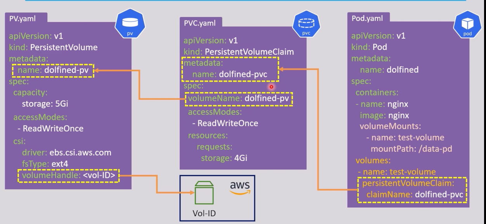

# Storage in K8s: Persistent Volumes (Part 2)

## Outlines:
1. [The First Solution: External Network Storage](#1-the-first-solution-external-network-storage)
2. [Deep Dive: Access Modes in Remote Storage](#2-deep-dive-access-modes-in-remote-storage)
3. [Introduction to CSI (Container Storage Interface)](#3-introduction-to-csi-container-storage-interface)
4. [Static Provisioning with Remote Storage (Labs)](#4-static-provisioning-with-remote-storage-labs)

---

## 1. The First Solution: External Network Storage

As we have seen in [***Part 1***](./24_storage_static_provisioning.md), the `hostPath` volume type is limited because it ties data to a single node's physical disk. To overcome the severe limitations of `hostPath`, Kubernetes supports **External Network Storage**. 

This architecture decouples the storage from the worker node's hardware. If a pod dies on `Node-1` and is rescheduled on `Node-2`, it simply reconnects to the external storage over the network, ensuring **zero data loss**.

---

## 2. Deep Dive: Access Modes in Remote Storage

Before implementing remote storage we have seen later YAML snippets for PV, PVC that have access modes defined and we used `RWO` with `hostPath`
```yaml
apiVersion: v1
kind: PersistentVolume
metadata:
  name: pv-storage
spec:
  storageClassName: manual   
  capacity:
    storage: 10Gi
  accessModes:             
    - ReadWriteOnce #  <----------- Defines how the volume can be mounted by pods
  hostPath:
    path: "/pv-data"
---
apiVersion: v1
kind: PersistentVolumeClaim
metadata:
  name: pvc-storage
spec:
  storageClassName: manual   
  volumeName: pv-storage
  accessModes:
    - ReadWriteOnce # <----------- must match the PV's access mode   
  resources:
    requests:
      storage: 5Gi
```
Now, it's crucial to understand why specific storage backends support specific Access Modes:

### Access Modes Types:

1. **ReadWriteOnce (RWO):**
   - Only a single node can mount the volume for reading and writing.
   - Tied to a specific node (like an SSD physically attached to a single machine).
   - *Example:* AWS EBS (Elastic Block Store), hostPath.

2. **ReadWriteMany (RWX):**
   - Multiple nodes can mount the volume simultaneously for both reading and writing.
   - *Example:* NFS, AWS EFS.

3. **ReadOnlyMany (ROX):**
   - Multiple nodes can mount the volume for reading only.
   - *Example:* Shared configuration or media assets.

4. **ReadWriteOncePod (RWOP):**
   - A single pod can mount the volume for reading and writing.
   - Introduced in Kubernetes 1.22, useful for scenarios where a volume should be restricted to a single pod, ensuring strict data isolation.


### Why AWS EBS with RWO (ReadWriteOnce)?
- **Why EBS supports ONLY RWO?** 
  * Imagine an EBS volume as a physical SSD attached to a server motherboard. It is physically impossible to attach the same SSD to multiple separate machines at the exact same time without causing severe data corruption at the OS level. 
- **Why multiple Pods can still read/write to it?**
  * If that SSD is attached to a *single* machine (Worker Node), the Linux OS mounts it as a folder. Since all pods scheduled on that specific node share the same underlying OS, multiple apps (pods) can easily read/write to that same folder simultaneously.`like multiple applications can access the SSD`.
- **Conclusion:** EBS cannot support `RWX` or `ROX` across multiple nodes.

### Why AWS EFS with RWX (ReadWriteMany)?
- **Why EFS supports RWX?**
  * Imagine EFS as a network-shared storage (like a NAS or shared drive). It is designed over network protocols (NFS) to be accessible from multiple machines simultaneously.
- **Why multiple Pods across multiple Nodes can use it?**
  * Because the shared storage is mounted via the network across multiple worker nodes, any pod on any node can read and write to the same shared files concurrently without data corruption. `like google drive or dropbox where multiple users can access the same file at the same time`.
- **Conclusion:** EFS supports `RWX` across multiple nodes.


See ***[K8s Access Modes](https://kubernetes.io/docs/concepts/storage/persistent-volumes/#access-modes)*** for more details.

---


## 3. Introduction to CSI (Container Storage Interface)

### Why CSI? (The In-Tree vs Out-of-Tree Evolution)
* **The Old Days (In-Tree Plugins):**
  * Originally, the code required to integrate with cloud providers (like AWS, GCP, Azure) was written directly inside the core Kubernetes source code.
  * This meant any bug fix or new cloud feature required waiting months for a new Kubernetes release.
* **The Modern Way (CSI):**
  * Kubernetes introduced the **Container Storage Interface (CSI)**, a standardized API that decouples storage plugins from the Kubernetes core.
  * Storage vendors now build and release **CSI Drivers** independently.


* **Benefits of CSI:**
  * Standardized interface for all storage vendors.
  
  * Easier integration with new storage technologies.
  * Automatically create storeage when required.
  * Make storage available to pods across multiple nodes easily.
  * Automatically delete storage when no longer needed. 


### How to Install a CSI Driver

To use cloud storage (like AWS EBS) in your cluster, you must install its corresponding CSI driver. 
1. **Using Helm (Standard):** Most CSI drivers can be installed via Helm charts, will discuss later in the Helm section.
2.  **GitHub releases**.
    ```bash
    kubectl apply -f "github.com/kubernetes-sigs/aws-ebs-csi-driver/deploy/kubernetes/overlay/stable/?ref=release-1.14"
    ```
2. **Using Managed Add-ons:** If you are using a managed Kubernetes service (like AWS EKS), you can install the driver directly via the cloud console, CLI, or Terraform as an EKS Add-on by enabling the `aws-ebs-csi-driver` add-on.

#### **Notes**:
- The CSI is not a general object or resource in Kubernetes. that means if you want to allocate a storage volume on `AWS EBS`, you must install the `aws-ebs-csi-driver` first. Then, you can create a PV and PVC that uses the `ebs.csi.aws.com` provisioner.
- and if you want to allocate a storage volume on `AWS EFS`, you must install the `aws-efs-csi-driver` first. Then, you can create a PV and PVC that uses the `efs.csi.aws.com` provisioner. and so on for other cloud providers. See ***[Kubernetes CSI Drivers](https://kubernetes-csi.github.io/docs/drivers.html)*** for available provisioners.

- After installing a certain CSI driver, you can find it by running the following command:
```bash
# Check installed CSI drivers
kubectl get csidrivers 

# Check the csi pods running in kube-system namespace
kubectl get pods -n kube-system | grep csi

# Check the csi nodes running in kube-system namespace
kubectl get csinodes
```

---

### The CSI need to communicate with the Cloud Provider, but how could it know which cloud provider and which user account to use?
* Lets see the full flow of how a pod can request a storage volume from the cloud provider using CSI and how the CSI driver can authenticate with the cloud provider to provision the storage volume.

#### 1. **The Authentication Stage**
  - The CSI driver needs to authenticate with the cloud provider to provision storage volumes.
  - This is typically done using **IAM credentials** (like Access Key and Secret Key for AWS).
  - The Admin creates an IAM user with the necessary permissions/policies.
#### 2. **The Authorization Stage**
  - Here there are two ways to provide the IAM credentials to the CSI driver:
    1. **Injecting the IAM credentials into the CSI Controller Pod via creating a Kubernetes Secret** (Recommended)
        - The Admin creates a Kubernetes Secret with the IAM user credentials.
        - The Admin deploys the CSI driver and injects the Secret into the CSI Controller Pod
    2. **Using IRSA (IAM Roles for Service Accounts)** (Recommended for EKS)
        - The Admin creates an IAM Role with the necessary permissions/policies.
        - The Admin creates a Kubernetes Service Account and annotates it with the IAM Role ARN.
        - The Admin deploys the CSI driver and configures it to use the annotated Service Account.

#### 3. **The Provisioning Stage**
  - The Developer creates a PVC and a Pod that uses the PVC.
  - The Kube-API Server receives the PVC and Pod request, and the Kube-Scheduler schedules the Pod to a specific Node (e.g., Node-A).
  - The CSI Controller Pod detects the scheduled Pod with an unbound PVC and makes an API call to the Cloud Provider (e.g., AWS) to create a new EBS volume using the injected IAM credentials.
  - The Cloud Provider creates the EBS volume and returns the Volume ID to the CSI Controller Pod.
  - The CSI Controller Pod creates a new PV in Kubernetes with the Volume ID and binds it to the PVC.
  - The CSI Controller Pod makes another API call to the Cloud Provider to attach the EBS volume to the Node-A where the Pod is scheduled.
  - The Kubelet on Node-A detects the attached volume, formats it (if necessary), and mounts it to the Pod's directory, allowing the Pod to read/write data to the EBS volume.




---


## 4. Static Provisioning with Remote Storage (Labs)

In **Static Provisioning**, the storage volume must already exist *outside* of Kubernetes before the Cluster Administrator can create the PV.

### Lab A: NFS-based PersistentVolume (Static)
Assuming you have an external NFS server running at `192.168.1.100`.

```yaml
apiVersion: v1
kind: PersistentVolume
metadata:
  name: pv-nfs-storage
spec:
  storageClassName: manual      # This PV is not dynamically provisioned
  capacity:
    storage: 10Gi
  accessModes:
    - ReadWriteMany
  nfs:
    server: 192.168.1.100       # IP of the external NFS server
    path: "/exported/data"      # Shared path on the NFS server
---
apiVersion: v1
kind: PersistentVolumeClaim
metadata:
  name: pvc-nfs-storage
spec:
  storageClassName: manual      # This PVC is not dynamically provisioned, must match the PV's storageClassName
  volumeName: pv-nfs-storage    # This PVC is bound to the specific PV named pv-nfs-storage
  accessModes:
    - ReadWriteMany
  resources:
    requests:
      storage: 5Gi
```

### Lab B: Cloud Storage-based PersistentVolume (Static EBS)

**The Pain Point:**

In this scenario, the Cluster Administrator must **manually** go to the AWS Console (or CLI), create an EBS volume in a specific Availability Zone, copy its `Volume ID`, and hardcode it into the PV manifest along with the zone's topology.

```yaml
apiVersion: v1
kind: PersistentVolume
metadata:
  name: pv-static-ebs
spec:
  capacity:
    storage: 10Gi
  accessModes:
    - ReadWriteOnce
  csi:
    driver: ebs.csi.aws.com
    volumeHandle: "vol-0a1b2c3d4e5f6g7h8"  # The ID of the manually created volume in AWS
    fsType: ext4
  nodeAffinity:                            # Ensures the PV is only scheduled on nodes in the same AZ as the EBS volume
    required:
      nodeSelectorTerms:
        - matchExpressions:
            - key: topology.ebs.csi.aws.com/zone 
              operator: In
              values:
                - us-east-1a
---
apiVersion: v1
kind: PersistentVolumeClaim
metadata:
  name: pvc-static-ebs
spec:
  storageClassName: manual
  volumeName: pv-static-ebs
  accessModes:
    - ReadWriteOnce
  resources:
    requests:
      storage: 5Gi
---
apiVersion: v1
kind: Pod
metadata:
  name: pod-using-static-ebs
spec:
  containers:
    - name: app-container
      image: nginx
      volumeMounts:
        - mountPath: "/usr/share/nginx/html"
          name: ebs-volume
  volumes:
    - name: ebs-volume
      persistentVolumeClaim:
        claimName: pvc-static-ebs
```



#### **Notes**:
- Once the pod is created, the CSI driver will attach the EBS volume to the node where the pod is scheduled. [Volume state - In-use]
- The volume will not be deleted automatically when the pod is deleted, and the admin has to manually delete it from AWS.
- If The pod is deleted, the CSI will detach the volume from the node [Volume state - Available], to be attached to another node if the pod is rescheduled.

> ⚠️ **The Operational Overhead:** Every time a developer needs storage, the Admin has to leave Kubernetes, go to AWS, provision the disk, get the ID, figure out the AZ, and write this lengthy YAML. This manual bottleneck leads us directly to the ultimate solution: **[Dynamic Provisioning](./26_storage_dynamic_provisioning.md)** 
---
<style>
body { font-size: 16px; }
</style>