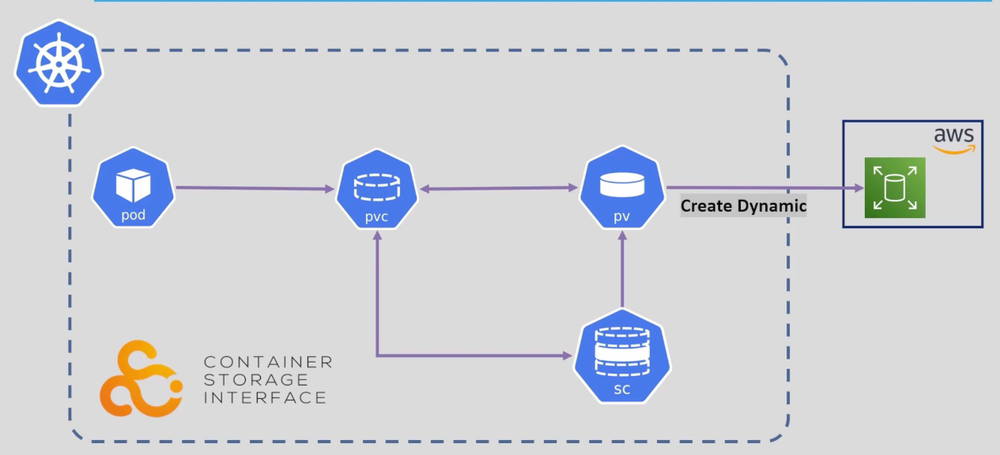
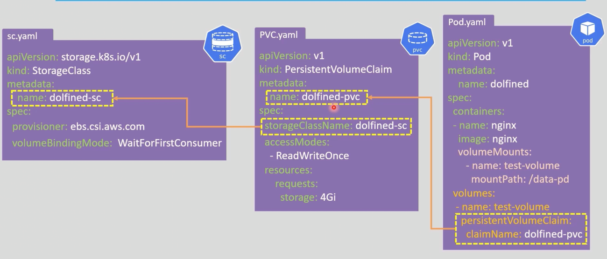
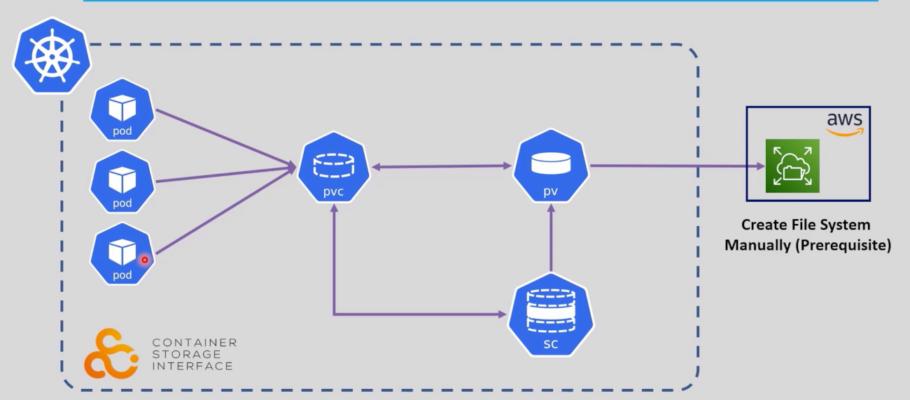

# Storage in K8s: Persistent Volumes (Part 3)

## Outlines:
1. [Dynamic Provisioning](#1-dynamic-provisioning)
2. [StorageClass Key Components](#3-storageclass-key-components)
3. [StorageClass Types](#4-storageclass-types)
4. [Volume Expansion (Resizing)](#5-volume-expansion-resizing)
5. [Complete Dynamic Provisioning Lab](#6-complete-dynamic-provisioning-lab)
---


## 1. Dynamic Provisioning

**Dynamic Provisioning** is an abstraction layer that defines storage provisioning policies. It completely eliminates the need for Cluster Administrators to manually create PVs (Persistent Volumes) beforehand. 

Kubernetes achieves this using a resource called **`StorageClass`**, which automatically provisions the exact PV requested by the developer's PVC on the fly.

---

## 3. StorageClass Key Components

To define a `StorageClass`, you have to specify the `provisioner`, `parameters`, `reclaimPolicy`, and `volumeBindingMode`.

### $1. Provisioners$
The provisioner determines which volume plugin is used for provisioning PVs (e.g., `kubernetes.io/aws-ebs`, `kubernetes.io/gce-pd`, `kubernetes.io/azure-disk`, or newer CSI drivers like `ebs.csi.aws.com`). 
See [Kubernetes CSI Drivers](https://kubernetes-csi.github.io/docs/drivers.html) for available provisioners.

### $2. Reclaim Policies$
Controls what happens to the underlying storage (PV and the actual Cloud Disk) when the user deletes the PVC.

| Policy | Behavior |
|--------|----------|
| **Delete** | (Default) Automatically deletes the PV and the underlying cloud storage disk when the PVC is deleted. |
| **Retain** | Keeps the PV and cloud disk intact after PVC deletion, requiring manual cleanup by the admin. |

### $3. Volume Binding Modes$
Controls *when* Kubernetes should talk to the cloud provider to create the actual storage.

| Mode | Behavior | Use Case |
|------|----------|----------|
| **Immediate** | Provisions the cloud storage as soon as the PVC is created. | Good for single-zone clusters. **Risk:** In Multi-AZ clusters, the disk might be created in AZ-A, but the Pod might be scheduled in AZ-B (Topology mismatch). |
| **WaitForFirstConsumer** | Delays provisioning until a Pod using the PVC is successfully scheduled on a node. | **Recommended:** Ensures the storage is created in the exact same Availability Zone (AZ) where the Pod is running. |

### $4. Parameters$
Storage provider-specific configuration options that customize the disk characteristics.

| Parameter | Description (AWS EBS Example) |
|-----------|-------------|
| **type** | Storage type (e.g., `gp2`, `gp3`, `io1`) |
| **iops** | Input/output operations per second for performance tuning |
| **throughput** | Data transfer rate for the storage volume |

---

## 4. StorageClass Types

### Local StorageClass
Uses local disks on the node, but handles them dynamically. 
K8s is a vanilla in nature that doesn't handel the local dynamic provisioninig by default.
But there are some third-party provisioners that can be used to handle local storage dynamic provisioning, such as [local-path-provisioner](https://github.com/rancher/local-path-provisioner).

If you use a testing flavour of Kubernetes (like Minikube or K3s), you can use the built-in `kubernetes.io/minikube-hostpath` provisioner.

```yaml
# 1. The StorageClass
apiVersion: storage.k8s.io/v1
kind: StorageClass
metadata:
  name: local-storage
provisioner: k8s.io/minikube-hostpath
volumeBindingMode: Immediate # Why not WaitForFirstConsumer? Because the local storage is already on the node, so we don't need to wait for the pod to be scheduled.
reclaimPolicy: Delete

# 2. The PVC
apiVersion: v1
kind: PersistentVolumeClaim
metadata:
  name: pvc-local
spec:
  storageClassName: local-storage
  accessModes:
    - ReadWriteOnce
  resources:
    requests:
      storage: 1Gi
---
# 3. The Pod
apiVersion: v1
kind: Pod
metadata:
  name: local-storage-pod
spec:
  containers:
    - name: storage-container
      image: busybox
      command: ["/bin/sh"]
      args: ["-c", "echo 'Data persisted locally' > /data-store/local.txt && sleep infinity"]
      volumeMounts:
        - name: local-volume
          mountPath: "/data-store"
  volumes:
    - name: local-volume
      persistentVolumeClaim:
        claimName: pvc-local
```


### Cloud Provider StorageClass (CSI)
Uses cloud provider storage with custom performance parameters.

```yaml
apiVersion: storage.k8s.io/v1
kind: StorageClass
metadata:
  name: fast-storage
provisioner: ebs.csi.aws.com  # as we discussed in the previous part, the CSI driver for AWS EBS has to be installed in the cluster first.
parameters:
  type: gp3
  iops: "3000"
  throughput: "125"
reclaimPolicy: Delete
volumeBindingMode: WaitForFirstConsumer
```

---

## 5. Volume Expansion (Resizing)

**The Problem:**
- When a dynamically provisioned volume (like AWS EBS) runs out of space, we cannot simply request a new PV. Creating a new PV provisions a brand-new, empty disk, which means losing all existing data on the old disk (a disaster for Stateful applications like Databases). 

**The Solution:**
- We must expand the existing volume dynamically without losing data and without application downtime.

**How to enable it:**
- By default, Kubernetes prevents volume resizing for safety. To allow it, you must explicitly set `allowVolumeExpansion: true` in the `StorageClass` creation.

```yaml
apiVersion: storage.k8s.io/v1
kind: StorageClass
metadata:
  name: expandable-storage
provisioner: ebs.csi.aws.com
allowVolumeExpansion: true  # <--- The Magic Line for Resizing
parameters:
  type: gp3
```

### The Resizing Workflow (Best Practice):

1. **NEVER** edit the `PV` directly. The `PV` represents the actual physical state of the disk, not your requested state.
2. Edit the **`PVC`** directly (`kubectl edit pvc <pvc-name>`) and increase the storage size (e.g., from `5Gi` to `10Gi`).
3. Kubernetes compares the new `PVC` request with the existing `PV` capacity.
4. The **`CSI Driver`** catches this change and tells the Cloud Provider (like AWS) to expand the physical disk size.
5. Finally, the **`Kubelet`** on the Node automatically resizes the File System (e.g., `ext4` or `xfs`) so the running container can actually see and use the new space.


### What about shrinking a volume?
- Kubernetes does not support shrinking volumes due to the risk of data loss.
- instead we use volume migration strategy pattern to shrink a volume. The steps are as follows:
    1. Create a new PVC with the desired smaller size.
    2. Stop the application that is using the old PVC temporarily.
    3. Create a temporary Pod that mounts both the old and new PVCs.
    4. Copy the data from the old PVC to the new PVC using a command like `rsync` or `cp`.
    5. Update the application to use the new PVC.
    6. Start the application again.


## 6. Complete Dynamic Provisioning Lab

In this lab, the developer only creates the `StorageClass` (usually done once by the Admin), a `PVC`, and a `Pod`. **No PV YAML is needed!** Kubernetes handles it automatically.

### 1. Dynamic Provisioning with AWS EBS (gp3) StorageClass



```yaml
# 1. The StorageClass
apiVersion: storage.k8s.io/v1
kind: StorageClass
metadata:
  name: dynamic-storage
provisioner: ebs.csi.aws.com
allowVolumeExpansion: true
parameters:
  type: gp3
reclaimPolicy: Delete
volumeBindingMode: WaitForFirstConsumer
---
# 2. The PVC
apiVersion: v1
kind: PersistentVolumeClaim
metadata:
  name: pvc-dynamic
spec:
  storageClassName: dynamic-storage  # Triggers the StorageClass!
  accessModes:
    - ReadWriteOnce
  resources:
    requests:
      storage: 5Gi
---
# 3. The Pod
apiVersion: v1
kind: Pod
metadata:
  name: dynamic-storage-pod
spec:
  containers:
    - name: storage-container
      image: busybox
      command: ["/bin/sh"]
      args: ["-c", "echo 'Data persisted dynamically via StorageClass' > /data-store/dynamic.txt && sleep infinity"]
      volumeMounts:
        - name: dynamic-volume
          mountPath: "/data-store"
  volumes:
    - name: dynamic-volume
      persistentVolumeClaim:
        claimName: pvc-dynamic

```




### 2. Dynamic Provisioning with EFS (Elastic File System) StorageClass




> First ensure you had installed the EFS CSI driver in your cluster. Then create a StorageClass for EFS.
```bash
kubectl apply -f https://raw.githubusercontent.com/kubernetes-sigs/aws-efs-csi-driver/master/deploy/kubernetes/base/efs-csi-driver.yaml

kubectl get csidrivers
# NAME                ATTACHREQUIRED   PODINFOONMOUNT   MODES        AGE
# efs.csi.aws.com      true             false            Persistent   1m
```

> The StorageClass YAML for EFS is as follows:
```yaml
apiVersion: storage.k8s.io/v1
kind: StorageClass
metadata:
  name: nfs-storage-class
provisioner: efs.csi.aws.com
volumeBindingMode: WaitForFirstConsumer
reclaimPolicy: Retain
parameters:
  provisioningMode: efs-ap
  fileSystemId: fs-0a1b2c3d4e5f6g7h8
  directoryPerms: "700"
```
**Note:**
- You may wonder why I have pass th fileSystemId parameter? doesn't the EFS CSI driver create the EFS file system automatically? The answer is **No**. The EFS CSI driver does not create the EFS file system for you. You have to create it manually in the AWS console or via AWS CLI, and then pass the fileSystemId to the StorageClass.

- But where is the dynamic provisioning here? The dynamic provisioning happens when you create a PVC that uses this StorageClass. The EFS CSI driver will automatically create an EFS Access Point for you, and mount it to the Pod. You don't have to create the Access Point manually.

- The Process of createin a new EFS every time is not recommended, because EFS is a shared file system, and you can use the same EFS file system for multiple Pods. You can create multiple Access Points for the same EFS file system, and each Access Point can have different permissions and directories.

- The Dynamic Provsioning here is that the EFS CSI driver will create a new subdirectory in the EFS file system for each PVC that uses this StorageClass. The subdirectory will be created under the root directory of the EFS file system, and the name of the subdirectory will be the same as the name of the PVC.


> Then create a PVC 
```yaml
apiVersion: v1
kind: PersistentVolumeClaim
metadata:
  name: pvc-dynamic
spec:
  storageClassName: nfs-storage-class
  accessModes:
    - ReadWriteMany
  resources:
    requests:
      storage: 5Gi
```

> Finally, create a deployment that uses this PVC

```yaml
apiVersion: apps/v1
kind: Deployment
metadata:
  name: efs-deployment
spec:
  replicas: 3
  selector:
    matchLabels:
      app: efs-app
  template:
    metadata:
      labels:
        app: efs-app
    spec:
      containers:
        - name: efs-container
          image: nginx
          volumeMounts:
            - name: efs-volume
              mountPath: /usr/share/nginx/html
      volumes:
        - name: efs-volume
          persistentVolumeClaim:
            claimName: pvc-dynamic
```

**Notes:**
- ***Resources created by K8s MUST be removed by K8s***. (The underlying cloud volume will be deleted automatically only if ReclaimPolicy is set to Delete).

- You technically CAN delete an EFS or EBS from the Cloud Console, but ***you MUST NEVER do it***. (It causes a "State Mismatch" and breaks the cluster).

- Instead, always delete the PVC. The K8s CSI driver will catch the deletion and safely remove the volume from the cloud for you if the ReclaimPolicy is set to Delete. If the ReclaimPolicy is set to Retain, you will have to manually delete the volume from the cloud.


### Dynamic Storage Commands

```bash
kubectl get sc                        # List all StorageClasses
kubectl describe sc <sc-name>         # Describe a specific StorageClass
kubectl get pvc                       # Watch the PVC status (Pending -> Bound)
kubectl get pv                        # See the auto-generated PV!
```

---

### Advantages of StorageClass
1. **Zero Manual Overhead:** PVs and cloud disks are created automatically on-demand.
2. **Topology Awareness:** Using `WaitForFirstConsumer` prevents Multi-AZ scheduling conflicts.
3. **Flexibility:** You can create different classes (`fast-ssd`, `cheap-hdd`) and let developers choose without touching the cloud console.

<style>
body { font-size: 16px; }
</style>