<div align="center">
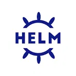
</div>


# Helm — The Kubernetes Package Manager

## Table of Contents
- [Overview](#overview)
- [1. What is Helm?](#1-what-is-helm)
- [2. Why Helm? (The Problem It Solves)](#2-why-helm-the-problem-it-solves)
- [3. Traditional Deployment vs. The Helm Way](#3-traditional-deployment-vs-the-helm-way)
- [4. Helm Core Concepts (Chart, Repo, Release)](#4-helm-core-concepts-chart-repo-release)
- [5. Chart Directory Structure](#5-chart-directory-structure)
- [6. How Helm Talks to Your Cluster](#6-how-helm-talks-to-your-cluster)
- [7. The Full Helm Workflow (Search → Deployed Release)](#7-the-full-helm-workflow-search-deployed-release)
- [8. `values.yaml` Deep Dive](#8-valuesyaml-deep-dive)
- [9. Danger Zone: Losing Your Custom Config](#9-danger-zone-losing-your-custom-config)
- [10. Helm Upgrade, Rollback & History](#10-helm-upgrade-rollback--history)
- [11. Basic Commands Cheat Sheet](#11-basic-commands-cheat-sheet)
- [12. Creating Your Own Chart (Packaging an App)](#12-creating-your-own-chart-packaging-an-app)
  - [Basic Flow](#basic-flow)
  - [Templating Basics](#templating-basics)
  - [Multiple Environments](#multiple-environments)
  - [Checking a Real Release](#checking-a-real-release)
  - [Useful Flags](#useful-helm-install--helm-upgrade-flags)
  - [Helm Plugins](#helm-plugins)
  - [Publishing to a Repo](#publishing-to-a-repo)
- [13. Annotated Walkthrough: My Automation Script](#13-annotated-walkthrough-my-automation-script)

---

## Overview

Helm is the tool that sits **between you and a pile of raw Kubernetes YAML**. Instead of writing and re-writing `Deployment`, `Service`, and `ConfigMap` manifests by hand for every app and every environment, you download a pre-built, parameterized package (a **Chart**), tell it your custom settings, and Helm generates and applies the final manifests for you.

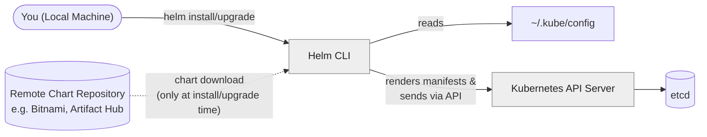

---

## 1. What is Helm?

Helm is **Kubernetes' package manager** — think of it as `apt`/`yum` for your cluster, or `npm` for JavaScript packages, but for Kubernetes applications.

- It's a **client-side binary installed on your local machine** (or wherever you run `kubectl` from) — it is **not** a pod or a service running inside the cluster.
- It doesn't talk to the cluster directly through some special channel — it uses **the exact same `kubeconfig`** that `kubectl` uses, and sends requests to the **same API Server**.
- Since Helm 3 (current version), there is **no "Tiller"** (a server-side component that older Helm 2 required). Everything runs from your machine.

> **In short:** Helm = a smart templating engine + a CLI that renders Kubernetes YAML from a package and `kubectl apply`s it for you.

---

## 2. Why Helm? (The Problem It Solves)

Without Helm, deploying a real application means hand-writing and maintaining a full set of raw manifests yourself:

| Pain Point (Without Helm) | How Helm Fixes It |
|---|---|
| You write `Deployment`, `Service`, `ConfigMap`, `Ingress`... manually for every app | You download an existing, tested **Chart** that already contains all of these, templated |
| Any small change (image tag, port, replica count) means editing multiple YAML files by hand | You change **one value** in `values.yaml` (or use `--set`) — the chart's templates regenerate everything consistently |
| Multiple environments (`dev`, `staging`, `prod`) means duplicating and manually keeping N sets of YAML files in sync | One chart + **different `values-<env>.yaml` files** per environment — same templates, different inputs |
| No built-in versioning or rollback — reverting a bad change means manually undoing YAML edits | Helm tracks every install/upgrade as a numbered **revision** — `helm rollback` reverts instantly |

---

## 3. Traditional Deployment vs. The Helm Way

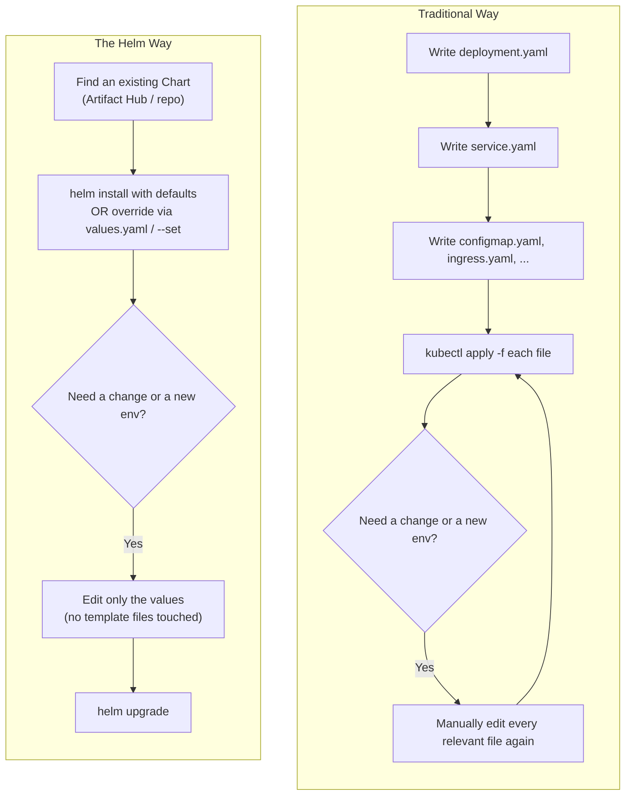

The core idea: **the templates (the hard, repetitive part) are written once by someone else and reused.** You only ever touch the *values* — the small set of settings that differ per deployment.

---

## 4. Helm Core Concepts (Chart, Repo, Release)

These four terms get confused a lot when you're starting out — here's the clean breakdown:

| Term | What it actually is | Example |
|---|---|---|
| **Repo Name** | A short **local alias** *you* choose for a remote chart repository | `bitnami` |
| **Repo URL** | The actual **web address** where the chart repository lives — where the chart gets downloaded from | `https://charts.bitnami.com/bitnami` |
| **Chart Name** | The **exact, unique name of the package** inside that repo. This is fixed by the chart's author — you can't invent it, you must know it | `nginx` |
| **Release Name** | The **alias/nickname** *you* give to a specific installed instance of a chart in your cluster. You use this name afterward to refer to that installation | `my-web-app` |

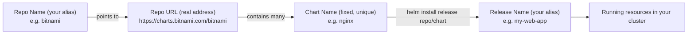

**Registering a repo (you only do this once per repo):**
```bash
helm repo add bitnami https://charts.bitnami.com/bitnami
#              ^repo-name  ^repo-url
```

**Installing from it (this is where Release Name and Chart Name meet):**
```bash
helm install my-web-app bitnami/nginx
#            ^release   ^repo-name/chart-name
```

> ⚠️ You must know the exact Chart Name in advance — Helm can't guess it. Use `helm search repo <repo-name>` to list every chart name available inside a repo you've added.

> **This is exactly the Linux package-manager pattern** (`apt`, `dnf`, etc.), and it's worth thinking of it in these 3 fixed steps, always in this order:
> 1. **Add the repo** (once, the source becomes known to Helm) → `helm repo add bitnami https://charts.bitnami.com/bitnami`
> 2. **Update your local index** (refresh what chart versions are available) → `helm repo update`
> 3. **Install the chart** (the actual package) → `helm install my-web-app bitnami/nginx`
>
> Just like `add-apt-repository` → `apt update` → `apt install <package>`. Skipping step 2 after adding a new repo is the most common reason `helm install` fails with a "chart not found" error — your local index is simply stale.

---

## 5. Chart Directory Structure

A Chart is really just a **folder with a fixed structure**, packaged into a `.tgz` archive. Knowing this structure matters because it answers a very practical question: *if I need to change something, do I edit these files directly, or do I make my own values file?*

**Where it actually lives:** when you run `helm install repo/chart`, Helm downloads the chart into a local cache (`~/.cache/helm/repository/`), renders it in memory, and sends the result to the API Server — it does **not** leave loose chart files in your working directory. If you want the real files on disk to look at or edit, pull them explicitly, or scaffold a fresh one with `helm create`:

```bash
helm pull bitnami/nginx --untar
```


**What you'll find inside** (this is a real `helm create` scaffold, straight from the terminal):

<div align="center">
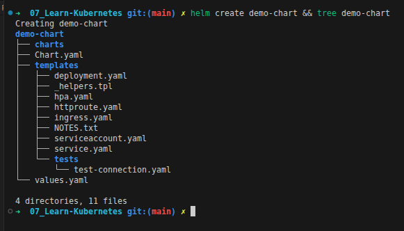
</div>

```
demo-chart/
├── Chart.yaml            # Metadata: chart name, version, description, dependencies
├── values.yaml            # The DEFAULT configuration values (what we've been overriding)
├── charts/                 # Any subcharts/dependencies bundled with this chart
└── templates/              # The actual Kubernetes manifests, written as Go templates
    ├── deployment.yaml
    ├── service.yaml
    ├── serviceaccount.yaml
    ├── ingress.yaml
    ├── httproute.yaml
    ├── hpa.yaml
    ├── _helpers.tpl        # Reusable template snippets shared across files
    ├── NOTES.txt           # The message Helm prints after a successful install
    └── tests/
        └── test-connection.yaml
```

> Helm Chart (Templates, Default Values, Metadata) → User Config (custom `values.yaml`) → Release (Deployed Resources in Cluster)

> Note the exact set of template files can differ slightly by Helm version/scaffold (here it includes `httproute.yaml` and a `tests/` folder) — the important part is the fixed top-level shape: `Chart.yaml` + `values.yaml` + `templates/`.

### Should you edit these files directly, or make your own `values.yaml`?

**Short answer: make your own values file — don't touch the chart's `templates/` directly**, unless you have a specific reason to.

| | Edit `templates/` directly | Use your own `custom-values.yaml` |
|---|---|---|
| Survives a `helm upgrade` pulling a newer chart version? | ❌ No — your edits get overwritten/lost, since the new version replaces the templates | ✅ Yes — your values file is separate and gets re-applied every time |
| Keeps you eligible for upstream bug fixes & security patches? | ❌ No — you've now forked the chart, you own it | ✅ Yes — you stay on the maintainer's chart |
| Easy to track "what did I actually change"? | ❌ Hard — changes are scattered across many template files | ✅ Easy — one small file with just your overrides |
| When it's actually the right call | Only if you're the chart's author, or deliberately forking/maintaining your own long-term copy of it | The right choice ~95% of the time |

---

## 6. How Helm Talks to Your Cluster

This answers a very natural question: *if Helm runs on my laptop, how does it know which cluster to touch?*

**The answer: it doesn't do anything special.** Helm reads the exact same `~/.kube/config` file that `kubectl` reads — same `current-context`, same cluster address, same user credentials. If `kubectl get pods` works on your machine, `helm install` will talk to the exact same cluster, using the exact same identity and permissions.

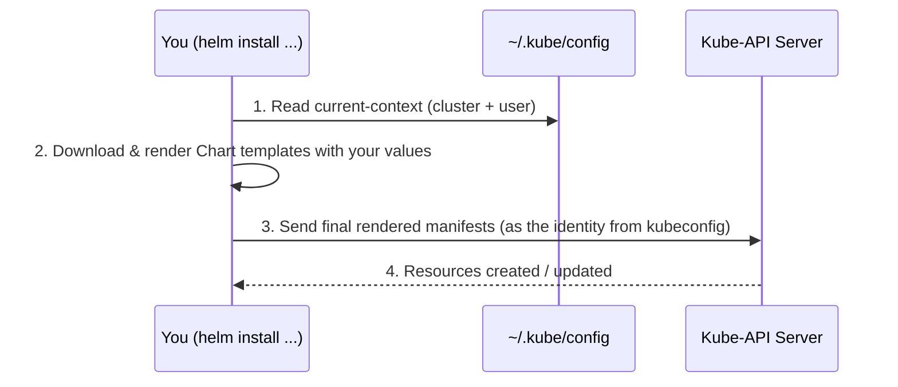

This also means: **Helm has exactly the same RBAC permissions you do.** If your user isn't authorized to create a `Deployment` in a namespace, Helm will fail too — it's not a superuser bypass.

---

## 7. The Full Helm Workflow (Search → Deployed Release)

Here's the realistic, end-to-end process — including the "I need to tweak something before installing" branch:

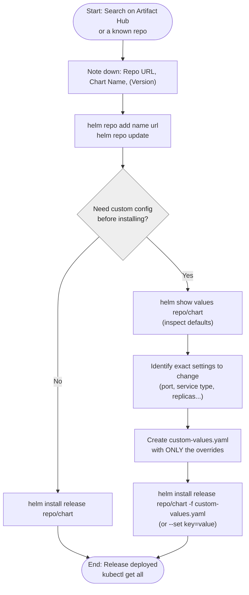

### Finding What You Need on Artifact Hub

[**Artifact Hub**](https://artifacthub.io/) is the standard, central place to search for Charts across every public repository (Bitnami, community charts, vendor charts, etc.). Here's exactly how the diagram above maps to the real site:

**1. Search for the chart you need:**

<div align="center">
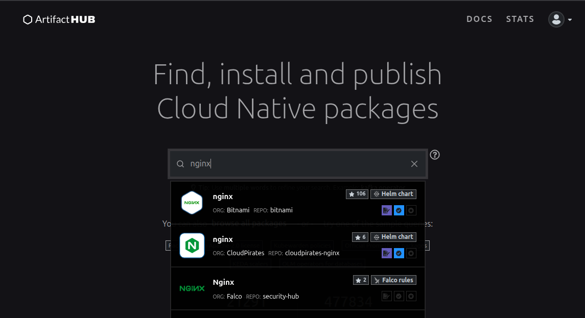
</div>

Searching `nginx` returns every chart named `nginx`, from different maintainers/orgs — this is where you pick the specific one you trust (here, the **Bitnami** one, used throughout this doc).

**2. Click "INSTALL" to get ready-to-copy commands, including the exact Version:**

<div align="center">
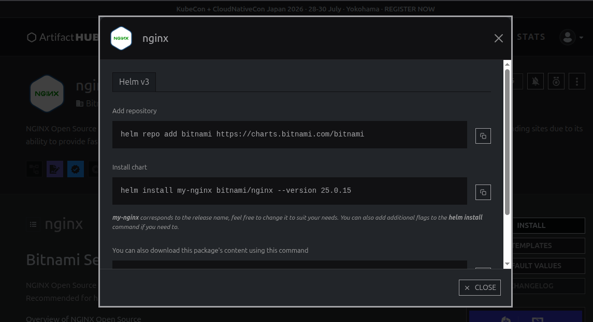
</div>

This single modal gives you **everything from Section 4 at once** — the suggested Repo Name, the Repo URL, the Chart Name, and the exact Version — as two copy-pasteable commands.

**3. The chart's main page gives you quick access to everything else:**

<div align="center">
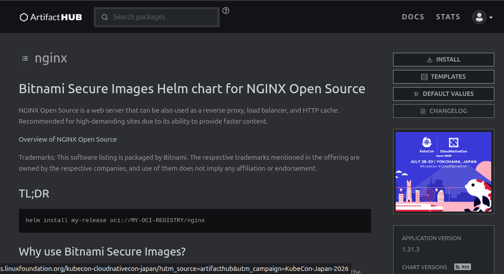
</div>

Note the **TL;DR** box — some charts (especially OCI-based ones) show a slightly different install command using an `oci://` registry address instead of a traditional repo URL. It's still a valid chart, just a different distribution method.

**4. Click "TEMPLATES" to preview every manifest the chart renders — before installing anything:**

<div align="center">
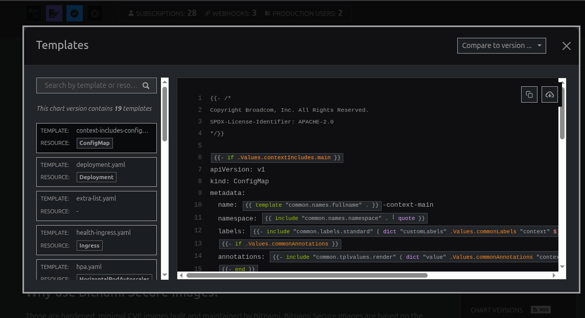
</div>

This is the browser equivalent of running `helm template` locally (see Section 11) — a quick way to check whether the chart even creates the resource type you care about, with zero risk to your cluster.

**5. Click "DEFAULT VALUES" to read the chart's `values.yaml` directly in the browser:**

<div align="center">
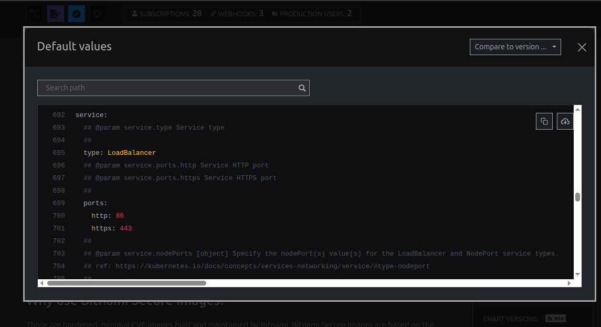
</div>

This is the exact same content `helm show values bitnami/nginx` prints in your terminal (see Section 8) — handy for a quick look before you've even added the repo locally.

**Practical rule of thumb:** the *only* things you strictly need from a chart's page on Artifact Hub to install it are:
1. **Repo URL**
2. **Chart Name**
3. **Version** (recommended, so upgrades don't surprise you with a newer major version)

Everything else — the actual `values.yaml` content — you can pull straight from your terminal with `helm show values`, no need to keep the browser open.

### What Actually Gets Created Inside the Cluster?

This **depends entirely on the chart** — there's no fixed rule. A simple chart might only create a `Deployment` + `Service`. A database chart might create a `StatefulSet` + `Service` + `Secret` + `ConfigMap` + `PersistentVolumeClaim`. Always check with:

```bash
# See everything belonging to your release, whatever it created
kubectl get all -l app.kubernetes.io/instance=<release-name>
```

Here's a real example, right after installing the Bitnami `nginx` chart as a release called `nginx-from-helm`:

<div align="center">
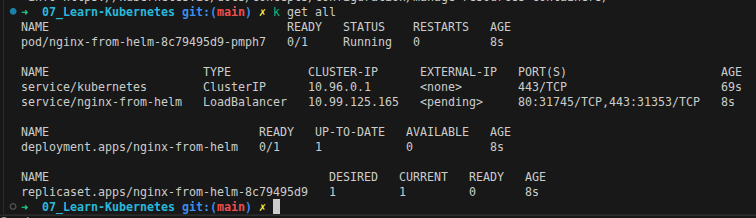
</div>

**Resource naming:** notice every resource — the `Pod`, `Deployment`, `ReplicaSet`, and `Service` — is prefixed with `nginx-from-helm`, the **release name** we chose. That's the pattern most well-built charts follow: `<release-name>-<chart-name>` (or just `<release-name>` if the chart name is implied), so things stay readable and multiple installs of the same chart don't collide. It's not random — it's defined by the chart's own templates (`{{ .Release.Name }}` is a built-in template variable every chart author uses for exactly this reason).

### `--dry-run`: Test Before You Touch the Cluster

```bash
helm install my-release bitnami/nginx --dry-run --debug > simulated-output.yaml
```

This **renders the final manifests locally and prints them** — it does **not** send anything to the API Server. It's the safest way to check "what exactly is Helm about to create?" before committing, especially useful when combined with custom values to make sure your overrides actually landed where you expect.

---

## 8. `values.yaml` Deep Dive

- When you `helm install` a chart, the chart's **`values.yaml` file is bundled inside the package** (the `.tgz`) — it is **not** extracted or shown to you automatically. You're using it "blind" unless you explicitly ask to see it.
- To view the full default values before (or after) installing:
```bash
helm show values <repo-name>/<chart-name>
```
- To change something, you have **two options** (can be combined):

| Method | When to use it | Example |
|---|---|---|
| `--set key=value` | Quick, one-off overrides — a couple of values | `helm install my-app bitnami/nginx --set service.type=NodePort` |
| `-f custom-values.yaml` | Several overrides, or values you want to keep & reuse/version-control | `helm install my-app bitnami/nginx -f custom-values.yaml` |
| `--values=custom-values_2.yaml` | The long-form name of `-f` — functionally identical, just spelled out. Can be repeated like `-f` (later files win on conflicts) | `helm upgrade my-app repo-name/chart-name --values=custom-values_2.yaml` |

> ⚠️ **Don't confuse `helm show values` with `helm get values`** — they answer two different questions:
> | Command | Answers | Works on |
> |---|---|---|
> | `helm show values <repo>/<chart>` | "What are this **chart's default** values?" | Any chart, even one you've never installed |
> | `helm get values <release-name>` | "What values is **this specific, already-running release** actually using right now?" | Only a release currently (or previously) installed in your cluster |
>
> `helm get values <release-name> -a` shows the **fully computed** values (chart defaults + your overrides merged) for the live release — and this works even if you never saved your own `custom-values.yaml`, because Helm stores each release's values inside the cluster itself with every revision. Add `--revision <n>` to pull the values from a specific past revision.

**Typical edit cycle:**
```bash
# 1. Pull the defaults so you have something to start from
helm show values bitnami/nginx > custom-values.yaml

# 2. Edit only the fields you actually care about in that file

# 3. Apply it
helm upgrade my-app bitnami/nginx -f custom-values.yaml
```

---

## 9. Danger Zone: Losing Your Custom Config

This is a real trap worth writing down clearly:

> If your release gets removed for any reason (cluster rebuilt, accidentally uninstalled, node wiped, etc.) and you simply run `helm install` **again from scratch without your saved custom values**, Helm has **no memory** of what you customized before. It will install the chart with its **plain defaults** — every override you made is gone, unless *you* kept a copy of your `custom-values.yaml` somewhere safe (git repo, local file, etc.), **or** the old release is *still* installed somewhere and you can pull its live values with `helm get values <release-name> -a` before touching anything.

**Takeaway:** Helm does not save your custom values anywhere persistent *outside* the release's own revision history **inside that same cluster**. As long as the release still exists, `helm get values` is your safety net. The moment the release (or the whole cluster) is gone, that safety net is gone too — this is exactly how teams end up with a "snowflake cluster": a deployment nobody can reproduce, because the only copy of its real configuration lived inside the cluster that just disappeared. Treat your `custom-values.yaml` file exactly like source code — commit it, back it up, never rely on "I'll remember what I changed" or "it's fine, it's already running."

> In short: **always version-control your custom values files** & **Don't use helm install in a production environment without having your custom values files saved**. If you don't, you will regret it.

---

## 10. Helm Upgrade, Rollback & History

Every `install` and every `upgrade` creates a new numbered **revision** for that release. This is what makes rollback possible.

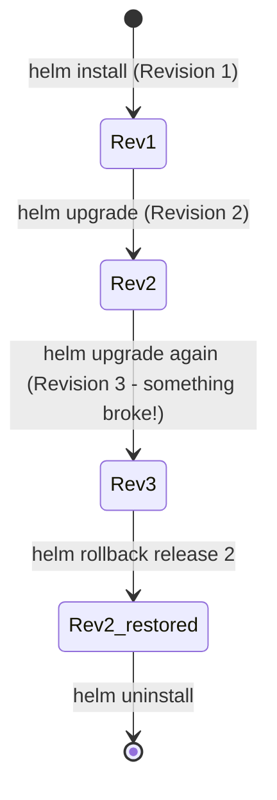

```bash
# See every past revision of a release
helm history my-app

# Roll back to a specific earlier revision
helm rollback my-app 2

# Upgrade, or install it if it doesn't exist yet (very useful for idempotent scripts!)
helm upgrade --install my-app bitnami/nginx -f custom-values.yaml
```

> 💡 `helm upgrade --install` is the pattern most automation scripts should use instead of manually checking "does it exist? install : upgrade" — Helm handles that check internally in one command.

---

## 11. Basic Commands Cheat Sheet

| Command | What it does | Example |
|---|---|---|
| `helm repo add <name> <url>` | Register a chart repository locally | `helm repo add bitnami https://charts.bitnami.com/bitnami` |
| `helm repo update` | Refresh the local cache of all added repos (get latest chart versions) | `helm repo update` |
| `helm repo list` | Show all repos you've added | `helm repo list` |
| `helm search repo <repo-name>` | List all charts available inside a repo | `helm search repo bitnami` |
| `helm show values <repo>/<chart>` | Print a chart's full default `values.yaml` | `helm show values bitnami/nginx` |
| `helm show chart <repo>/<chart>` | Print chart metadata (version, description) | `helm show chart bitnami/nginx` |
| `helm install <release> <repo>/<chart>` | Install a chart as a new release | `helm install my-app bitnami/nginx` |
| `helm install ... -f file.yaml` / `--set k=v` | Install with custom overrides | `helm install my-app bitnami/nginx --set service.type=NodePort` |
| `helm install ... --dry-run --debug` | Simulate install, render YAML, apply nothing | `helm install my-app bitnami/nginx --dry-run --debug` |
| `helm upgrade <release> <repo>/<chart>` | Apply new values/version to an existing release | `helm upgrade my-app bitnami/nginx -f custom-values.yaml` |
| `helm upgrade --install <release> ...` | Upgrade if exists, else install (idempotent) | `helm upgrade --install my-app bitnami/nginx` |
| `helm rollback <release> <revision>` | Revert a release to a previous revision | `helm rollback my-app 2` |
| `helm history <release>` | List every revision of a release | `helm history my-app` |
| `helm list` / `helm ls` | List all currently installed releases | `helm ls -A` (all namespaces) |
| `helm uninstall <release>` | Remove a release and everything it created | `helm uninstall my-app` |
| `helm create <name>` | Scaffold a brand-new chart folder structure locally | `helm create my-chart` |
| `helm template <repo>/<chart>` | Render manifests locally without any cluster interaction at all | `helm template bitnami/nginx` |

---

## 12. Creating Your Own Chart (Packaging an App)

So far this doc covered *consuming* charts other people built. This section covers the other side: packaging **your own** application as a chart, so it gets the same benefits — versioning, templating, multi-environment config — that a chart like Bitnami's `nginx` already gives you.

### The Problem: Deploying Without a Chart

Without packaging your app as a chart, a typical multi-environment setup looks like this:

```
├── dev/
│   ├── deployment.yaml
│   ├── service.yaml
│   └── configmap.yaml
├── staging/
│   ├── deployment.yaml
│   └── service.yaml
└── prod/
    ├── deployment.yaml
    └── service.yaml
```

Every environment has its **own full copy** of the manifests. A small change (image tag, port, replica count) means editing the same field in multiple files, across multiple folders — exactly the problem Section 2 described, just happening to *your own app* this time instead of someone else's.

### Basic Flow

Packaging an app as a chart follows a fixed sequence:

1. **Scaffold the chart** — `helm create my-custom-chart` generates the standard folder structure (see Section 5).
2. **Clean up `templates/`** — delete the example templates you don't need (`hpa.yaml`, `ingress.yaml`, etc. if unused). **Keep `_helpers.tpl`** — it defines reusable snippets and naming conventions used across the other templates.
3. **Bring in your real manifests** — copy your actual `deployment.yaml` / `service.yaml` into `templates/`.
4. **Templatize them** — replace hardcoded values (image tag, port, replica count...) with `{{ .Values.xxx }}` placeholders (see [Templating Basics](#templating-basics) below).
5. **Fill in `values.yaml`** — clear out the example content and define the actual default values your templates reference.
6. **Lint it** — `helm lint ./my-custom-chart` catches syntax errors and missing/mismatched fields.
7. **Render it locally** — `helm template ./my-custom-chart` prints the final YAML without touching any cluster, so you can check the output.
8. **Install it** — `helm install my-release ./my-custom-chart` deploys it for real.
9. **Package it** (once it's ready to share) — `helm package ./my-custom-chart` (see [Publishing to a Repo](#publishing-to-a-repo)).

### Templating Basics

Your templates aren't plain YAML — they're **Go templates**, with `{{ }}` markers that Helm evaluates and replaces before anything is sent to the API Server.

**Before** — a plain, hardcoded manifest:
```yaml
apiVersion: apps/v1
kind: Deployment
metadata:
  name: lumo-backend
spec:
  replicas: 2
  selector:
    matchLabels:
      app: lumo-backend
  template:
    metadata:
      labels:
        app: lumo-backend
    spec:
      containers:
        - name: backend
          image: "karimfathy/lumo-backend:v1.0.0"
          imagePullPolicy: IfNotPresent
          ports:
            - containerPort: 8080
```

**After** — the same manifest, templated:
```yaml
apiVersion: apps/v1
kind: Deployment
metadata:
  name: lumo-backend
spec:
  replicas: {{ .Values.replicaCount }}
  selector:
    matchLabels:
      app: lumo-backend
  template:
    metadata:
      labels:
        app: lumo-backend
    spec:
      containers:
        - name: backend
          image: "{{ .Values.image.repository }}:{{ .Values.image.tag }}"
          imagePullPolicy: {{ .Values.image.pullPolicy }}
          ports:
            - containerPort: {{ .Values.service.port }}
```

Paired with this `values.yaml`:
```yaml
replicaCount: 2
image:
  repository: karimfathy/lumo-backend
  tag: "v1.0.0"
  pullPolicy: IfNotPresent
service:
  port: 8080
```

**Rules of the notation:**
- Every reference starts with `.Values`, then a `.` for each nested key — `.Values.image.repository` reaches `image: → repository:` in `values.yaml`.
- **Quoting depends on the value's type**: numbers (`replicaCount: 2`, `containerPort: 8080`) are used bare — `{{ .Values.replicaCount }}`. Values that YAML needs quoted as strings (like the combined `image:tag` field) get wrapped in `"..."` in the template itself: `"{{ .Values.image.repository }}:{{ .Values.image.tag }}"`.
- **Naming is convention, not enforcement** — Helm doesn't force your `values.yaml` keys to match anything specific, but keeping the same key names between `values.yaml` and the templates (as above) makes charts far easier to read.
- **The values filename doesn't matter either** — `values.yaml` is just the default file Helm looks for automatically. Any other file (`values-dev.yaml`, `prod.yaml`, whatever you name it) must be passed explicitly with `-f`.

#### A Bit More on Go Templates

A few more pieces worth knowing, since almost every real-world chart uses them:

| Concept | Syntax | What it does |
|---|---|---|
| **Built-in objects** | `.Values`, `.Release`, `.Chart`, `.Files`, `.Capabilities` | The data available inside every template — see the table below |
| **Functions** | `lower, upper , default ""` | see [Functions](https://helm.sh/docs/chart_template_guide/function_list/)|
| **Pipelines** | `{{ .Values.image.tag \| default "latest" \| quote }}` | Chains functions left to right — here: fall back to `latest` if no tag was set, then wrap the result in quotes |
| **Whitespace control** | `{{- ... -}}` | The `-` trims the newline/whitespace touching it, so the templating logic doesn't leave blank lines or broken indentation in the final rendered YAML |
| **Conditionals** | `{{- if .Values.ingress.enabled }} ... {{- end }}` | Only include this block of YAML if the condition evaluates to true |
| **Loops** | `{{- range .Values.env }} ... {{- end }}` | Repeat a block for every item in a list — e.g. generating one `env:` entry per variable |
| **Named templates** | Defined in `_helpers.tpl` with `{{ define "chart.fullname" }} ... {{ end }}`, called with `{{ include "chart.fullname" . }}` | Reusable snippets — this is exactly how charts generate consistent resource names everywhere |

**The built-in objects, specifically:**

| Object | Gives you access to | Example |
|---|---|---|
| `.Values` | Whatever is in `values.yaml` (or overridden via `-f` / `--set`) | `.Values.image.tag` |
| `.Release` | Info about *this specific installation* — name, namespace, revision number | `.Release.Name`, `.Release.Namespace` |
| `.Chart` | Metadata from `Chart.yaml` — chart name, version, appVersion | `.Chart.Name`, `.Chart.Version` |
| `.Files` | Access to non-template files bundled inside the chart | `.Files.Get "config.txt"` |
| `.Capabilities` | Info about the cluster itself (Kubernetes version, installed APIs) | `.Capabilities.KubeVersion` |

> **`.Values` vs. `.Release`, in practice:** use `.Values` for anything the *user* should be able to configure (image, replicas, ports). Use `.Release` — especially `.Release.Name` — for naming the resources themselves, since it's guaranteed unique per installation and needs no entry in `values.yaml` at all:
> ```yaml
> metadata:
>   name: {{ .Release.Name }}-backend
> ```

### Multiple Environments

Once your chart is templated, supporting `dev` / `staging` / `prod` is just a matter of **which values file you pass in** — the templates themselves never change:

```bash
helm install my-app ./my-custom-chart -f values-dev.yaml
helm install my-app ./my-custom-chart -f values-staging.yaml
helm install my-app ./my-custom-chart -f values-prod.yaml
```

**Pro tip:** since environment values files are usually 90% identical, keep one base `values.yaml` with the shared defaults, and layer environment-specific overrides on top. You can combine multiple `-f` flags — **later files win over earlier ones** — or use `--set` for one-off differences:

```bash
# Layer a small env-specific file on top of the base values (values-dev.yaml wins on conflicts)
helm install my-app ./my-custom-chart -f values.yaml -f values-dev.yaml

# Or override a couple of fields directly, no extra file needed
helm install my-app ./my-custom-chart -f values.yaml --set replicaCount=3 --set image.tag=v1.0.1
```

### Checking a Real Release

Once installed, `helm list` and `helm history` show you exactly what's running — note the distinct **CHART** version (the packaging version, from `Chart.yaml`) vs. **APP VERSION** (the version of the actual application inside, also declared in `Chart.yaml`):

```
$ helm history petclinic-app
REVISION  UPDATED                    STATUS    CHART                 APP VERSION  DESCRIPTION
1         Tue Jul 28 23:12:34 2026   deployed  petclinic-app-0.1.0   1.16.0       Install complete

$ helm list
NAME            NAMESPACE  REVISION  UPDATED                    STATUS    CHART                 APP VERSION
petclinic-app   default    1         2026-07-28 23:12:34 +0300  deployed  petclinic-app-0.1.0   1.16.0
```

> **On bumping versions:** there's no special flag needed to "record" a new revision — `helm upgrade` creates a new numbered revision automatically, every single time, regardless of whether `Chart.yaml`'s `version`/`appVersion` changed. Those two fields are metadata **you** maintain by hand to track your chart's own release history (think of it like semantic-versioning a library) — bump them when you make a meaningful change, then `helm upgrade` as usual. Rollback and history work exactly as covered in [Section 10](#10-helm-upgrade-rollback--history).

### Useful `helm install` / `helm upgrade` Flags

| Flag | What it does |
|---|---|
| `--set key=value` | Override a single value from `values.yaml` |
| `-f values.yaml` | Use a specific values file (can be repeated) |
| `--timeout <duration>` | Fail the operation if it takes longer than this |
| `--wait` | Block until all resources reach a ready state before returning |
| `--atomic` | Automatically roll back if the install/upgrade fails |
| `--cleanup-on-fail` | Delete any resources that were created before a failed install |
| `--force` | Force resource updates through delete/recreate if a normal update isn't possible |
| `--dry-run` | Simulate the operation, render the YAML, apply nothing |
| `--wait-for-jobs` | Also wait for any `Job` resources to complete (used together with `--wait`) |

These all combine freely:
```bash
helm upgrade --install my-app ./my-custom-chart \
  -f values.yaml --set image.tag=v1.0.1 \
  --wait --atomic --timeout 2m
```

**`helm install` vs. `helm upgrade --install`:** `helm install` only works for a brand-new release — it fails if one already exists. `helm upgrade --install` does either automatically, which is why it's the safer default for automation scripts (see Section 10).

### Helm Plugins

Plugins extend Helm with extra commands. The most commonly used one is [`helm-diff`](https://github.com/databus23/helm-diff), which shows exactly what an upgrade *would* change before you actually run it:

```bash
# Install the plugin (once)
helm plugin install https://github.com/databus23/helm-diff

# Preview an upgrade's changes before applying it
helm diff upgrade my-app ./my-custom-chart -f values.yaml
```

### Publishing to a Repo

Once your chart works and is tested, making it installable via `helm repo add` (instead of a local folder path) takes a few steps, **in this order**:

1. **Package it** — `helm package ./my-custom-chart` produces a versioned archive, e.g. `my-custom-chart-0.1.0.tgz`.
2. **Put the archive in a folder** that will act as your repo (a plain folder, an S3 bucket, GitHub Pages, etc.).
3. **Generate the index** — `helm repo index ./repo-folder` creates/updates the `index.yaml` file that catalogs every chart version in that folder — this is the file repo tooling (including Artifact Hub) actually reads.
4. **Host that folder** somewhere reachable over HTTP(S) — GitHub Pages and ChartMuseum are common choices; OCI registries (Docker Hub, GHCR, etc.) are the modern alternative and skip the `index.yaml` step entirely.
5. **Anyone (including future-you) can now use it** the normal way:
   ```bash
   helm repo add my-repo https://your-hosted-url.example.com
   helm repo update
   helm install my-release my-repo/my-custom-chart
   ```

---

## 13. Annotated Walkthrough: My Automation Script

This is what my `helm-deploy.sh` script does, step by step — plus a few improvements worth making.

```bash
#!/usr/bin/bash
RELEASE_NAME=$1
REPO_NAME=$2
REPO_URL=$3
CHART_NAME=$4
PORT=$5
```
> Takes everything discussed above as arguments — release name, the repo alias, the repo's real URL, the exact chart name, and the local port to forward to.

```bash
if [[ -z $RELEASE_NAME ]] || [[ -z $PORT ]] || [[ -z $REPO_URL ]] || [[ -z $CHART_NAME ]] || [[ -z $REPO_NAME ]]; then
    echo "Usage: $0 <release-name> <repo-name> <repo-url> <chart-name> <forwarded-port>"
    exit 1
fi
```
> Basic input validation — good practice, fails fast with a clear usage message instead of crashing halfway through.

```bash
{
    read -r HOST
    read -r API_SERVER
} <<< "$(minikube status | grep -ie host -ie apiserver | awk '{print $2}')"
```
> Parses `minikube status` to check if the cluster (host + API server) is already running, so the script doesn't unnecessarily restart it.

```bash
if [[ "$MINIKUBE_STATUS" != "Running" ]]; then
    minikube start --driver=docker
    # ... enable ingress & metrics-server addons if not already enabled
fi
```
> Bootstraps Minikube (with `docker` driver) and makes sure `ingress` + `metrics-server` addons are on — only if the cluster isn't already up. This is exactly the precondition Section 6 talks about: Helm needs a *running, reachable* cluster with a valid kubeconfig context.

```bash
helm version &> /dev/null
HELM_STATUS=$(echo $?)
if [[ "$HELM_STATUS" -ne 0 ]]; then
    curl -fsSL -o get_helm.sh https://raw.githubusercontent.com/helm/helm/main/scripts/get-helm-3
    chmod +x get_helm.sh
    ./get_helm.sh
fi
```
> Installs Helm itself if it isn't already available — makes the script fully self-contained on a fresh machine.

```bash
helm repo add "$REPO_NAME" "$REPO_URL"
helm repo update
```
> Registers the repo and refreshes the chart index — exactly the "Repo Name / Repo URL" step from Section 4.

```bash
if helm list | grep -q "$RELEASE_NAME"; then
    helm upgrade "$RELEASE_NAME" "$REPO_NAME"/"$CHART_NAME" &> /dev/null
else
    helm install "$RELEASE_NAME" "$REPO_NAME"/"$CHART_NAME" &> /dev/null
fi
```
> Manually checks whether the release already exists to decide between `install` and `upgrade`.

```bash
SERVICE_NAME=$(kubectl get svc | grep -i "$RELEASE_NAME" | awk '{print $1}' | head -n 1)
TARGET_PORT=$(kubectl get svc "$SERVICE_NAME" -o jsonpath='{.spec.ports[0].port}')
# ... fallback to port 80 if not found
mkdir -p $PWD/"$RELEASE_NAME"
helm show values $REPO_NAME/$CHART_NAME > $PWD/"$RELEASE_NAME"/"$CHART_NAME"-values.yaml
nohup kubectl -n default port-forward svc/"$SERVICE_NAME" $PORT:$TARGET_PORT &
brave-browser http://localhost:$PORT &> /dev/null &
```
> Auto-discovers the Service created by the chart, port-forwards it locally, saves a copy of the chart's values, and opens it straight in the browser — a nice end-to-end touch, using `$REPO_NAME` (not `$REPO_URL`) with `helm show values`, and creating the target folder with `mkdir -p` before writing into it.


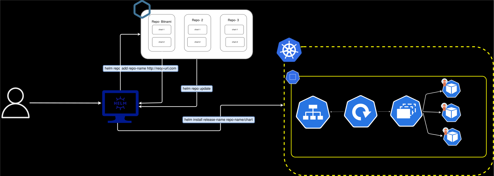
<style>
body {font-size: 16px; line-height: 1.6;}
</style>
