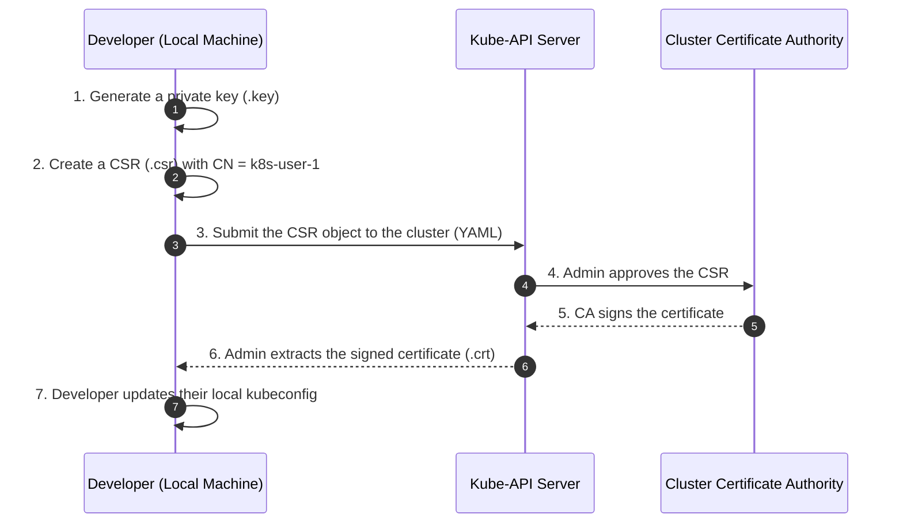
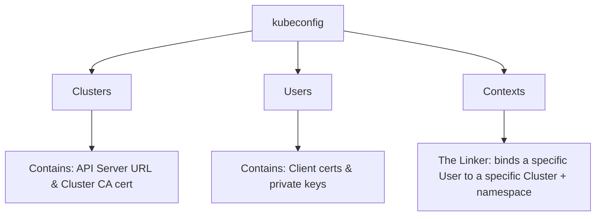
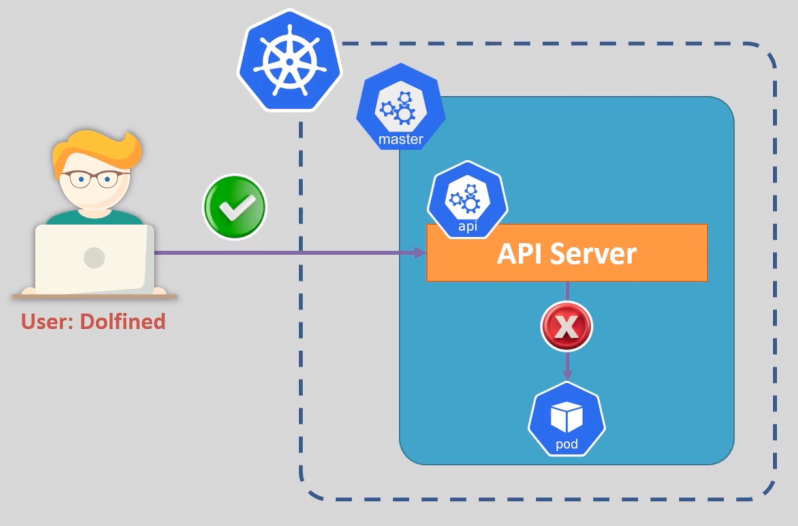
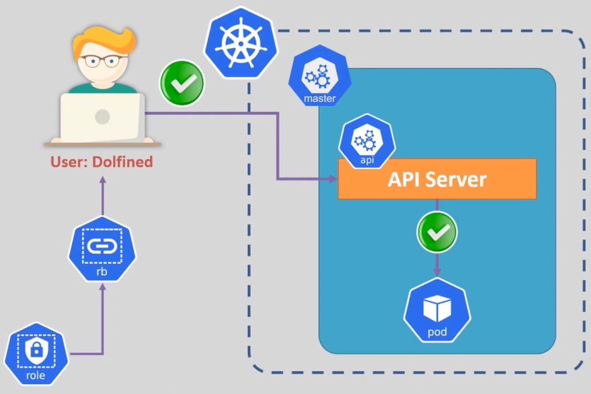
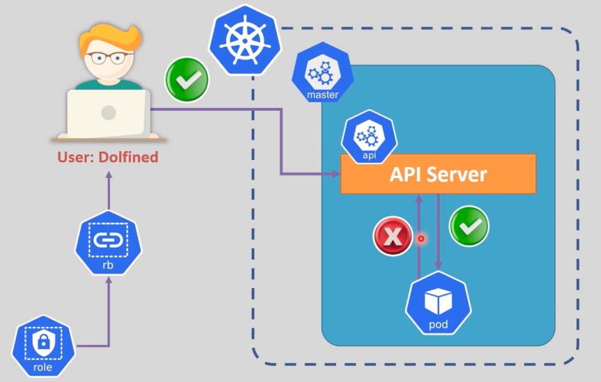
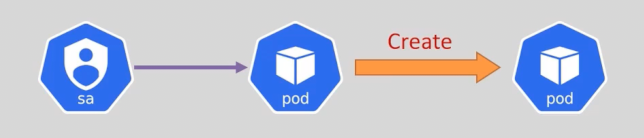
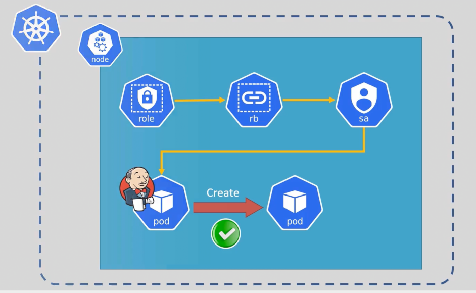
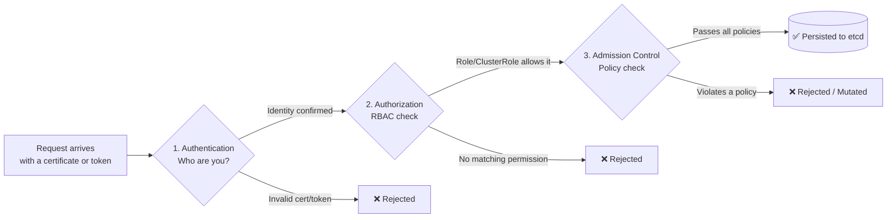

# Kubernetes Security: Authentication, Authorization & Identities

## Table of Contents
- [The 3 Pillars of Kubernetes Security](#the-3-pillars-of-kubernetes-security)
- [1. Authentication (AuthN) — Who Are You?](#1-authentication-authn--who-are-you)
  - [1.1 Kubernetes Identities: Users vs. Service Accounts](#11-kubernetes-identities-users-vs-service-accounts)
  - [1.2 Authentication Flow (PKI & Certificates)](#12-authentication-flow-pki--certificates)
  - [1.3 The Administrator Workflow (Step-by-Step)](#13-the-administrator-workflow-step-by-step)
  - [1.4 The `kubeconfig` File Architecture](#14-the-kubeconfig-file-architecture)
- [2. Authorization (AuthZ) — What Are You Allowed to Do?](#2-authorization-authz--what-are-you-allowed-to-do)
  - [2.1 Role & RoleBinding](#21-role--rolebinding)
  - [2.2 ClusterRole & ClusterRoleBinding](#22-clusterrole--clusterrolebinding)
  - [2.3 Quick Comparison: Namespaced vs Cluster-Wide](#23-quick-comparison-namespaced-vs-cluster-wide)
- [3. Service Accounts & Pod Identity](#3-service-accounts--pod-identity)
- [4. Admission Control](#4-admission-control)
- [5. Putting It All Together (Full Request Lifecycle)](#5-putting-it-all-together-full-request-lifecycle)

---

## The 3 Pillars of Kubernetes Security

Every single API request that hits the Kubernetes cluster passes through **three sequential checkpoints**, in this exact order. If a request fails any of them, it never reaches `etcd` (the cluster's database):

| # | Checkpoint | Question it Answers |
|---|------------|----------------------|
| 1 | **Authentication (AuthN)** | *Who are you?* — Identity verification. |
| 2 | **Authorization (AuthZ)** | *What are you allowed to do?* — RBAC (Roles & Permissions). |
| 3 | **Admission Control** | *Does this request follow cluster policy?* — e.g., "../images must come from a private registry." |

> Passing checkpoint 1 does **not** mean you pass checkpoint 2. Being a known identity doesn't automatically give you permissions — that distinction is the whole point of this document.

---

## 1. Authentication (AuthN) — Who Are You?

Authentication is the process of verifying **who** is sending a request to the API Server — before Kubernetes even considers what that identity is allowed to do.

### 1.1 Kubernetes Identities: Users vs. Service Accounts

The biggest surprise for anyone new to Kubernetes: **there is no such thing as a "user" object inside Kubernetes.** There's no `useradd` equivalent, and you can't run `kubectl get users` — because that resource simply doesn't exist.

| Feature | Regular Users | Service Accounts |
|---|---|---|
| **Used by** | Humans (admins, developers) | Applications, Pods, CI/CD pipelines |
| **Managed by** | External systems (PKI/Certificates, AWS IAM, OIDC, etc.) | Kubernetes itself (stored in `etcd`) |
| **Creation** | No K8s object — nothing to `kubectl create` | `kubectl create sa <name>` — it's a real object with YAML |
| **How it's verified** | Validates the certificate's signature / external identity provider | Validates the JWT token mounted inside the Pod |

> **Key takeaway:** If someone presents a valid certificate signed by the cluster's Certificate Authority (CA), Kubernetes extracts the **Common Name (`CN`)** field from that certificate and treats it as the **username**. That's it — no database lookup involved.

### 1.2 Authentication Flow (PKI & Certificates)

Since Kubernetes has no built-in user database, human identity is proven using **X.509 digital certificates**. Here's the full flow, end to end:



### 1.3 The Administrator Workflow (Step-by-Step)

Below are the actual commands an admin runs to grant a new developer access to the cluster.

**Step 1 — Generate a private key (on the developer's machine)**
```bash
openssl genrsa -out k8s-user-1.key 2048
```

**Step 2 — Create a Certificate Signing Request (CSR)**

> The `/CN` (Common Name) field is exactly what Kubernetes will recognize as the username.

```bash
openssl req -new -key k8s-user-1.key -out k8s-user-1.csr -subj "/CN=k8s-user-1/O=developers"
```

**Step 3 — Submit the CSR to Kubernetes**

Encode the `.csr` file in `base64` and wrap it inside a `CertificateSigningRequest` object, then apply it with `kubectl apply -f`.

**Step 4 — Admin reviews and approves the CSR**
```bash
kubectl get csr
kubectl certificate approve <csr-name>
```

**Step 5 — Extract the now-signed certificate**
```bash
kubectl get csr <csr-name> -o jsonpath='{.status.certificate}' | base64 -d > k8s-user-1.crt
```

At this point, the developer has a valid, signed certificate — but they still can't use it until it's registered in their `kubeconfig`.

### 1.4 The `kubeconfig` File Architecture

The `kubeconfig` file (usually at `~/.kube/config`) is your **passport + GPS** for reaching the cluster. It's built from 3 sections that reference each other:



**Real example** (`kubectl config view --minify`):
```yaml
apiVersion: v1
kind: Config

clusters:
- name: minikube
  cluster:
    certificate-authority: /home/karim/.minikube/ca.crt
    server: https://192.168.49.2:8443

contexts:
- name: minikube
  context:
    cluster: minikube
    namespace: default
    user: minikube

users:
- name: minikube
  user:
    client-certificate: "xxxxxx"
    client-key: "xxxxxx"

current-context: minikube
```

**Registering our new user in kubeconfig:**
```bash
# 1. Add the user's credentials
kubectl config set-credentials k8s-user-1 \
  --client-key=k8s-user-1.key \
  --client-certificate=k8s-user-1.crt \
  --embed-certs=true

# 2. Create a context linking the user to a cluster
kubectl config set-context dev-context --cluster=my-cluster --user=k8s-user-1

# 3. Switch to the new context
kubectl config use-context dev-context
```

<div align="center">
  
  <p><strong>At this stage, the user is only <em>authenticated</em>.</strong><br/>
  The request reaches the API Server successfully (✅), but it's rejected (❌) before touching the Pod — because <strong>no permissions have been granted yet</strong>. That's Authorization's job, coming up next.</p>
</div>

---

## 2. Authorization (AuthZ) — What Are You Allowed to Do?

**RBAC (Role-Based Access Control)** is Kubernetes' authorization model. It controls *what an already-authenticated identity can actually do* — which resources it can touch, and which actions (verbs) it can perform on them.

RBAC is built from 4 objects, working in pairs:

<div align="center">
  
  <p>Once a <code>Role</code> is linked to a user through a <code>RoleBinding</code>, the same request that was blocked before now passes all the way through to the Pod (✅).</p>
</div>

### 2.1 Role & RoleBinding

- **`Role`** — defines a set of permissions **within a single namespace** (namespace-scoped).
- **`RoleBinding`** — attaches that `Role` to a specific user, group, or service account, **also scoped to one namespace**.

<div align="center">
  
</div>

**Full YAML example:**
```yaml
apiVersion: rbac.authorization.k8s.io/v1
kind: Role
metadata:
  namespace: dev   # Always declare this explicitly — your current context's namespace might change
  name: pod-reader
rules:
- apiGroups: [""]        # "" = the core API group (v1)
  resources: ["pods"]    # Must be a namespaced resource — check with `kubectl api-resources --namespaced=true`
  verbs: ["get", "watch", "list"]

- apiGroups: ["apps"]    # You can stack multiple rules for different API groups
  resources: ["deployments"]
  verbs: ["get", "watch", "list"]
  resourceNames: ["my-deployment"]   # Optional: restrict the rule to one specific named resource
```

```yaml
apiVersion: rbac.authorization.k8s.io/v1
kind: RoleBinding
metadata:
  name: read-pods
  namespace: dev   # Mandatory for RoleBinding (unlike ClusterRoleBinding)
subjects:
- kind: User                          # Can be: User, Group, or ServiceAccount
  name: k8s-user-1
  apiGroup: rbac.authorization.k8s.io  # Mandatory for User/Group — omit this for ServiceAccount
roleRef:
  kind: Role
  name: pod-reader
  apiGroup: rbac.authorization.k8s.io
```

**Equivalent imperative commands:**
```bash
# Create a Role
kubectl create role pod-reader \
  --verb=get,list,watch --resource=pods \
  --namespace=dev --resourceNames=my-deployment

# Create a RoleBinding
kubectl create rolebinding read-pods --role=pod-reader --user=k8s-user-1 -n dev

# Test what a user can actually do
kubectl auth can-i <verb> <resource> --as <user> -n <namespace>
```

> ⚠️ **Common pitfall:** running `kubectl auth can-i get nodes --as k8s-user-1` with the setup above will return **"no"** — because `Role`/`RoleBinding` are namespace-scoped, while `nodes` is a **cluster-scoped** resource. For cluster-wide resources, you need `ClusterRole` + `ClusterRoleBinding` instead.

> 💡 **Good to know:** a `RoleBinding` can also reference a `ClusterRole` (instead of a `Role`). This lets you reuse one broad, predefined `ClusterRole` (like the built-in `view`, `edit`, or `admin` roles) but still grant it **only within one namespace** — a very common real-world pattern.

### 2.2 ClusterRole & ClusterRoleBinding

- **`ClusterRole`** — defines permissions that apply **across the whole cluster**, and can also target cluster-scoped resources (like `nodes`, `persistentvolumes`, or `namespaces` themselves).
- **`ClusterRoleBinding`** — attaches a `ClusterRole` to a user/group/service account **cluster-wide** (no namespace involved).

<div align="center">
  
</div>

```yaml
apiVersion: rbac.authorization.k8s.io/v1
kind: ClusterRole
metadata:
  name: cluster-admin-example
rules:
- apiGroups: [""]          # Core API group — NOT "v1" (a common typo — the group is "", the version is v1)
  resources: ["nodes"]
  verbs: ["get", "list", "watch", "create", "update", "delete"]

- apiGroups: [""]
  resources: ["persistentvolumes"]
  verbs: ["get", "list", "watch", "create", "update", "delete"]

- apiGroups: ["*"]     # "*" = all API groups
  resources: ["*"]     # "*" = all resources
  verbs: ["*"]         # Absolute god-mode — use with extreme caution
```

```yaml
apiVersion: rbac.authorization.k8s.io/v1
kind: ClusterRoleBinding
metadata:
  name: cluster-admin-binding
subjects:
- kind: User
  name: k8s-user-1
  apiGroup: rbac.authorization.k8s.io
roleRef:
  kind: ClusterRole
  name: cluster-admin-example
  apiGroup: rbac.authorization.k8s.io
```

**Equivalent imperative commands:**
```bash
kubectl create clusterrole <name> --verb=<verb> --resource=<resource>
kubectl create clusterrolebinding <name> --clusterrole=<clusterrole> --user=<user>
```

### 2.3 Quick Comparison: Namespaced vs Cluster-Wide

| Object | Scope | Can target cluster-scoped resources (nodes, PVs)? | Typical use case |
|---|---|---|---|
| `Role` | Single namespace | ❌ No | "This team can only read pods in `dev`" |
| `RoleBinding` | Single namespace | Grants a `Role` **or** a `ClusterRole`, but scoped to one namespace | Attach permissions to a user/SA in one namespace |
| `ClusterRole` | Whole cluster | ✅ Yes | "Anyone with this role can list all nodes" |
| `ClusterRoleBinding` | Whole cluster | ✅ Yes | Cluster admins, monitoring agents, CI/CD systems |

---

## 3. Service Accounts & Pod Identity

**What is a Service Account (SA)?**

A Service Account is an identity — but instead of being used by a human, it's used by **applications running inside Pods** so they can authenticate to the Kubernetes API themselves.

<div align="center">
  
  <p>Here's the crucial nuance: even after <strong>you</strong> (the user) are authorized to create a Pod, that doesn't mean <strong>the Pod itself</strong> has any identity or permissions to talk back to the API Server. The Pod needs its <em>own</em> credentials — that's exactly what a Service Account provides.</p>
</div>

**Real-world example — Jenkins:** when Jenkins runs inside a Pod and needs to dynamically create/manage other Pods for CI/CD pipelines, it can't use your `kubeconfig` — it needs its own Service Account with its own permissions.

<div align="center">
  
</div>

**Default behavior:** every Pod is automatically assigned the `default` Service Account of its namespace unless told otherwise — and that `default` SA has almost no permissions by design (least privilege).

```bash
# Check which Service Account a running Pod is using
kubectl describe pod <pod-name> -n <namespace> | grep -i "Service Account"
```

**Creating and assigning a custom Service Account (full example):**
```yaml
# 1. Role — what the Service Account is allowed to do
apiVersion: rbac.authorization.k8s.io/v1
kind: Role
metadata:
  namespace: dev
  name: pod-reader
rules:
- apiGroups: [""]
  resources: ["pods"]
  verbs: ["get", "watch", "list"]
---
# 2. RoleBinding — attaching the Role to the Service Account
apiVersion: rbac.authorization.k8s.io/v1
kind: RoleBinding
metadata:
  name: pod-reader-binding
  namespace: dev
subjects:
- kind: ServiceAccount
  name: my-service-account
  namespace: dev
roleRef:
  kind: Role
  name: pod-reader
  apiGroup: rbac.authorization.k8s.io
---
# 3. The Service Account itself
apiVersion: v1
kind: ServiceAccount
metadata:
  name: my-service-account
  namespace: dev
---
# 4. Assigning it to a Deployment's Pods
apiVersion: apps/v1
kind: Deployment
metadata:
  name: my-deployment
  namespace: dev
spec:
  replicas: 1
  selector:
    matchLabels:
      app: my-app
  template:
    metadata:
      labels:
        app: my-app
    spec:
      serviceAccountName: my-service-account   # <-- this line links the pod to its identity
      containers:
      - name: my-container
        image: nginx
```

<div align="center">
  
  <p>The complete chain: <code>Role → RoleBinding → ServiceAccount → Pod</code>. Once wired together, the Pod (e.g. Jenkins) can authenticate itself and successfully create other Pods (✅).</p>
</div>

---

## 4. Admission Control

Even after a request is **authenticated** (AuthN) and **authorized** (AuthZ), there's one last gate before it's written to `etcd`: **Admission Controllers**.

Admission Controllers intercept the request and can do two things:

1. **Validating** — reject the request if it breaks cluster policy. Examples: blocking ../images pulled from an untrusted public registry, or rejecting a Pod that would exceed the namespace's resource quota.
2. **Mutating** — silently modify the request to enforce standards or inject defaults. Examples: auto-injecting a sidecar container (like a service-mesh proxy), or adding default CPU/memory limits if none were specified.

> **Key distinction:** RBAC answers *"does this user have the right to create a Pod?"* — Admission Control answers *"does this specific Pod meet our cluster's operational and security standards?"* Both must say yes.

---

## 5. Putting It All Together (Full Request Lifecycle)

Here's the complete journey of a single API request, tying every section above into one flow:



| Stage | Human user path | Pod / application path |
|---|---|---|
| **Identity** | Client certificate (`CN` = username) | Service Account JWT token |
| **Granted via** | `Role`/`ClusterRole` + `RoleBinding`/`ClusterRoleBinding` | Same objects, bound to a `ServiceAccount` instead of a `User` |
| **Configured in** | `kubeconfig` | `spec.serviceAccountName` in the Pod spec |
| **Final gate** | Admission Control | Admission Control |