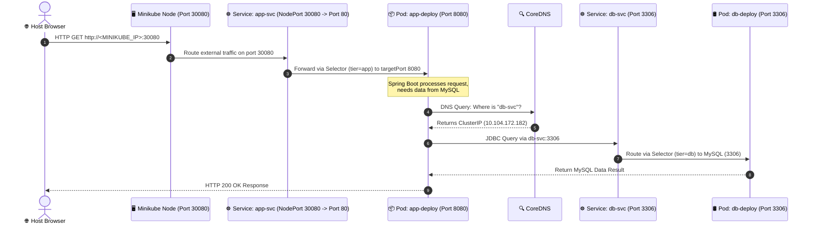
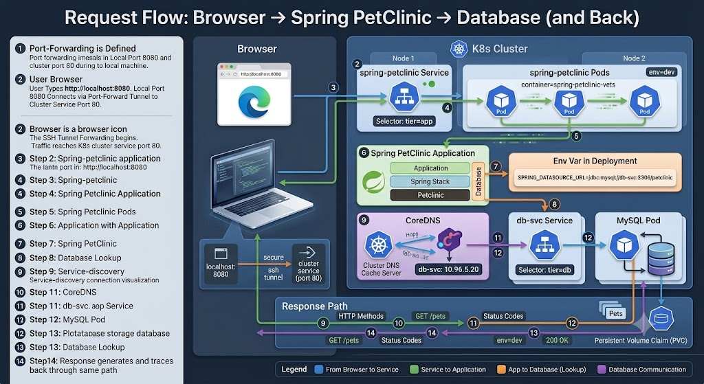

# 🐾 Spring PetClinic - Legacy Kubernetes Architecture & Troubleshooting Post-Mortem

## Project Overview
This directory contains the legacy Kubernetes deployment setup for the **Spring PetClinic** microservices-style application (Spring Boot + MySQL). 

This configuration was built using basic Kubernetes workloads (`Deployments` & `ClusterIP Services, NodePort Services`) to establish a working baseline before refactoring to a Production-Ready architecture (`StatefulSets`, `Secrets`, `Headless Services`, and `InitContainers`).

---

##  Architecture Stack & Components

* **Namespace:** `petclinic-namespace`
* **Application Layer:** 
  * `Deployment` (3 Replicas) running `springcommunity/spring-petclinic:3.5.6`
  * `Service` (`NodePort` on port `30080 (NodePort)-> 80(ServicePort) -> 8080(TargetPort)`)
* **Database Layer:** 
  * `Deployment` (1 Replica) running `mysql:8.4.5`
  * `Service` (`ClusterIP` on port `3306`)
* **Orchestration Tool:** `Kustomize` (`kustomization.yaml`)


## 🔄 Request Lifecycle & Architecture Flow (NodePort Mode)

To understand how traffic traverses through this legacy setup, here is the step-by-step lifecycle of a user request—from your host browser through the NodePort directly to the database container and back.



### 📍 Detailed Step-by-Step Request Flow:

#### **Phase 1: External Access via NodePort**
1. **NodePort Exposure:** The `app-svc` Service exposes port `30080` globally across all Kubernetes cluster nodes.
2. **Direct Browser Request:** You open your host machine browser and navigate directly to:
   `http://<MINIKUBE_IP>:30080` (or run `minikube service app-svc -n petclinic-namespace`).
3. **Port Chain Mapping:** Kubernetes receives traffic on NodePort `30080`, routes it to Service port `80`, and forwards it to the container's `targetPort: 8080`.
   ```yaml
   # Service: app-svc
   spec:
     type: NodePort
     ports:
     - port: 80         # Internal Cluster IP Port
       targetPort: 8080 # App Container Port
       nodePort: 30080  # External Host Port
   ```

#### **Phase 2: Frontend Routing to Application Pod**
4. **Service Endpoint Selection:** The `app-svc` checks its defined `selector` to locate all healthy Pods:
   ```yaml
   selector:
     tier: app
   ```
5. **Load Balancing:** The Service forwards the HTTP request to one of the available `app-deploy` Pods on port `8080`.
6. **Application Processing:** The Spring Boot application inside `petclinic-app-container` receives and starts processing the request.

#### **Phase 3: Internal Service Discovery & Database Query**
7. **Database Target Identification:** To fetch or persist data, Spring Boot inspects its database connection URL configured in the environment variables:
   ```yaml
   - name: SPRING_DATASOURCE_URL
     value: jdbc:mysql://db-svc:3306/petclinic
   ```
8. **DNS Resolution via CoreDNS:** The application queries **CoreDNS** to resolve the internal hostname `db-svc`.
9. **IP Retrieval:** CoreDNS translates `db-svc` to its assigned internal ClusterIP (e.g., `10.104.172.182`) and returns it to Spring Boot.

#### **Phase 4: Database Routing & Response**
10. **Database Service Forwarding:** The application sends TCP traffic to `10.104.172.182:3306`. The `db-svc` Service intercepts this and routes it to the MySQL Pod using its selector (`tier: db`).
11. **MySQL Engine Execution:** The request reaches the `mydql-db-container` on port `3306`, where MySQL executes the query.
12. **Response Return Path:** MySQL returns the data back to Spring Boot, which renders the HTML page and sends it back to your browser through the NodePort interface.


---

## Identified Architectural Bad Practices (Anti-Patterns)

While this setup successfully ran the application after troubleshooting, it contains several critical **anti-patterns** that make it unsafe for Production environments:

### 1. Plaintext Secrets & Hardcoded Credentials (Security Risk)
* **Problem:** Database credentials (`MYSQL_ROOT_PASSWORD`, `MYSQL_PASSWORD`, `SPRING_DATASOURCE_PASSWORD`) are hardcoded in plaintext inside the `Deployment` YAML files.
* **Impact:** Anyone with access to the source code repository can view sensitive production passwords.

### 2. Database as a Deployment without Persistent Storage (Data Loss Risk)
* **Problem:** MySQL is managed using a stateless `Deployment` instead of a `StatefulSet`, without attaching any `PersistentVolumeClaim` (PVC).
* **Impact:** Any Pod restart, node failure, or reschedule will lead to **total and irreversible data loss**.

### 3. Missing Network Identity for Database Replicas
* **Problem:** MySQL uses a standard `ClusterIP` load-balanced service.
* **Impact:** If the database is scaled to multiple replicas, write commands (`INSERT`/`UPDATE`) will be randomly load-balanced to read-only replicas, breaking application functionality.

### 4. Lack of Health Probes & Race Conditions
* **Problem:** No `readinessProbe` or `livenessProbe` defined for either the database or the application.
* **Impact:** Kubernetes marks the Application Pods as `Ready` before the JVM finishes warming up or before MySQL opens port `3306`, causing immediate traffic drops and application crashes.

### 5. Inefficient External Access Strategy
* **Problem:** Accessing the application via `NodePort` exposes random high-range ports (30000-32767) and requires manual IP tracking, while `port-forward` is only suitable for local debugging.
* **Impact:** Lack of centralized SSL/TLS termination, custom routing, and Production-grade domain mapping.

---

##  The Startup Problem & Root Cause Analysis

### **Symptom:**
When running `kubectl apply -k .`, the Spring Boot application enters a continuous **CrashLoopBackOff** cycle.

> **Execution Log Output:**
> - `Caused by: com.mysql.cj.exceptions.CJCommunicationsException: Communications link failure`
> - `Caused by: java.net.UnknownHostException: db-svc: Temporary failure in name resolution`

### **Root Cause Breakdown:**
1. **Race Condition at Startup:** `Kustomize` applies both Deployments concurrently. Spring Boot boots up in ~4 seconds and attempts to establish a JDBC connection before MySQL has initialized its database engine.
2. **JVM Negative DNS Caching:** Upon the initial connection failure, Java 21's JVM caches the negative DNS resolution (`UnknownHostException`). Even when `db-svc` becomes fully healthy, Java refuses to query `CoreDNS` again, pinning the application in a permanent crash loop.

---

## 🛠️ Temporary Fixes Applied (Legacy Baseline)

To get this legacy setup functioning for testing, the following workarounds were verified:

1. **Manual Rollout Reset:** Executing `kubectl rollout restart deployment/app-deploy` after MySQL is fully `1/1 Running` clears Java's startup state and allows clean DNS resolution.
2. **FQDN Connection Strings:** Replacing `db-svc` with the Fully Qualified Domain Name:
   `jdbc:mysql://db-svc.petclinic-namespace.svc.cluster.local:3306/petclinic`
3. **Cluster Health Verification:** Ensuring `coredns` pods are running in `kube-system` using `kubectl get pods -n kube-system`.

---

##  Future Roadmap & Refactoring Plan (Production-Ready)

To eliminate all identified anti-patterns, the architecture is being refactored into the following design:

| Issue | Legacy Setup | Refactored Architecture |
| :--- | :--- | :--- |
| **Security** | Plaintext `env` vars | Kubernetes `Secret` & `ConfigMap` |
| **Data Retention** | Ephemeral Pod Storage | `StatefulSet` + `PersistentVolumeClaim` (PVC) |
| **Networking** | Standard `ClusterIP` | `Headless Service` (Direct Pod Identity) |
| **Startup Order** | Race Condition / Crashes | `InitContainer` (pings DB before App starts) |
| **Health Checks** | None | `readinessProbe` & `livenessProbe` (Spring Actuator) |
| **External Access** | `port-forward` / `NodePort` | `Ingress` (NGINX Controller with SSL/TLS) |


