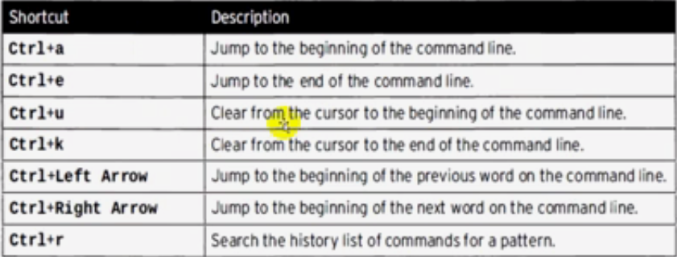

# Most Important Basic Commands and Options

## Basic Commands and Their Options

### System Information
- **`uptime`**  
    Display system uptime, users, and load.

- **`lscpu`**  
    Display information about the `cpu`.

### Command Shortcuts
- **`Alt + .`**  
    Repeat the last argument.

### File and Directory Operations
- **`ls -lr`**  
    Reverse order listing.  
- **`ls -lh`**  
    Human-readable sizes.  
- **`cd -`**  
    Go to the previous directory.  
- **`touch file`**  
    Create or update a file.  
- **`mkdir -p dir1/dir2`**  
    Create nested directories.  
- **`cp -r /src /dest`**  
    Copy directories without permissions.  
- **`cp -r -p /src /dest`**  
    Copy directories with permissions.  
- **`dd if=<path1> of=<path2> bs=<n>M count=<x>`**  
    Copy data with block size and count.  
    ```bash
    # Example: dd if=/dev/zero of=file.img bs=1M count=100
    ```  
- **`rm -r dir`**  
    Remove directories.  
- **`rm -r /dir/*`**  
    Clear directory contents.  
- **`rm -i file`**  
    Confirm before deleting.  
      
- **`mv /src /dest`**  
    Move files or directories.  
- **`mv -v f0 f1`**  
    Show move details.  
      

### Root and Command History
- **`sudo -i`**  
    Open root shell.  
- **`!<command>`**  
    Repeat last matching command.  

### Writing Command Shortcuts


---

# Most Important Files in Linux

1. **`/etc/passwd`**  
     User account details.  
2. **`/etc/group`**  
     Group account details.  
3. **`/etc/login.defs`**  
     System variables.  
4. **`/etc/shadow`**  
     Encrypted passwords.  
5. **`/var/log/secure`**  
     Security logs.  

---

# Crazy Files in Linux

1. **`/dev/random`**  
     Random content file.  
2. **`/dev/urandom`**  
     Random content file.  
3. **`/dev/zero`**  
     File with "0" characters.  
4. **`/etc/sudoers`**  
     Superuser privileges.  
5. **`~/.bashrc`**  
     Customize environment.  

