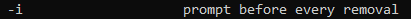
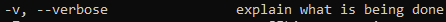

# Most Important Basic Commands and Options
> ``Alt + .  ``                # reuse the last argument

> ``ls -lr ``                  # reverse the order ot listing [a-z] 

> ``ls -lh ``                  # humanize the sizes of files and directories 

> ``cd - ``                    # to return to the last curent working directory 

> ``touch file ``              # create a file, if file exists, will modify the timestamp

> ``mkdir -p dir1/dir2  ``     # make two recursive directories

> ``cp -r /src  /dest  ``      # must spisify -r to copy "directories" & will copy without preserve the permissions

> ``cp -r -p src  /dest  ``    # must spisify -r to copy "directories" & will copy and preserve the permissions 

> ``dd if=<path1> of=<path2> bs=<n>M conut=<x> ``  
```
# used to copy the content of a file to another file  
# copy from path1 to path2 and make the block size (bs) = n MegaByte and count x from this Block
```

> ``rm -r dir ``               # must spisify -r to remove "directories"      

> ``rm -r /dir/* ``            # to delete the files inside a directory only and keep the directory

> ``rm -i file ``              # to inform me about the action 

> ``mv /src  /dest  ``         # no -r for mv

> ``mv -v f0 f1  ``            # 

> ``sudo -i ``                 # login as root without password only if password was stored in buffer      


> ``!<command>``               # excute the last command starts with `<command> `
## writing commands shortcuts:

--------------------------------------------------------------
# Most important Files in Linux:
1) /etc/passwd
2) /etc/group
3) /etc/login.defs # contain the system predefined variables    
4) /etc/shadow
5) /var/log/secure 

# Crazy Files in Linux:
1) /dev/random          # file contains random content
2) /dev/urandom         # file contains random content
3) /dev/zero            # file contains only characters "0"
4) /etc/sudoers         # make you Hulk
5) /.bashrc             # make your own Linux


