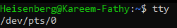

# Accessing Shell in Linux:
## This could be done by two main methods:
   - GUI [ tty2 ] 
      - Used to emulate the tty in CLI 
      - 
      - ``pts``: pesudo screen 
      > ``/dev/pts/1`` 
      > ``/dev/pts/2`` 
      > ``/dev/pts/3`` # pts for each tap, and so on  
   
   - CLI [ tty3 to tty6 ] 

- tty means: teletype writer
- accessing ttys [Alt+ctrl+F2..F6]
- tty: used to login multiple users at the same time 

> ``tty`` # to know the current tty
