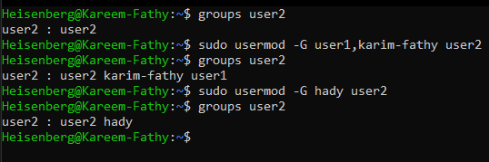

# Users
> ``/etc/passwd/`` # contains the database of all users

> ``man 5 passwd`` #	the man pages of passwd file

## Content of `passwd` file:
- ### each line has 7 fields
> 
> 
 
## 1- Super User (root)
- UID = 0

## 2- Service User
- UID = 1:200
- can not login at system

## 3- System User
- UID = 201: 999
- can not login at system

## 4- Regular User
- UID = +1000 
- any created user will create a primary group and will be member of it
- Secondary groups also can be created.

>```id```           
>``id <user>`` # show info about the current user or the given user

> 


# `How to create users?!`
- ### `useradd` command and some options
- `useradd <options> username`
   - -m    # create a home directory under `/home/`
   - -d 	  #spicify the home directory path
   - -p    # create an `unencrypted` password
   - -s    # select a shell
   - -c    # add comment
   - -u    # spicify the user id
   - -g	  # spicify the primary group id 
## Example:
> ## ``sudo useradd -m -p PasSw0rD -s /bin/bash -c "add user 1" -u 1011 user1``
> 
## see the unencrypted password! 👇
> 

## interactive adding user 
> ## ``adduser <username>``
>  

## IN REDHAT ⛑
> ### Redhat create the home directory and select bash shell as the default shell by default
> ### You can directly use: `useradd username`

---

# `How to modify users?!`
- ### `usermod` command and some options
- `usermod <options> user` 
- > 
	- -u user 							# modify the user ID
	- -g	new_primary_group user		# change the primary group
	- -G 	group user					# add the user to secondary group, exit from the other groups except the primary one
		- > 
	- -aG group(s) user						# append to secondary groups
		- > 
	- -rG group user						# remove a user from a group
	- -L user								# lock user [!password in shadow file]
	- -U user								# unlock 	
	- -s [shell path]						# edit the user shell
	- -l newname oldname 					# edit the user name

- `passwd <user>`		# to add an encrypted password
## look at the stupid password 👇
> 


# `How to remove a user?!`
- ### `userdel` command to remove the user
- `userdel <options> user`
	- -r					# to completely remove the user and its home directory
- `userdel user`			# only remove the user from `passwd` file
