# Controlling access to files:
## 1- Types of owners:
- [user,group,other] 
- > 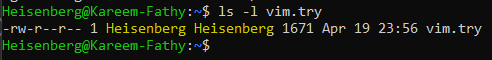
## 2- Types of files:
- regular file
- excutable file
- > 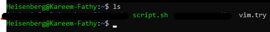

## 3- Types of permissions:
- Basic Permissions :
   - Read(r-4) & Write(w-2) & Excute(x-1)
- Special Permissions:

## File and Directory Permissions:

### - **Permissions on Files:**
- **Read (r):** Allows viewing the file's content using commands like `cat`, `more`, `less`, `head`, `tail`.
- **Write (w):** Allows modifying the file's content like vi, vim, `nano`, `gedit`, `mv`, `rm`, `cp`, `ln`
- **Execute (x):** Allows running the file as a program or script. `normal file >> script file`

### - **Permissions on Directories:**
- **Read (r):** Allows listing the directory's contents using commands like `ls`.
- **Write (w):** Allows creating, deleting, or renaming files within the directory using commands like `cp`, `mv`, `rm`, `touch`, `mkdir`, `rmdir`.
- **Execute (x):** Allows accessing the directory (e.g., using `cd`, `ls -l`) and performing operations on its contents if other permissions are granted.

---

## `How to Read Permissions?!`

#### **Using `ls -l` Command:**
- Run the command: `ls -l file/dir`
- Example output:
   - > 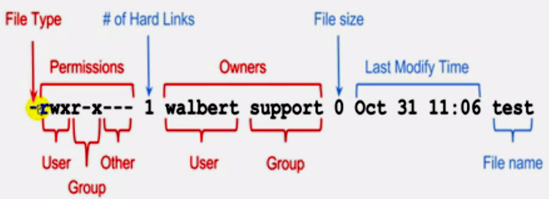

#### **Understanding the Permissions Field:**
The permissions field consists of 10 characters, divided into four parts:
1. **File Type:** The first character indicates the type of file:
   - `-` for a regular file.
   - `d` for a directory.
   - `l` for a symbolic link.
2. **Owner Permissions:** The next three characters represent the owner's permissions (e.g., `rwx`).
3. **Group Permissions:** The following three characters represent the group's permissions (e.g., `r-x`).
4. **Other Permissions:** The last three characters represent permissions for others (e.g., `r--`).

Example:
```
-rwxr-xr--
```
- `-` indicates a regular file.
- `rwx` means the owner has read, write, and execute permissions.
- `r-x` means the group has read and execute permissions.
- `r--` means others have read-only permissions.

## `How to change permissions?!`
### 1- Sympolic Method:
> `chmod <operation> /dir/file`

| **Set**  | **Operation** | **Examples**  |
|------|-----------|-------|
| u    | user      | chmod u+rwx file |
| g    | group     | chmod g+rwx file |
| o    | others    | chmod o+rwx file |
| a    | all       | chmod a+rwx file |
| +    | add       | chmod u+x file   |
| -    | remove    | chmod g-w file   |
| =    | set exactely| chmod u=rwx,go=rw file   |


### Notes on `chmod` Syntax

1. **Use of `,` Without Spaces**:
   - The comma `,` is used to separate multiple user-permission combinations in a single `chmod` command.
   - No spaces should be added between the combinations. For example:
     ```bash
     chmod u=rwx,go=rw file
     ```
     - This sets:
         - `u` (user) permissions to `rwx` (read, write, execute).
         - `g` (group) and `o` (others) permissions to `rw` (read, write).

2. **Use of `-` or `+` Without Specifying a User**:
   - When `-` (remove) or `+` (add) is used without specifying a user (`u`, `g`, `o`, or `a`), it applies to **all users** by default.
   - For example:
     ```bash
     chmod +r file
     ```
     > 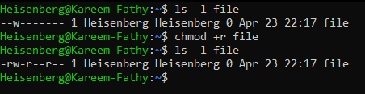 

     - Adding the read permission for all users (`u`, `g`, and `o`).
     ```bash
     chmod +rx file
     ```
     - Adds read (`r`) and execute (`x`) permissions for all users (`u`, `g`, and `o`).

> $These \ shorthand \ methods \ are \ useful \ for \ quickly \ modifying \ permissions \ without \ explicitly \ targeting \ specific \ user \ groups.$
### 1- Octal Method:

#### The octal method uses numeric values to represent permissions. Each permission (read, write, execute) is assigned a specific value:

| Permission | Value |
|------------|-------|
| Read (r)   | 4     |
| Write (w)  | 2     |
| Execute (x)| 1     |
| No Permission (-) | 0     |

👉To calculate the permission value for a file or directory, add the values for each permission. For example:
- `rwx` = 4 (read) + 2 (write) + 1 (execute) = 7
- `rw-` = 4 (read) + 2 (write) = 6
- `r--` = 4 (read) = 4

The permissions are represented as a three-digit number:
1. The first digit represents the owner's permissions.
2. The second digit represents the group's permissions.
3. The third digit represents others' permissions.

#### Example:
To set `rwx` for the owner, `r-x` for the group, and `r--` for others:
- Owner: `rwx` = 7
- Group: `r-x` = 5
- Others: `r-x` = 5
- Command: 
   ```bash
   chmod 755 file
   ```
- > 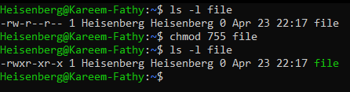

#### Common Examples:
- `chmod 777 file`: Grants full permissions (read, write, execute) to everyone.
- `chmod 644 file`: Grants read and write permissions to the owner, and read-only permissions to the group and others.
- `chmod 755 file`: Grants full permissions to the owner, and read and execute permissions to the group and others.
   - for group and other, permissons assigned are `read and excute only`, so if we try to write to a file or a directory, this will happen:
      - write for files means: `vi`, `vim`, `nano`, `gedit`, `mv`, `rm`, `cp`, `ln`
         - > 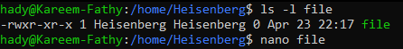
            - > 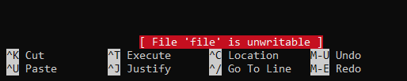
         - > 
      - write for directory means: `cp`, `mv`, `rm`, `touch`, `mkdir`, `rmdir`.
         - > 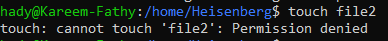
#### Notes:
- The octal method is concise and commonly used in scripts or when setting permissions for multiple files.
- Always verify permissions using `ls -l` after applying changes.

---

### Inheritance Note:
- Directory permissions do not automatically propagate to files or subdirectories. Each item has its own permissions, which must be explicitly set or modified.

#### Example 1: Default Behavior
1. Create a directory with specific permissions:
   ```bash
   mkdir example_dir
   chmod 770 example_dir
   ```
2. Create a file inside the directory:
   ```bash
   touch example_dir/file1
   ```
3. > 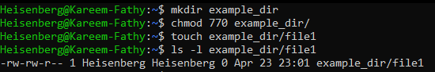
   - The file's permissions are determined by the system's `umask` value, not the directory's permissions.

#### Example 2: Using `chmod -R` for Recursive Permission Changes
1. Apply permissions recursively to a directory and its contents:
   ```bash
   chmod -R 755 example_dir
   ```
2. Verify the changes:
   ```bash
   ls -lR example_dir
   ```
3. > 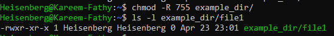
   > 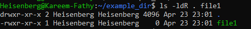

#### Key Note:
- The `-R` option applies changes to all contents of a directory. Use it carefully and verify permissions after applying.

#### Key Takeaway:
- By default, permissions on a directory do not propagate to its contents. Use tools like `umask` or `setfacl` to manage default permissions and inheritance effectively.