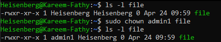
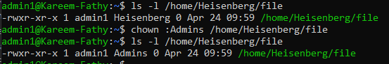
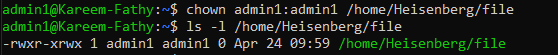

# Change ownership:

## `chown user file`
- Changes the owner of the file to the specified user.
## `chown :group file`
- Changes the group ownership of the file to the specified group.
## `chown user:group file`
- Changes both the owner and the group of the file. 


### Examples:

1. Change the owner of a file:
    ```bash
    chown admin1 file
    ```
    This sets the owner of `file` to `admin1`.
    > 

2. Change the group of a file:
    ```bash
    chown :Admins file
    ```
    This sets the group of `file` to `Admins`.
    > 

3. Change both the owner and group of a file:
    ```bash
    chown admin1:Admin1 file
    ```
    This sets the owner to `admin1` and the group to `admin1`.
    > 

### Notes:

- You need appropriate permissions (e.g., root or sudo privileges) to change ownership.
- Use the `-R` option to apply changes recursively to directories:
  ```bash
  chown -R admin1:Admins /path/to/directory
  ```
  This changes ownership for all files and subdirectories within the specified directory.
