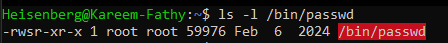
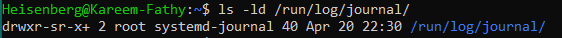
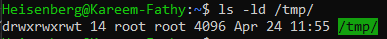

# Special Permissions in Linux

In Linux, special permissions provide additional control over file and directory access. These include:

## 1. SUID (Set User ID)
- Allows a file to be executed with the permissions of the file owner.
- Commonly used for executables requiring elevated privileges.
- applied only on files

### Example:
```bash
chmod u+s filename
ls -l filename
# Output: -rwsr-xr-x
```

> 

## 2. SGID (Set Group ID)
- For files: Executes with the group permissions of the file.
- For directories: Files created inside a directory will inherit the group owner of the this directory.


### Example:
```bash
chmod g+s directory_name
ls -ld directory_name
# Output: drwxr-sr-x
```

> 


## 3. Sticky Bit
- Applied to directories to restrict file deletion from any user except the owner.
- Commonly used in shared directories like `/tmp`.

### Example:
```bash
chmod o+t directory_name
ls -ld directory_name
# Output: drwxrwxrwt
```
> 


## Difference Between `s` and `S` in the Permissions Field

When viewing file or directory permissions using `ls -l`, the presence of `s` or `S` in the user (`u`) or group (`g`) permission fields indicates the SUID or SGID special permissions. The difference lies in whether the execute (`x`) permission is also set:

- **`s`**: Indicates that the SUID or SGID bit is set **and** the execute (`x`) permission is present.
    - Example: `-rwsr-xr-x` (SUID with execute permission for the owner).
    - Example: `drwxr-sr-x` (SGID with execute permission for the group).

- **`S`**: Indicates that the SUID or SGID bit is set **but** the execute (`x`) permission is **not** present.
    - Example: `-rwSr--r--` (SUID without execute permission for the owner).
    - Example: `drwxr-Sr--` (SGID without execute permission for the group).

### Key Points:
- `s` = Special permission + Execute permission.
- `S` = Special permission only (no execute permission).

### Example Commands:
```bash
# Set SUID without execute permission
chmod 4644 filename
ls -l filename
# Output: -rwSr--r--

# Set SGID without execute permission
chmod 2644 directory_name
ls -ld directory_name
# Output: drwSr--r--
```


## Checking Special Permissions
Use `ls -l` to check for:
- `s` in the user or group permission fields (SUID/SGID).
- `t` in the others' permission field (Sticky Bit).

## Removing Special Permissions
- SUID: `chmod u-s filename`
- SGID: `chmod g-s directory_name`
- Sticky Bit: `chmod -t directory_name`

## Summary Table

| Permission | Command         | Effect                                   |
|------------|-----------------|------------------------------------------|
| SUID       | `chmod u+s`     | Run as file owner                       |
| SGID       | `chmod g+s`     | Run as group or inherit group           |
| Sticky Bit | `chmod +t`      | Restrict file deletion in directories    |


## Setting Special Permissions Using Octal Method

Special permissions can also be set using the octal representation in `chmod`. The octal values for special permissions are:

- **SUID**: `4`
- **SGID**: `2`
- **Sticky Bit**: `1`

### Syntax:
```bash
chmod <special><owner><group><others> filename
```

### Examples:
1. **Set SUID**:
    ```bash
    chmod 4755 filename
    ls -l filename
    # Output: -rwsr-xr-x
    ```

2. **Set SGID**:
    ```bash
    chmod 2755 directory_name
    ls -ld directory_name
    # Output: drwxr-sr-x
    ```

3. **Set Sticky Bit**:
    ```bash
    chmod 1755 directory_name
    ls -ld directory_name
    # Output: drwxrwxrwt
    ```

4. **Combine Special Permissions**:
    To set SUID, SGID, and Sticky Bit together:
    ```bash
    chmod 7755 filename
    ls -l filename
    # Output: -rwsr-sr-t
    ```

### Summary of Octal Values:
| Permission   | Octal Value | Example Command     |
|--------------|-------------|---------------------|
| SUID         | `4`         | `chmod 4755 file`  |
| SGID         | `2`         | `chmod 2755 dir`   |
| Sticky Bit   | `1`         | `chmod 1755 dir`   |
| Combined     | `7`         | `chmod 7755 file`  | 


## Understanding umask

The `umask` command in Linux determines the default permissions for newly created files and directories. It subtracts permissions from the system's default settings.

### Default Permissions
- Files: `666` (read and write for owner, group, and others)
- Directories: `777` (read, write, and execute for owner, group, and others)

### How umask Works
The `umask` value is subtracted from the default permissions:
- For files: `666 - umask`
- For directories: `777 - umask`

### Example
If the `umask` is `022`:
- Files: `666 - 022 = 644` (read and write for owner, read-only for group and others)
- Directories: `777 - 022 = 755` (read, write, and execute for owner, read and execute for group and others)

### Checking umask
To view the current `umask` value:
```bash
umask
```

### Setting umask [Temporarely method - at this session only]:

To set a new `umask` value:
```bash
umask 027
```
This sets:
- Files: `666 - 027 = 640` --> `-rw-r-----`
- Directories: `777 - 027 = 750` --> `drwxr-x---` 

### Persistent umask [Permanent method]:
To make the `umask` setting persistent, add it to the shell configuration file (e.g., `/etc/bash.bashrc` in Debian & `/etc/bashrc` in Readhat):
```bash
echo "umask 027" >> /etc/bash.bashrc
```
Then reload the configuration:
```bash
source ~/.bashrc
```


### Examples and Summary Table:
| umask Value | File Permissions | Directory Permissions |
|-------------|------------------|-----------------------|
| `000`       | `666`            | `777`                |
| `022`       | `644`            | `755`                |
| `027`       | `640`            | `750`                |
| `077`       | `600`            | `700`                |
