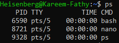
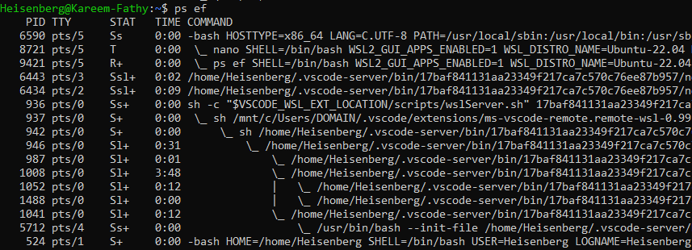
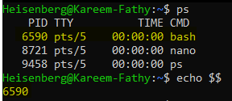
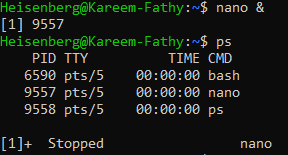

# Managing and Monitoring Linux Processes [Services and Diamond]

##Introduction to Processes
- A process is an instance of a program in execution. Linux assigns a unique Process ID (PID) to each process, enabling users to manage and monitor them effectively.
- The first process operate at the linux system is `systemd`. 

---

## Viewing Processes
### `ps` Command
The `ps` command display information about active processes at the current Terminal only:
```bash
ps
pstree
```
> 


The `ps` command displays information about active processes for the Terminal on the system:
```bash
ps aux
ps ef
ps fax
```
> 


The current Terminal id:
```bash
echo $$
```
> 

## Managing Processes
### Killing a Process
Use the `kill -l` command to list all available signals:
```bash
kill -l
```

### Commonly Used Signals
The `kill` command supports various signals to control processes. Here are some of the most commonly used signals:

- **SIGHUP (1)**: Reloads the service by rereading its configuration files.
- **SIGINT (2)**: Interrupts the process (e.g., triggered by `Ctrl + C`).
- **SIGTKILL (9)**: Force stop the process.
- **SIGTERM (15)**: Politely requests a process to terminate `[Default signal]`.
- **SIGTSTP (20)**: Pauses the process (e.g., triggered by `Ctrl + Z`).

1- Use the `kill` command followed by signal and the PID to terminate a process:
```bash
kill -<signal> <PID>
```

2- The Procces Id of certain process
```bash
pidof <process>
```
3- Kill by name [Default: (15)SIGTERM]
```bash
pkill <process name>
```
4- Display the background jobs
```bash
jobs
```

5- Move the job to foreground
```bash
fg %[job-number]
```
6- Move the job to background
```bash
bg %[job-number]
```

7- Move the job to the background.
```bash
<job-name> & 
``` 
> 