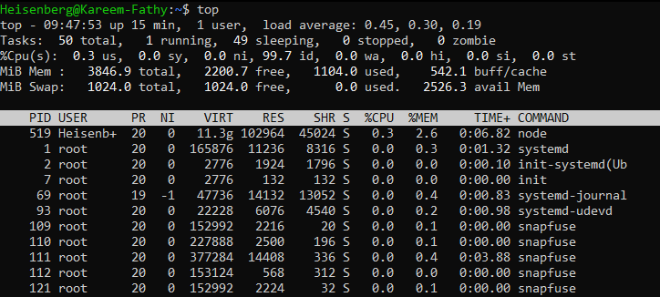
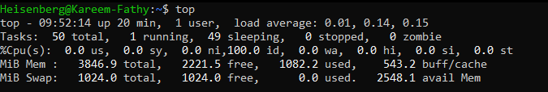

# top
- The `top` command in Linux is used to display real-time information about system processes, including CPU and memory usage. It provides a dynamic view of the system's performance.

- This command launches the `top` interface, displaying real-time system statistics.

```bash
top
```
> 

## Displayed Statistics:
> 
### The `top` Content/info:
    1- General info: the hour now, Up Time, login Users, Load average-% @ 1min, 5min, 15min   
    2- Tasks: total, running, sleeping, stopped, zompie
    3- CPU usage: user usage, system usage, nice value, ...
    4- Physical Memory usage: total space, free memory, used memory, buffer 
    5- Swap memory: total space, free memory, used memory, buffer


## Interactive Commands:
- `1`: Toggle the display of `CPU usage` for each core.
- `b`: Toggle bold highlighting for running tasks.
- `e`: Display the sizes in a human readable form
- `f`: Add or remove fields from the display.
- `h`: Display `help` within the `top` interface.
- `H`: Show threads instead of processes.
- `k`: `Kill` a process by specifying its PID.
- `l`: Toggle the display of `load average` and uptime information.
- `L`: Display a list of fields that can be toggled on or off.
- `m`: Toggle the display of `memory` information.
- `M`: Sort processes by `memory usage`.
- `P`: Sort processes by `CPU usage`.
- `q`: Quit the `top` interface.
- `r`: Renice a process to change its `priority`.
- `s`: Change the delay `time` between updates.
- `t`: Toggle the display of task and `CPU` information.
- `U`: Filter processes by a specific user.
- `W`: Write the current configuration to a file for future use.
- `z`: Toggle `color` highlighting for easier readability.


## Commonly Used Options:
- `-d <seconds>`: Set the delay between updates.
- `-n <count>`: Limit the number of updates before exiting.
- `-u <username>`: Show processes for a specific user.

## Priority
### Understanding Process Priority (`nice` and `renice`):
- **Priority**: Determines the order in which processes are scheduled for execution.
    - ` Lower values indicate higher priority.`
- **Nice Value**: A user-space value that affects process priority:
    - Ranges from `-20` (highest priority) to `19` (lowest priority).

#### Adjusting Priority:
- Use the `nice` command to start a process with a specific priority:
    ```bash
    nice -n <priority> <command>
    ```
    Example:
    ```bash
    nice -n 10 myscript.sh
    ```

- Use the `renice` command to change the priority of an existing process:
    ```bash
    renice <priority> -p <PID>
    # has to be a uperuser
    ```
    Example:
    ```bash
    renice 5 -p 1234
    ```

#### Notes:
- **Only** the `root` user can set a `negative nice value` (higher priority).
- Use `top` or `htop` to view and manage process priorities interactively.
- Priority changes can improve system responsiveness for critical tasks.