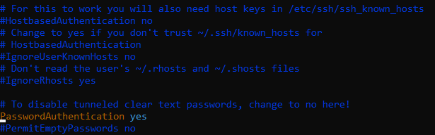
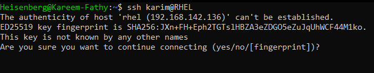
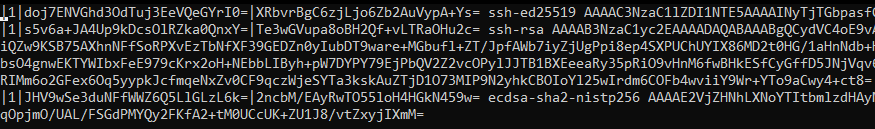
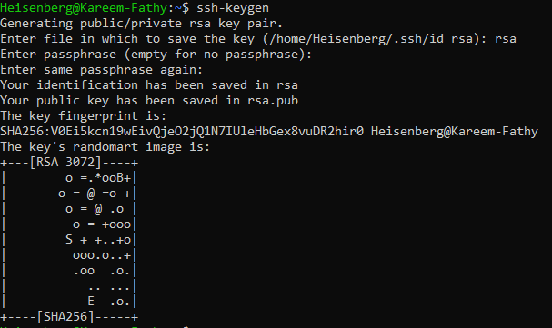
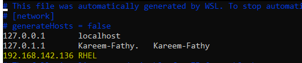
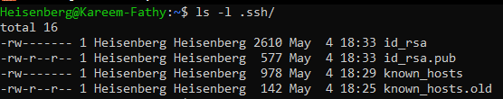
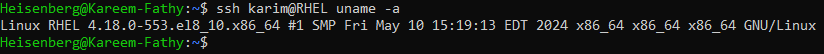

# Configuring and Securing SSH

## SSH Command Syntax
```bash
ssh <option> user@host
```


## Installing the SSH Package
The client must install the SSH package (`openssh-server`):
```bash
sudo apt update
sudo apt install openssh-server
```

## Types of Remote Server Connections [2 methods]

### 1. Password-Based Authentication
1. Edit the SSH configuration file:
   ```bash
   sudo vim /etc/ssh/sshd_config
   ```
   - Search for and Set `PasswordAuthentication yes`.
   - Remove the `#` from the beginning of the line if it exists.
   > 

2. Restart the SSH service:
   ```bash
   sudo systemctl restart sshd
   ```
3. Connect to the remote server:
   ```bash
   ssh user-name@its-public-ip-address
   ```
   - If the server is not in the `known_hosts` file, it will prompt to add it.
   - 
   - Type `yes` to add the server to the `known_hosts` file.
      * The known_hosts file contains the `fingerprints` of all servers we have connected to.
      * The fingerprint is a unique identifier for the server's public key.
      * 
   - Enter the user password when prompted.


### 2. Key-Based Authentication -> More Secure
- Key-based authentication is more secure than password-based authentication.
- It uses a pair of cryptographic keys: a public key and a private key.
- The public key is stored on the server, while the private key remains on the client machine.
- connecting to the server without entering a password.

#### How to do it:👇
1. Generate an SSH key pair:
   ```bash
   ssh-keygen
   ```
   - type the desired hashing type during the process: eg. `rsa`, `ed25519` 
   - Press `Enter` to accept the default file location for the key pair.
   - Press `Enter` to leave the passphrase empty (or enter a passphrase for added security).
   - The public key will be saved in `~/.ssh/id_rsa.pub` and the private key in `~/.ssh/id_rsa`.
   - 

   - #### 👉Try to open the public/private key files.

2. Copy the public key to the remote server:
   ```bash
   ssh-copy-id user-name@its-public-ip-address
   ```
3. Connect to the remote server:
   ```bash
   ssh user-name@its-public-ip-address
   ```  
   - we can add the `-i` option to specify the public key file if needed.
   - also we can add the IP address of the server to the `/etc/hosts/` for easier access.
   -  

- Now we can connect to the server without entering a password using the `name` of the server instead of its `IP address`   

### Viewing SSH-Related Files
- The SSH Files are located in the `.ssh` directory within the user's home directory. `/home/user-name/.ssh/`.
- Use `ls -al` to view all hidden files, including the `.ssh` directory.
- Inside `.ssh`, the following files are relevant:
  - `id_rsa`: Private key (client machine).
  - `id_rsa.pub`: Public key (client machine).
  - `authorized_keys`: Public key (server machine).
  - `known_hosts`: Host fingerprints.
- 

## Server-Side Configuration
The SSH server configuration file is located at `/etc/ssh/sshd_config`. Key settings include:
- `PermitRootLogin no` (default is `yes`, change to `no` for security).
- `AllowUsers user1 user2` (restrict access to specific users).
   - If this directive is present, only the listed users (user1 and user2) can log in via SSH.
   - All other users will be denied access, even if they have valid credentials.
   - This enhances security by limiting access to specific accounts.
- `Port 22` (change if desired).

After making changes, restart the SSH service:
```bash
sudo systemctl restart sshd
```

## Additional Notes
- SSH service configuration files are located in `/etc/ssh/sshd_config.d/`. Write your custom configurations in `.conf` files within this directory.
- To run a command on a remote machine without logging in:
  ```bash
  ssh user@host command
  ```
- 

### Additonal Notes:
- SSH Default Port: `22`
- Service Daemon: `sshd`
- Package: `openssh-server`
- SSH Options: 
   - `-i`: Specify the identity file (private key) for authentication.
       - eg. `ssh -i ~/.ssh/id_rsa user@host`
   - `-l`: Specify the username to log in as.
       - eg. `ssh -l user-name Sever-name/IP-address`
   - `-p`: Specify the port number.
   - `-v`: Enable verbose mode for debugging.
   - `-X`: Enable X11 forwarding (for GUI applications).