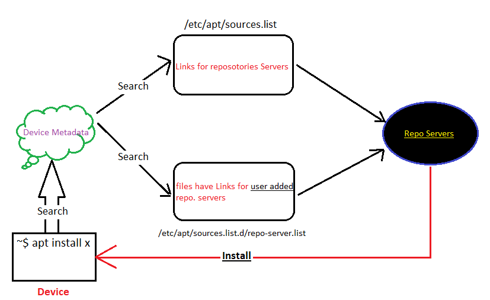
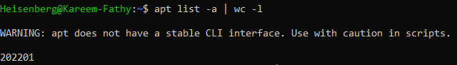
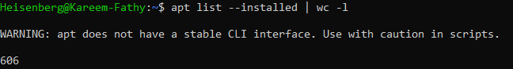
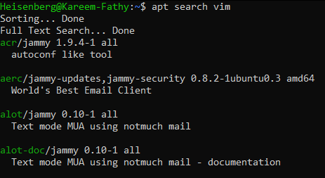
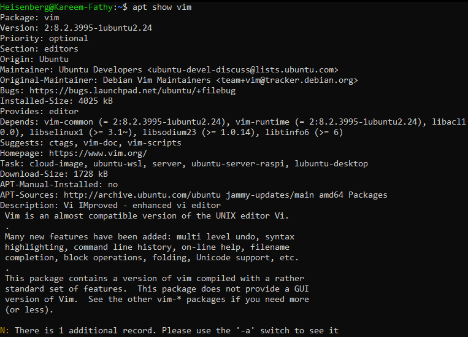
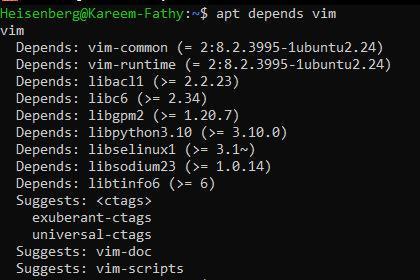

# Package Management in Linux

A **package** is a collection of files, applications, or scripts bundled together to provide specific functionality, often for easier distribution, installation, and management.

---

## Package Management in Debian-based Systems

### **Debian Packages (.deb)**

#### **dpkg** (with dependencies, similar to rpm):
- `dpkg --help`  
   Common commands:
   - `dpkg -s <Package>`: Check if a package is installed.
   - `dpkg --info <Package>`: Get information about a downloaded package.
   - `dpkg -l <Package>`: Check if a package is installed.
   - `dpkg -i <Package>`: Install a package.
   - `dpkg -r <Package>`: Remove a package.
   - `dpkg -P <Package>`: Remove a package along with its configuration files.
   - `dpkg -c <Package>`: List files that will be downloaded and their paths.
   - `dpkg -L <Package>`: List downloaded files and their locations.

#### **apt** (no dependencies, similar to yum):
- **Old name**: `apt-get`

The client device has metadata of packages and their dependencies. Packages exist in a repository server, and the client sends a query to install a package using:
```bash
apt install <package-name>
```

- **Repository Configuration**:
   - File containing all repositories to search in: `/etc/apt/sources.list`
   - Add your own repository server: `/etc/apt/sources.list.d/<repo-link.list>`

- **Metadata Update**:
   - Update metadata to stay up-to-date with package updates:
      ```bash
      apt update
      ```
   - List upgradable packages:
      ```bash
      apt list --upgradable | wc <option>
      ```
   - Upgrade packages:
      ```bash
      apt upgrade
      ```



---

### **apt Options**

#### **List**
- List all packages from all repositories (installed or not):
   ```bash
   apt -a
   ```
   

- List installed packages:
   ```bash
   apt --list
   ```
   

#### **Search**
- Search for a package:
   ```bash
   apt search <package>
   ```
   

#### **Show**
- Show package details:
   ```bash
   apt show <package>
   ```
   

#### **Download**
- Download a package without installation:
   ```bash
   apt download <package>
   ```

#### **Depends**
- List package dependencies:
   ```bash
   apt depends <package>
   ```
   

#### **Remove**
- Remove a package:
   ```bash
   apt remove <package>
   ```

#### **Purge**
- Remove a package and its configuration files:
   ```bash
   apt purge <package>
   ```