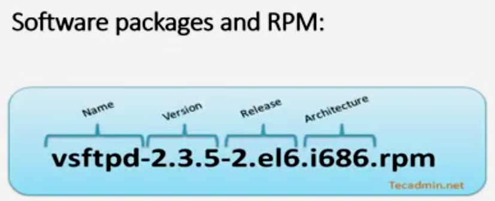
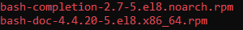
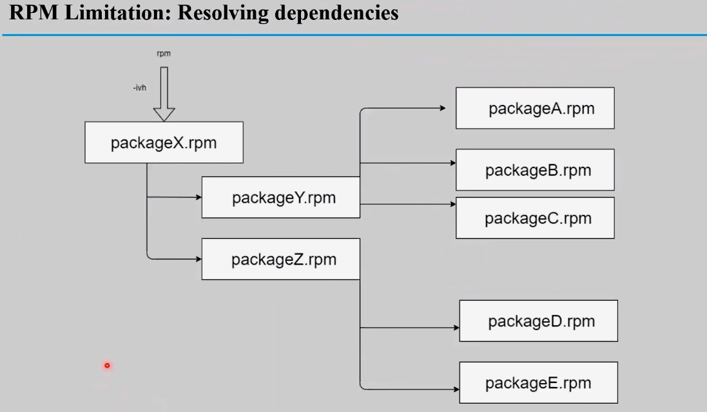
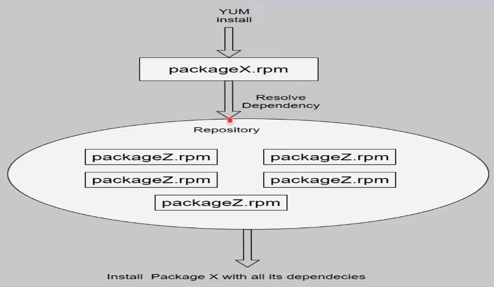

## Package Management in RedHat-based Systems

### **RPM Packages**



#### **Example**:
```bash
ls /run/media/karim/RHEL-8-10-0-BaseOS-x86_64/BaseOS/
```


#### **RPM Modes (requires dependencies)**:
1. **Query Mode (-q)**: Ask for uninstalled packages.
    ```bash
    rpm -qa            # List all installed packages
    rpm -q <package>   # Get full name, arguments, release, etc.
    rpm -qi <package>  # Print detailed info about the package
    rpm -ql <package>  # List package files inside the package
    rpm -qc <package>  # List configuration files inside the package
    rpm -qp <package>  # Query a package not yet installed
    rpm -qd <package>  # List documentation of the package
    rpm -qs <package>  # Check if there are scripts in the package files
    ```

2. **Installation Mode**: Install a package.
    ```bash
    rpm -ivh <package-URL-or-path>
    ```


3. **Update Mode**: Update a package to a newer version.
    ```bash
    rpm -Uvh <package-URL-or-path>
    ```
    - The `-U` option is used to upgrade an existing package or install it if it is not already installed.

4. **Deletion Mode**: Remove an installed package from the system.
    ```bash
    rpm -e <package>
    ```
    - The `-e` option stands for "erase" and is used to uninstall a package by its name.


#### **Problems with RPM**:
- Resolving dependencies manually.


---

### **YUM** (No dependencies required)
- Installs packages along with all dependencies.



#### **Common YUM Commands**

- `yum list all`  
    *Lists all available and installed packages.*

- `yum install <Package>`  
    *Installs the specified package along with its dependencies.*

- `yum update <Package>`  
    *Updates the specified package to the latest version.*

- `yum remove <Package>`  
    *Removes the specified package from the system.*

- `yum search <Package>`  
    *Searches for a package by name or description.*

- `yum info <Package>`  
    *Displays detailed information about the specified package.*


- **Repository Configuration**:
   - File containing all repositories: `/etc/yum.repos.d/redhat.repo`

---

### **dnf** (For RedHat 9)

`dnf` is the modern package manager for RedHat-based systems, replacing `yum`.

