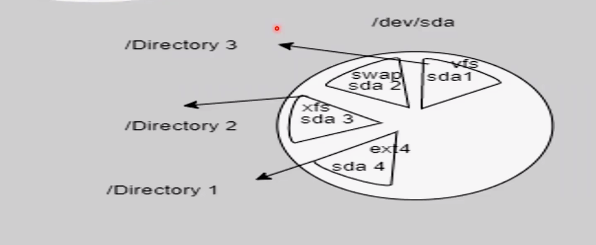
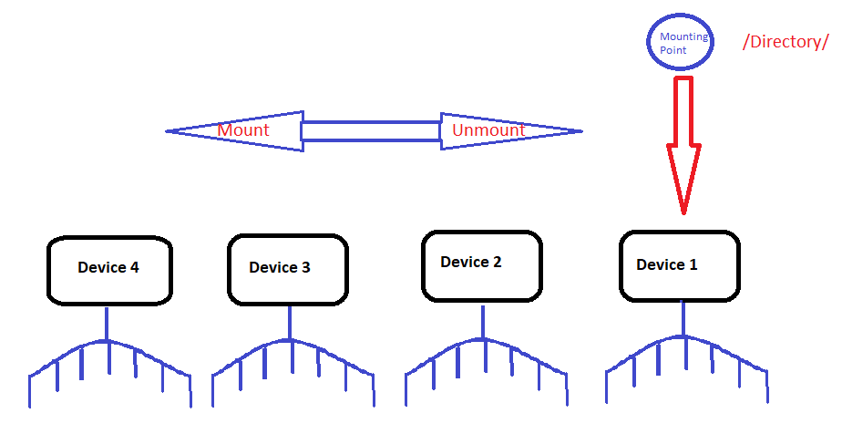

# Linux File Systems

## Overview
- Common file systems: `ext2`, `ext3`, `ext4`, `xfs`, `btrfs`, etc.
- Depending on the system type:
    - **BIOS**: Hard disk uses `MBR`.
    - **UEFI**: Hard disk uses `GPT`.

## MBR (Master Boot Record)
- Located at the beginning of the disk, occupying **512 bytes**.
- Contains a **partition table** of **64 bytes**.
    - Each partition requires **16 bytes**, allowing information for up to **4 partitions**.
- Partitioning:
    - 3 primary partitions and 1 extended partition (which can contain logical volumes).

## File System and Mounting
- Each partition must:
    - Be assigned a file system.
    - Be **mounted** to a directory to become readable.
- `/dev/` directory:
    - Contains block devices (e.g., hard disks, CD-ROMs, flash memory).

### Device Naming Conventions
- **HDD**: `hdxy` (e.g., `hda1` for hard disk A, partition 1).
- **SSD/SCSI/Flash Storage**: `sdxy` (e.g., `sda1` for SSD A, partition 1).
- **Virtual Machines**: `vdxy`.
- **NVMe Drives**: `nvmexnypz` (e.g., `nvme0n1p1` for NVMe drive 0, namespace 1, partition 1).
- Logical volumes start with `type5` (e.g., `hda5`, `sdb5`).
- **CD-ROM/DVD**: `srx`.

## Useful Commands
- `lsblk`: List information about block devices.
- `df`: Show all mounted partitions.
- `du /dir/`: Display the size of a directory (`-s` for summary).

## Mounting
### Temporary Mounting
- Mount a device to a directory:
    ```bash
    mount /Device/ /Directory/
    ```
- Unmount a device from a directory:
    ```bash
    umount /Directory/
    ```
- Example:
> 

##  **Note**: The mounting point (directory) acts as a "gate" to the device. Changing the gate to another device will display the contents of the new device.

> 


# The rest of the Mounting  Types & Storage Management will be presented in Linux Admin 2 Course. [Wait for it 😁]