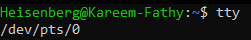

# Accessing Shell in Linux:
## This can be done by two main methods:

- **GUI Terminal Emulators (Pseudo Terminals - pts):**
   - Run inside the graphical environment (like GNOME Terminal, Konsole, etc.).
   - Each new terminal window or tab gets its own pseudo terminal (pts), such as:
     > `/dev/pts/1`  
     > `/dev/pts/2`  
     > `/dev/pts/3`  # pts for each tab, and so on
   - 
   - These are not tied to hardware ttys like tty2.

- **Virtual Consoles (Hardware TTYs):**
   - Accessed directly using keyboard shortcuts.
   - Usually available on `tty1` to `tty6` (for example, `tty3` to `tty6` for CLI).
   - Switch between them using [Ctrl+Alt+F1] to [Ctrl+Alt+F6].
   - The graphical interface (GUI) often runs on `tty1` or `tty2`, depending on the system.

- **Notes:**
  - `tty` means: teletype writer.
  - Multiple users can log in at the same time using different ttys.
  - To know the current terminal, use:
    ```
    tty
