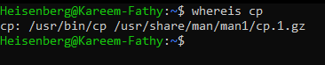
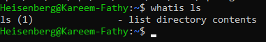
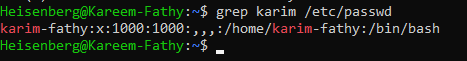
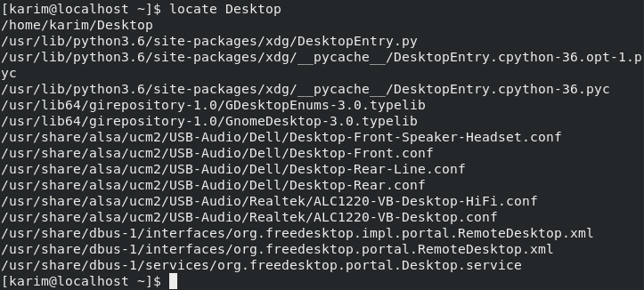
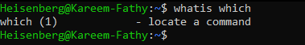
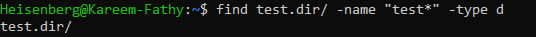
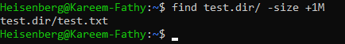
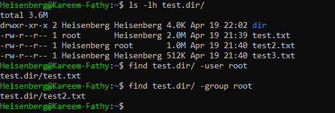
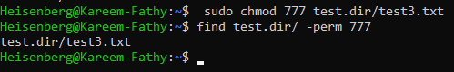
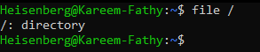

# Searching
## (1) Searching for commands:
>``whereis <command>`` # search for the command location
- 

>``whatis <command>``  # search for the functionality of the commands
- 


## (2) Searching about text from file: 
>``grep <pattern> <path>``    # find a specific pattern in a file 
- 
### Options:
- `-q` (quiet mode, no output, just exit status)
- `-w` (match whole words exactly)
- `-i` (case insensitive)
- `-v` (invert match , show lines that do not match)
- `-r` (recursive search in directories)
- `-l` (list only the names of files with matching lines)
- `-n` (show line numbers)
- `-c` (count the number of matching lines)
- `-E` (extended regex)
## (3) Searching for file or directory:
>``locate <file>`` # match faster, search in database, has fewer options 
- 
- 

### locate = which
### locate search in the device databases, so any current changes will not be viewed untill system reboot or directely useing `updatedb` command

```bash
dd if=<path1> of=<path2> bs=<n>M conut=<x>
# copy from path1 to path2 and make the block size (bs) = n MegaByte and count x  Blocks
```

>``find <path> <criteria>``	# seach in the whole file system, has many options
- Criteria:
    1) ``name`` 
        - -name (case senstive)
        - -iname (insenstive)
    2) ``type``
        - -type f(file), d(directory), l(sLink) ,b(block device), c(character device)
        - 
    3) ``size``
        - -size 10M, +5M(more than 5M), -1G(less than 1G)
        - 
    4) ``ownership``
        - -user user
        - -user group
        - 
    5) ``permissions``
        - -perm 777
        - 
    6) ``time``
        - -atime 10,+10,-10 # access within 10 or more than 10 or less than 10 days 
        - -mtime 10,+10,-10 # modified within 10 or more than 10 or less than 10 days
     
## Specify the type of a file:
>``file <file>`` # Specify the type of a file
- 