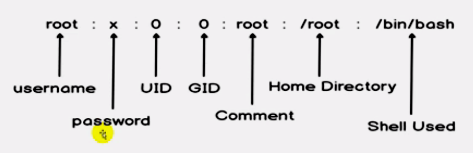
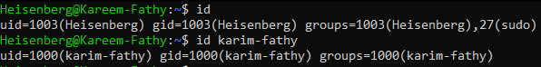
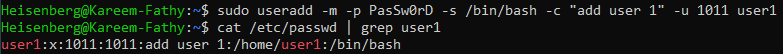
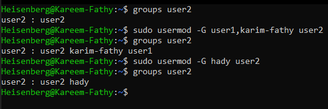
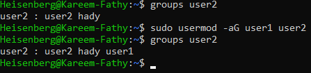
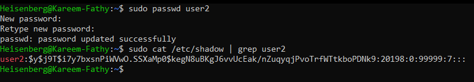

# 👤 Managing Local Users in Linux

> **File:** `/etc/passwd`  
> Contains the database of all users.

> **Manual:** `man 5 passwd`  
> View the man pages for the `passwd` file.

---

## 📄 Structure of the `passwd` File

Each line in the `passwd` file has **7 fields**:

>   
> 

---

## 👑 Types of Users

### 1. **Super User (root)**
- **UID:** `0`

---

### 2. **Service User**
- **UID:** `1–200`
- Cannot log in to the system

---

### 3. **System User**
- **UID:** `201–999`
- Cannot log in to the system

---

### 4. **Regular User**
- **UID:** `1000+`
- Any created user will have a primary group and be a member of it.
- Secondary groups can also be created.

---

> ```bash
> id
> id <user>   # Show info about the current user or the given user
> ```
> 

---

# 🆕 How to Create Users

### `useradd` Command & Options

```bash
useradd <options> username
```
- `-m`    — Create a home directory with the same user name under `/home/`
- `-d`    — Specify the home directory path with custom name
- `-p`    — Create an **unencrypted** password
- `-s`    — Select a shell
- `-c`    — Add a comment
- `-u`    — Specify the user ID
- `-g`    — Specify the primary group ID
- `-G`    — Specify secondary groups
	
#### **Example:**
> ```bash
> sudo useradd -m -p PasSw0rD -s /bin/bash -c "add user 1" -u 1011 user1
> ```
> 

#### **See the unencrypted password! 👇**
> 

---

## 👤 Interactive User Creation

> ```bash
> adduser <username>
> ```
> 

---

## 🟥 In Red Hat

> - Red Hat creates the home directory and selects Bash as the default shell by default.
> - You can directly use:  
>   ```bash
>   useradd username
>   ```

---

# ✏️ How to Modify Users

### `usermod` Command & Options

```bash
usermod <options> user
```
- `-u <user>`                — Modify the user ID
- `-g <new_primary_group>`   — Change the primary group
- `-G <group>`               — Add the user to a secondary group (removes from others except primary)
	- 
- `-aG <group(s)>`           — Append to secondary groups
	- 
- `-rG <group>`              — Remove a user from a group
- `-L <user>`                — Lock user (`!password` in shadow file)
- `-U <user>`                — Unlock user
- `-s <shell path>`          — Edit the user shell
- `-l <newname> <oldname>`   — Edit the user name

---

- `passwd <user>` — Add an **encrypted** password

#### **Look at the password example 👇**
> 

---

# ❌ How to Remove a User

### `userdel` Command

```bash
userdel <options> user
```
- `-r` — Completely remove the user and their home directory

```bash
userdel user
```
- Only removes the user from the `passwd` file

