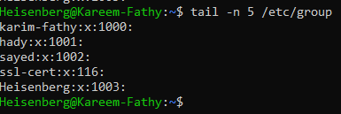
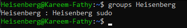
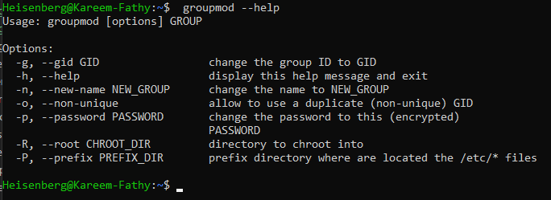
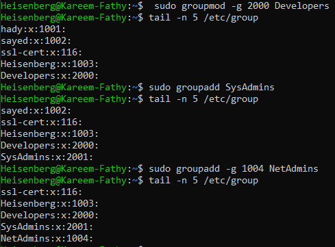
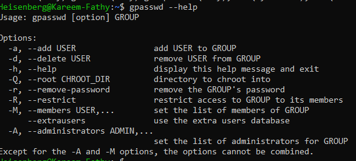
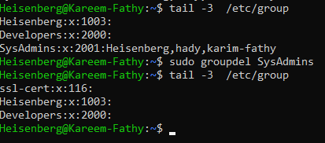

# Groups
> `cat /etc/group` # display all groups and its members, primary groups will not be printed.
- 

### Content of `group` file:
- each line has 4 fields
- 

- `groups <user>`		# to display the groups that  the user is member in
- >  

# `Hwo to create a group?!`
- `groupadd <option> group`
	- -g 		# assign a group id
- `usermod -aG group user` #adding a user to group

# `How to Modifiy a group?!`
- `groupmod <option> group`
> 
- `groupmod -n <newname> <oldname>` # change the group name

- `newgrp group` 		# to change the current primary group at the current session

> new group id = last group id + 1, [if -g is not used]

> 

# `How to add/remove Users to/from groups?!`
- ## `usermod -aG group user` 
> 

- ## `gpasswd -a user group`
> 

# `How to delete a group?!`
- `groupdel group`
> 
