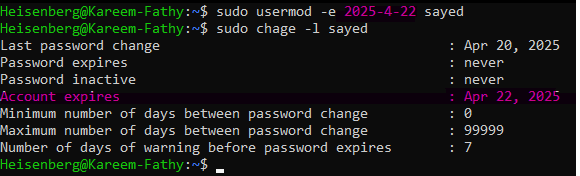

# Shadow File Format
> `cat /etc/shadow`

> 


> `man 5 shadow`

> 
- ## Each line of this file contains 9 fields, separated by colons (“:”), in the following order:
```markdown
1- login-name:
2- encrypted-password:
3- date-of-last-password-change: # expressed as the number of days since Jan 1, 1970.
4- minimum-password-age: # the password can't be changed before this period 
5- maximum-password-age: # maximum age of the password
6- password-warning-period: # warning berfore the max password age expires
7- password inactivity period: # password has to be changed within this period or the account will expire 
8- account expiration date: # The date of expiration  account, expressed as the number of days since Jan 1, 1970.
9- reserved field    # This field is reserved for future use.
```
- ### Default periods can be modified from `/etc/login.dif`

## the Encrypted Passwords Fileds:
- The Password is divided into 3 fields starts with ($):
- ``$y$j9T$qJeLBOrxrTLZWrx9wHf2F/$UOWa0.8qdGd9oYzcJBTKDdaU5VNxDmIx/A39dob6tB9``
   ### 1) First filed befine the hashing algorithm `$y`:
   - $1$ --> MD5
   - $2a$ --> Blowfish
   - $5$ --> SHA 256
   - $6$ --> SHA 512
   - $y$ --> yescrypt
    
   ### 2) Second Filed is the Salt Random Number `$j9T$qJeLBOrxrTLZWrx9wHf2F/`:
   - adding the plain text password to the salt random number to avoid the pre-computed list for encrypted passwords
    
   ### 3) Third Field is a combination of (Salt + password)
        - `$UOWa0.8qdGd9oYzcJBTKDdaU5VNxDmIx/A39dob6tB9`

## Configure Password Aging:
> 

> ### `chage <option> user`

   - > ``chage -l user ``  # list info about the password periods
 
      - >  

   - > ``chage -m <no. days> user `` # change the period that the user can change his password after it
      - > 

   - > ``chage -M <no. days> user `` # set the password expiration date
      - > 
   
   - > ``chage -W <no. days> user `` # set warning period before password expirey date
      - > 
   
## How to set an account expiration date:
### Suitable date formats will be used:
> ### ``date -d "string" +%F`` 
   
1) > ``date -d "string" ``
   - ### the String may be:
      - "+1 day" 
         > 
      
      - "-10 day"
         > 
      
      - "+4 month"
      - "-2 year" ``and son on``

2) > ``date +%F ``
   - 

$So$ :
   - > ``sudo chage -E $(date -d "string" +%F) user`` # will delete the user account after a period
   - > 

$OR:$
> ``usermod -e <date format> user `` # set the acoount expiration date 
> 
> 

## Force Passwrod change on the First Login:
> ``sudo chage -d 0 user`` # will force the user to change his password on first login
>    