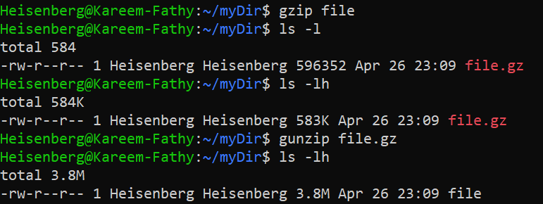
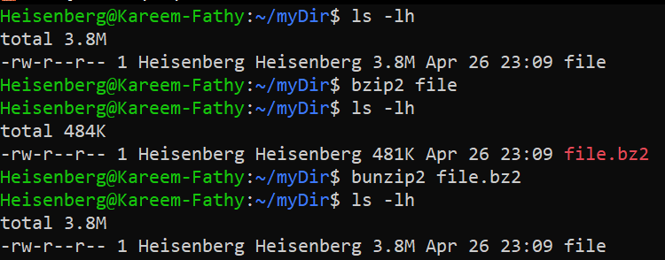
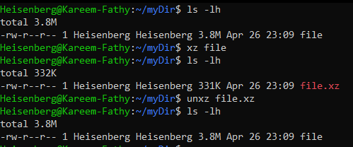
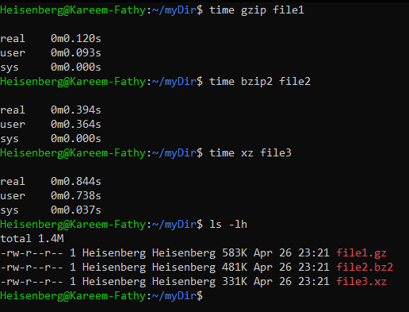
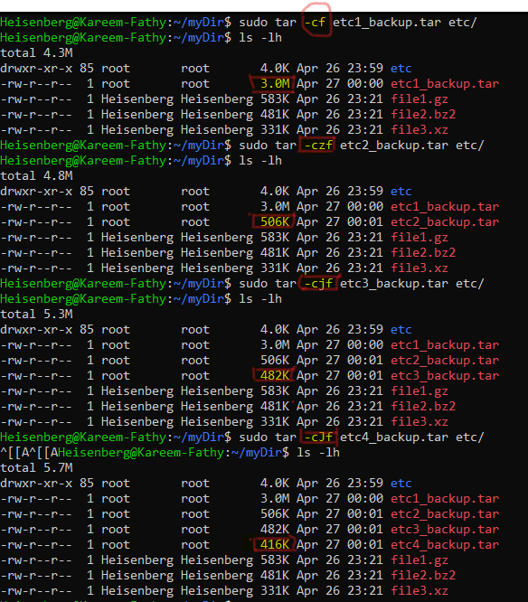

# Compressing and Archiving in Linux

## Compressing [used with Files]

### For Compressing:
```bash
gzip <file>   # output: file.gz
bzip2 <file>  # output: file.bz2
xz <file>     # output: file.xz
```

### For Decompressing:
```bash
gzip -d <file.gz>   # output: file
bzip2 -d <file.bz2> # output: file
xz -d <file.xz>     # output: file
```

### Alternative Commands:
```bash
gunzip <file.gz>    # output: file
bunzip2 <file.bz2>  # output: file
unxz <file.xz>      # output: file
```
> 
> 
> 

### Comparing Compressed File Sizes:
- Use the `ls -lh` command to compare the sizes of `.gz`, `.bz2`, and `.xz` files.

### Compression Speed vs Ratio:
- `gzip` <--> `bzip2` <--> `xz`
    - --> Speed of compression decreases ⬇ while compression ratio increases ⬆.
    - <-- Speed of compression increases ⬆ while compression ratio decreases ⬇.

### Measuring Compression Time:
- Use the `time` command to measure the duration of the compression process.

---

## Archiving

### What is Archiving?
Archiving creates a single file from a directory while keeping the original directory intact.

### Basic `tar` Command:
```bash
tar <option> <name.tar> <directory> <file1> <file2> 
```

#### Common Options:
- `-f`: Refers to the file.
    - `-c`: Create an archive file.
    - `-x`: Extract the archived file.
    - `-t`: List the contents of the archived file.
- `-v`: Display verbose output.

### Preserving Permissions:
- Use `sudo` with `tar` to preserve the original file permissions.
- or user -p [preserve] with `tar` to preserve the original file permissions.
---

## Compression and Archiving

### Combining Compression with Archiving:
```bash
tar czf archive.tar.gz file1 file2 file3
```
- Archives and compresses `file1`, `file2`, and `file3` into `archive.tar.gz`.
- Compression options:
    - `z`: Gzip
    - `j`: Bzip2
    - `J`: Xz

> 
### Examples:
#### Using `gzip`:
```bash
tar -czf archive.tar.gz directory_name
```

#### Using `bzip2`:
```bash
tar -cjf archive.tar.bz2 directory_name
```

#### Using `xz`:
```bash
tar -cJf archive.tar.xz directory_name
```

### Explanation of Options:
- `-c`: Create a new archive.
- `-z`: Compress using `gzip`.
- `-j`: Compress using `bzip2`.
- `-J`: Compress using `xz`.
- `-f`: Specify the archive file name.

### File Naming:
- Always use proper extensions: `.tar.gz`, `.tar.bz2`, `.tar.xz`.
---

### Decompressing and Extracting Archives

#### Decompressing and Extracting Combined:
```bash
tar -xzf archive.tar.gz  # Extracts .tar.gz
tar -xjf archive.tar.bz2 # Extracts .tar.bz2
tar -xJf archive.tar.xz  # Extracts .tar.xz
```

#### Explanation of Options:
- `-x`: Extract files from the archive.
- `-z`: Decompress `.gz` files.
- `-j`: Decompress `.bz2` files.
- `-J`: Decompress `.xz` files.
- `-f`: Specify the archive file name.

#### Listing Archive Contents:
```bash
tar -tf archive.tar.gz
```
- Displays the contents of the archive without extracting.

#### Extracting Specific Files:
```bash
tar -xzf archive.tar.gz file1 file2
```
- Extracts only `file1` and `file2` from the archive.

#### note:

## Additional Notes and Tips

### Comparing Compression Tools:
- **Decompression notes**
    - Use `bunzip2`, `gunzip`, or `unxz` for simple `decompression` of individual `compressed` files.
    - Use tar `-x[z,j,J]f` for extracting `compressed and archived` in one step.


- **Speed vs Compression Ratio**:
    - `gzip`: Faster compression, lower compression ratio.
    - `bzip2`: Moderate speed and compression ratio.
    - `xz`: Slower compression, highest compression ratio.

### Viewing Compression Results:
- Use `ls -lh` to view file sizes and compare results.

