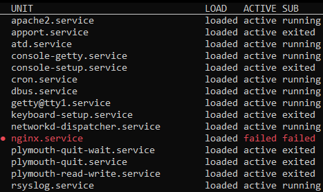
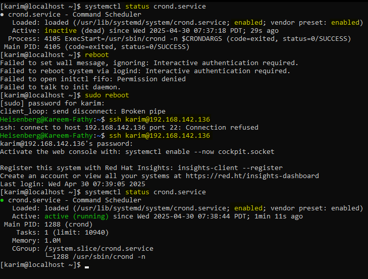

# Services and Daemons

## `systemctl`
`systemctl` is used to control the `systemd` system and service manager.

---

## 1. Listing Commands

### Show all active services:

```bash
systemctl
systemctl list-units
```

### List units of a particular type:
```bash
systemctl list-units --type=service
systemctl list-units --type service
systemctl list-units -t services
systemctl -t service
```
> 

### List installed unit files:
```bash
systemctl list-unit-files
```
> 

### Show all services (active and inactive):
```bash
systemctl --all
```

---

## 2. Managing Services

### Start a service:
```bash
systemctl start <service>
```

### Stop a service:
```bash
systemctl stop <service>
```

### Disable a service (prevent it from starting at boot):
```bash
systemctl disable <service>
```

### Enable a service (start it at boot):
```bash
systemctl enable <service>
```

### Enable and start a service immediately:
```bash
systemctl enable <service> --now
```

---

## 3. Checking Service Status

### Check the status of a service:
```bash
systemctl status <service>
```
> 

### Service States:
- **Enabled**: The service will be `active` after a system restart.
- **Disabled**: The service will be `inactive` after a system restart.
- **Preset Enabled**: The service is `active` by default.
- **Active**: The service is currently running.

### Example:
- The `cron` service is `enabled` by default, so it will auto-activate after a system restart.

> 

- If you stop the system and start it again, the service will be in `active` status.

> 

- Restart the system to observe the behavior:
> 

### Try it yourself:
- Disable the `cron` service and restart the system. What is the status of the service?

---

### Additional Commands:
```bash
systemctl is-active <service>  # Check if the service is active
systemctl is-enabled <service> # Check if the service is enabled
systemctl is-failed <service>  # Check if the service has failed
```

### Restart a service:
```bash
sudo systemctl restart <service>
```
- This stops and starts the service.
- Any users or processes connected to the service (e.g., SSH) will lose their connection.
- The PID will change.

### Reload a service:
```bash
sudo systemctl reload <service>
```
- Reloads the configuration file without interrupting the service.
- The PID will not change.

### Reload or restart a service:
```bash
sudo systemctl reload-or-restart <service>
```

### Show service dependencies:
```bash
systemctl list-dependencies
```

### Permanently deactivate a service:
```bash
sudo systemctl mask <service>
```

### Reactivate a masked service:
```bash
sudo systemctl unmask <service>
```
> 

---

### Show all failed services:
```bash
systemctl --failed --type=service
```
> 

---

### Notes:
- **Debian**: Services are named normally (e.g., `cron`).
- **Red Hat**: Services are suffixed with `d` (e.g., `crond`, `sshd`).

