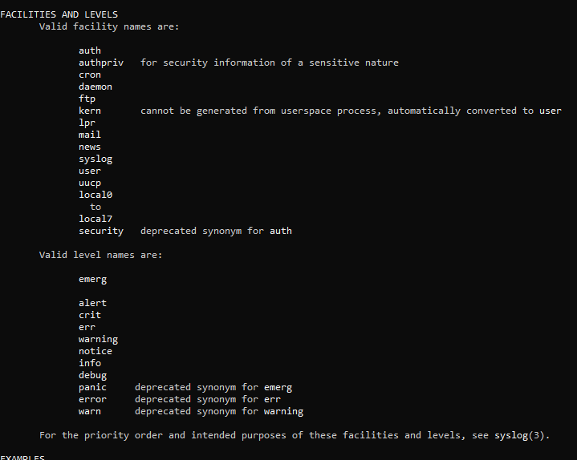

# Analyzing and Storing Logs


## 1- rsyslog (formerly syslog) [Red Hat]
### Service Name
```plaintext
rsyslog
```
### rsyslog Configuration File: `/etc/rsyslog.conf`
```plaintext
Determines which logs are stored in which files.
```
- Saves logs as `text files`.
- Files `persist` across reboots.
- Logs can be stored in:
   - `/var/log/messages`: Contains most log message types.
   - `/var/log/secure`: Logs related to authentication and security.
   - `/var/log/maillog`: Mail-related logs.
   - `/var/log/cron`: Scheduling logs.
   - `/var/log/boot.log`: System boot logs.

### Log Components: [Facility & Priority]
- **Facilities**: Sources of logs:
   - Examples: kernel, user, mail, cron, local1:local7, ftp.
- **Priorities**: Importance levels of logs:
   - Levels: `emerg`, `alert`, `crit`, `err`, `warning`, `notice`, `info`, `debug`.
   - Indexed from `0` (highest) to `7` (lowest).
   - Examples: `emerg.err`, `cron.info`, `mail.info`, `ftp.*`, `*.debug`.
   - `*` matches any value.

```bash
man logger
# Displays all facilities and priorities.
```
> 

### Log Rotation
- When a log file reaches its size limit or expiration time, it is renamed (e.g., `log.textdate`).
- rsyslog creates a new log file with the original name and continues logging.
- Configuration file: `/etc/logrotate.conf`.

### Notes
- To read a log file:
   - Use `tail -f /var/log/logfile` to follow logs in real-time (file must exist).
   - Use `-F` to wait for file creation and follow logs.
- Use the `logger` command to add messages to the system log:
   ```bash
   logger -p facility.priority "message"
   ```
- Log messages are written to their `facility.priority` files, including higher priorities.


---

## 2- systemd-journald Service [Red Hat, Debian]
### Service Name
```plaintext
systemd-journald
```
- Saves logs as `structured` and `indexed` journal files.
- Files `do not persist` across reboots:
   - Logs are stored in `/run/log/journal` (default in Red Hat).
   - Root permissions are required for full access.

### `journalctl` Options
- Common options:
   ```bash
   -n                # Show the last 10 lines.
   -n x              # Show the last x lines.
   -f                # Follow events/logs.
   -p <priority>     # Show logs of a specific priority.
   -u <service>      # Search logs for a specific service/unit.
   --since "yyyy-mm-dd hh:mm:ss" --until "yyyy-mm-dd hh:mm:ss"
                              # Display logs within a time range.
                              # Examples: --since today, yesterday, -1 hour, -2 months.
   ```
- Most used filters:
   - `_COMM=`: Filters logs by the name of the command that generated the log entry.
   - `_EXE=`: Filters logs by the executable path of the process that generated the log entry.
   - `_PID=`: Filters logs by the process ID (PID) of the process that generated the log entry.
   - `_UID=`: Filters logs by the user ID (UID) of the user running the process that generated the log entry.
   - `_SYSTEMD_UNIT=`: Filters logs by the systemd unit name associated with the process that generated the log entry.

### Making Logs Persistent
Through the Configuration file: `/etc/systemd/journald.conf`.
> 
   - `Storage` options:
      - `none`: Drops all logs.
      - `auto`: Uses `/var/log/journal` if available; otherwise, volatile storage.
      - `volatile`: Memory-based storage in `/run/log/journal`.
      - `persistent`: Non-volatile storage in `/var/log/journal` (created if missing).
         

### These lines set rules for managing log files in a filesystem:
- `File size ≤ 10% of filesystem size`:
   - A single log file cannot exceed 10% of the total filesystem capacity.
   - This prevents one file from using too much space.
- `At least 15% free space must remain`:
   - The filesystem must always have at least 15% of its capacity free to avoid performance issues or failures.
   - Together, these rules ensure efficient storage usage and prevent the filesystem from being overwhelmed.         


- Reactivate the service after changes:
   ```bash
   systemctl reload-or-restart systemd-journald
   ```
- Use `journalctl --flush` or reload the service to apply changes.
