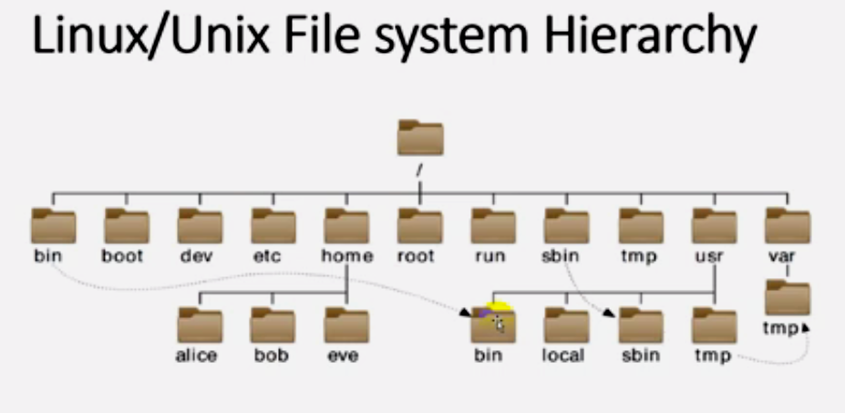

# Linux File System Hierarchy:
> ## The Single Inverted Tree Hierarchy




```
[    /   ]                  # root file system, the parent of all directories
[ /bin/ -> /usr/bin/ ]      # contains the binary files of the local user commands
[ /boot/ ]                  # conatins the files that start the boot process via the boot loader
[ /dev/  ]                  # contains the devices drivers files
[ /etc/  ]                  # contains the configuration files
[ /home/ ]                  # home directory for local users
[ /root/ ]                  # the home directory for thr root user
[ /run/  ]                  # contains the current running process   
[ /sbin -> /usr/sbin/]      # contains the binary files of the root/super user commands
[ /tmp/  ]                  # contains the temporarly files
[ /usr/  ]                  # contains the files shared between users
[ /var/  ]                  # contains the variable files (data bases, logs, email, ...)
[ /lib/ -> /usr/lib ]       # contains the shared files between applications
[ /lib64/ -> /usr/lib64 ]   # contains the shared files between applications
[ /media/]  & [ /mnt/ ]     # used to maunt a device 
```