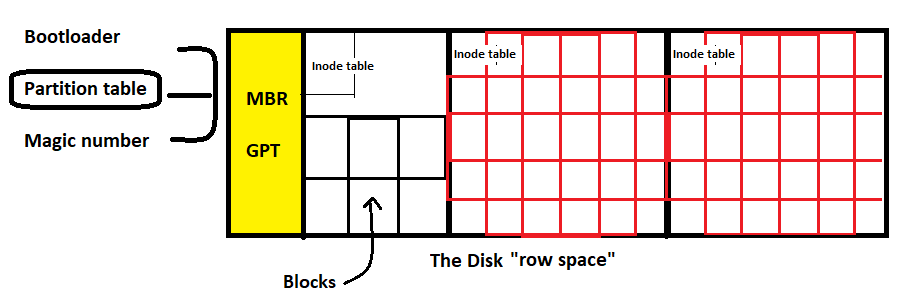
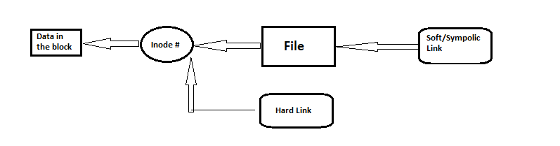

# Inodes:
- ``partition taple`` responsible for spicifing the start and end sectors for each block 
- formatting the partition by file systems types 
    - fat32, NTFS [for windows]
    - ext2, ext3, ext4, xfs, Btrfs [for linux]
- selection of file system according to the file and the action needed
- Inode table contains/store the metadata for each file 
    - Inode number
    - permission
    - owner
    - creation time
    - size ``and son on`
- each Inode number will point to one block
    - > `ls -li` # will print the inode number 
- in case of larg file 
    - the Inode number will point to the first block and the other blocks will point to each other 
- in case of deletion of file:
    - the data will not be deleted, but the Inodes will be flaged to `free`
 
 

# Links:

1) Soft/Sympolic Link;
    - a file points to a file points to the inode points to the data block
    - can be done in different file systems
    - links to files or directories 
    - must spicify the full/absolute path of the file (not the link) if they are not in the same directory  
        
2) Hard Link    
    - more than one file point to the inode that points to the data block
    - must be done at the same file system
    - links to only files 
        - as the directory is a reference to another files

>``ln file link`` # for hard link  
>``ln -s file link`` # for soft link