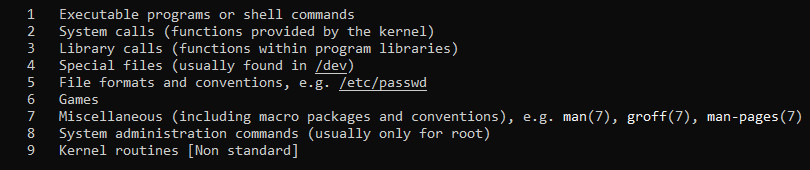

# How to help your self without internet?

## (1) help  
>```<command> --help```

>``<command> -h`` # not for all commands

## (2) manual pages
> ``man <commands, files, super commands>``
   - the man pages can be accessed from ``/usr/share/man``
   - 
   - the man pages consists of `9` sections
   - most important sections are [1,5,8]
        - sections "1" for: excutable files "commands" & is the default section 
        - sections "5" for: configuration files
        - sections "8" for: privileged commands "root"
        > 


### Example(1):
> ``man ls``
        

### To search for spesific section:
- > ``man <section #> <comamnd or file>``


### Example(2):
- search for the ``command`` passwd:
    >```man passwd``` # will search at section 1 by default which responsible for the commands
- search for the `file` passwd  
    >``man 5 passwd`` # will search at section 5 which responsible for the configuration files  


- `/` to search for certain word
- `n` to display  the next word 
- `N` to display the previous word
- `g` to go the the header of the man
- `G` to go to the end of te man 
- `spacebar` Scroll forward (down) one screen
- `retrun(Enter)` Scroll forward (down) one line
- `q` to exit the man 


### To search about a command by only describe its functionality:
> ``man -k "description"``
- 
> ``man -K "describtion"``
- 


## (3) info/pinfo:
> ``info <command>`` # for more help    
> ``pinfo <command>`` # enhanced info

## (4) the documentation files for each command:
- reading from: ``/usr/share/docs/<command>/README``
- 

## (5) Search the internet 😆