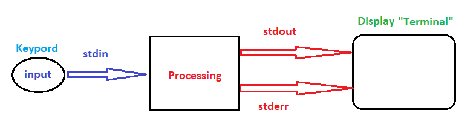
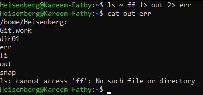

# Redirection
> 

## Describtors:
```
- stdin  -> '0' 
- stdout -> '1'
- stderr -> '2' 
```

## Redirection  & overwriting: 
```markdown
* 1> for overwrite only standerd output (stdout)    #  1> == >
* 2> for overwrite only standerd error  (stderr)
* &> for overwrite stdour and stderr                # similer to 1&2>
```


## Redirection  & appending:
```markdown
* 1>> to append only standerd output (stdout)       # 1>> == >>
* 2>> to append only standerd error  (stderr)
* &>> for overwrite only stdour and stderr          # similer to 1&2>>
```

## Example:
> ``ls ~ ff 1> out 2> err`` # ff not actually exists
- 