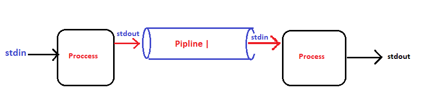
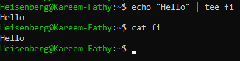

# Piplining

## command | command | command ...

- 

> ``tail -n 5 /etc/passwd | grep <word> | wc [-l, -w, -c]``
   - get the last 5 lines from /etc/hosts, grep any "word" and count their lines, words, characters.

> ``command <option> <argument> | tee <path>``    
   -  read from standard input and write to [standard output/ screen] and [files/pathes]
   - 