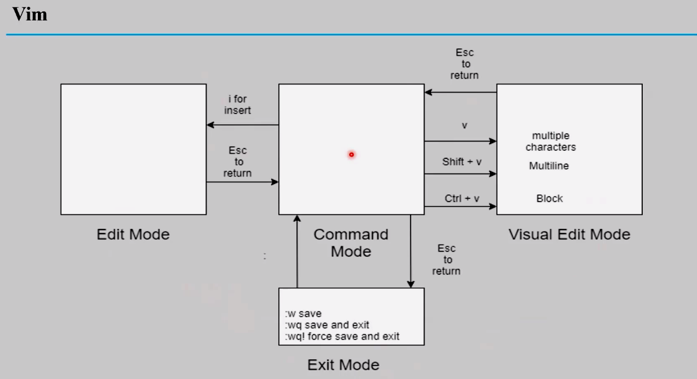

# Editing Text Files:
>``vimtutor`` # Learning vim locally

## (1) Vim:
>
- Vim is enhanced vi
- vim has `4 modes`:
    1) Command          mode 
    2) Edit/Insert      mode 
    3) Visual Edit      mode 
    4) Exit/Extended    mode  

### from command to insert mode:
    -> i to write before the letter
    -> a to write after the letter
    -> o to create a new line under my position  
    -> O to create a new line above my position 

### from command to visual mode:
    -> V to select line by line
    -> ctrl + V to select a block 
    -> v to select letter by letter 

### @ command mode:
- 'x' to remove a letter from the current position to right
- 'X' to remove a letter from the current position to left
- 'u' to undo delete
- 'd''w' to delete from the currecnt position to the end of the word 
- 'd''$' to delete from the currecnt position to the end of the line 
- 'd''0' to delete from the currecnt position to the beginning of the line 
- 'gg' to navigate to head of the page  
- 'G' to navigate to end of the page  
- 'yy' to copy a line from the current position
- '4yy' to copy 4 lines from the current position   
- 'yw' to copy the word  
- 'dd' to cut a line from the current position
- 'p' to paste a line under the current position
- '/' to search about a pattern

### @ Extended mode:
- ``:.,$d``             # to delete from the current position to the end ot the file  
- ``:4,15d``            # to delete from line 4 to 15 
- ``:%s/word1/word2``   # to replace word1 by word2
- ``:9``                # to go to certain line
- ``:set number``       # to number the file  
- ``:set nonumber``     # to hide the numbering 
- ``:w``                # save without quit 
- ``:wq``               # save and quit
- ``:wq!``              # force save and quit 
- ``:w file.name``      # save the content to an new file [like: save as in windows]
- ``:r <file.path>``    # copy the content of the file to the current position 
- ``:! <command>``      # to run a command 
- ``:. ! <command>``    # to run a command inside the file 