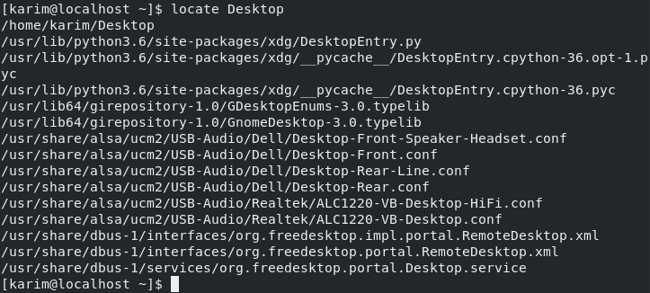
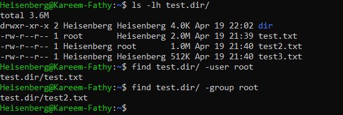

# Searching
## (1) Searching for commands:
>``whereis <command>`` # search for the command location
- 

>``whatis <command>``  # search for the functionality of the commands
- 


## (2) Searching about text from file: 
>``grep <pattern> <path>``    # find a specific pattern in a file 
- 
 

## (3) Searching for file or directory:
>``locate <file>`` # match faster, search in database, has fewer options 
- 
- locate == which
- 


```markdown
    dd if=<path1> of=<path2> bs=<n>M conut=<x>
    # copy from path1 to path2 and make the block size (bs) = n MegaByte and count x from this Block
```

>``find <path> <criteria>``	# seach in the whole file system, has many options
- Criteria:
    1) ``name`` 
        - -name (case senstive)
        - -iname (insenstive)
    2) ``type``
        - -type f(file), d(directory), l(sLink) ,b(block device), c(character device)
        - 
    3) ``size``
        - -size 10M, +5M(more than 5M), -1G(less than 1G)
        - 
    4) ``ownership``
        - -user user
        - -user group
        - 
    5) ``permissions``
        - -perm 777
        - 
    6) ``time``
        - -atime 10,+10,-10 # access within 10 or more than 10 or less than 10 days 
        - -mtime 10,+10,-10 # modified within 10 or more than 10 or less than 10 days
     
## Specify the type of a file:
>``file <file>`` # Specify the type of a file
- 