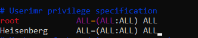
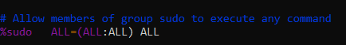
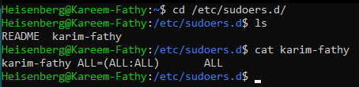

# Gain root access:
   ## 1- add the user to the sudoers file:
   > ``vim /etc/sudoers/``
   
   > ``sudo visudo``
   -  add it under root to have the same root privilages
      -  

   - add it to the super group (sudo ,wheel, ..) to have its permissions:
      - > ``gpasswd -a <user> <group>`` # append user to super group
      - > ``gpasswd -d <user> <group>`` # delete user from group 
      -   
   
      - the disadvantages of this methos is the system must be restarted to apply changes.
   ## 2- Create a file under `/etc/sudoers.d/` has the username as a name of the file (optional) and has the required permissions.
   - 
   - The system has not to be restarted , changes happen momentarily